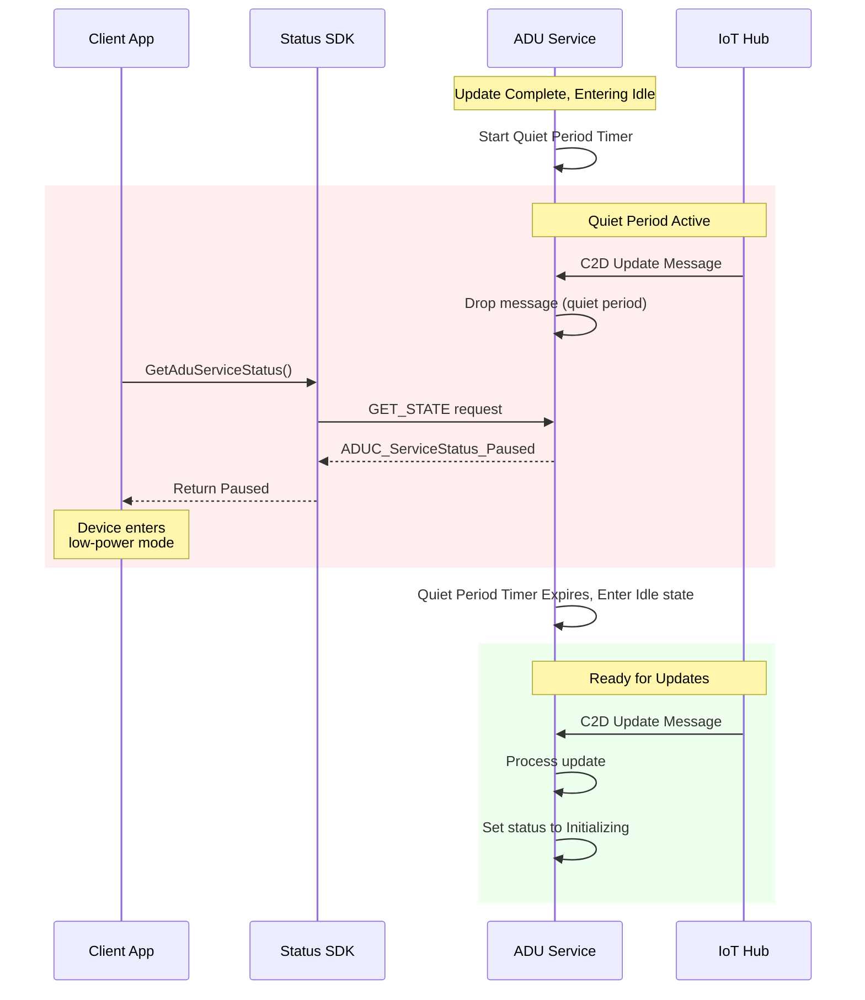
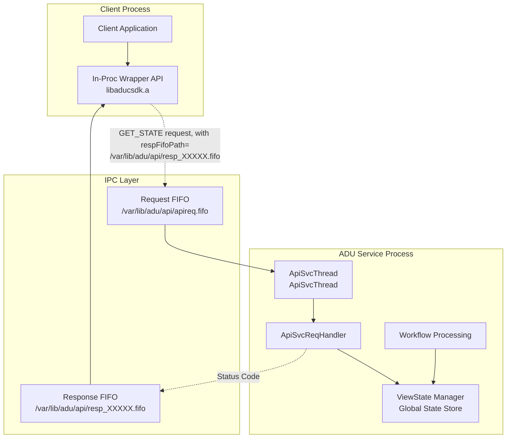
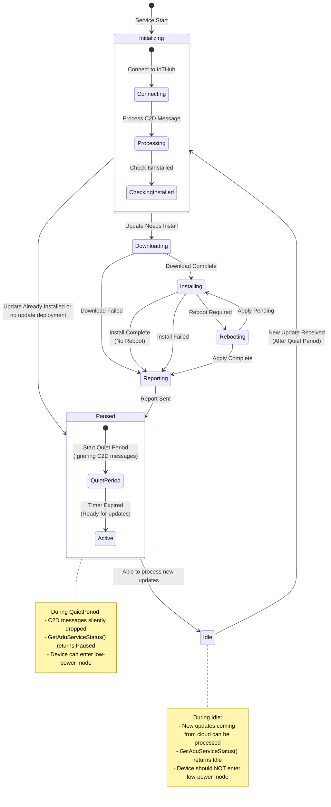

# SDK - GetAduServiceStatus

The SDK is a static library only devpkg consisting of the following files:
* aducsdk.h header
* libaducsdk.a static library
* aducsdk.pc pkgconfig
* aducsdk-config.cmake

The .a static library will take care of all interprocess communication between the calling client process and the AducIotAgent service process and the .h has the supported API.

## Building the SDK

### Prerequisites

Install pkg-config for library discovery:

**Ubuntu/Debian:**
```sh
sudo apt update && sudo apt install pkg-config
```

### Build and Install

```sh
# Build the entire project (includes SDK)
./scripts/build.sh -c

# Or build just the SDK
cmake --build out --target aducsdk

# Install system-wide
sudo cmake --build out --target install
```

### Build Configuration Options

The SDK supports several build-time configuration options:

#### FIFO Path Configuration
```sh
# Custom FIFO path (default: /var/lib/adu/api/apireq.fifo)
# This is the underlying request FIFO to which SDK requests are written.
cmake -DADUC_API_DEFAULT_FIFO_PATH="/custom/path/to/api/apireq.fifo" ..
./scripts/build.sh -c
```

## The aducsdk.h development header

The SDK header is at [src/sdk/inc/aduc/aducsdk.h](../../src/sdk/inc/aduc/aducsdk.h)
It consists of the ADUC_ServiceStatus enum, the integer values of which are returned from SDK API:
`ADUC_ServiceStatus GetAduServiceStatus(void);`

You can get a human-readable string for it with:

`const char* ADUC_ServiceStatusToString(ADUC_ServiceStatus status);`

The states in ADUC_ServiceStatus enum are "view states", a simplified high-level view of the AducIotAgent state.
It is designed for allowing the calling client process to determine if the agent is busy (with a bit more detail) or Idle.
This would allow another process to determine if it's safe to, e.g. power-down (i.e. not currently installing an update or determining if an update is needed) to a low-power state to save battery, but at the same time ensure that any updates available are applied first.

The in-proc wrapper API will communicate to the AducIotAgent daemon process via IPC. Currently, it is a name-pipe FIFO request for ADU requests.

Internally, the CommandHandler will read the request. In the case of GET_STATE it also reads in the path to the response FIFO for writing the response status code.

Key points in the code will call an internal API to set these "view state" statuses on a ViewStateManager component and the CommandHandler will get the status from it.

## Pause State

The `ADUC_ServiceStatus_Paused` state is returned from the `GetAduServiceStatus()` API after the agent has finished a deployment cycle and before it transitions to `Idle`.

The pause period is controlled by the `IdlePauseMilliseconds` configuration in `du-config.json`.
During this pause period the agent will ignore any incoming C2D messages, so no cancel, replacement, or new update deployment can begin during this interval.

Because new deployments cannot start while the agent is `Paused`, this is the state in which a caller may safely transition the device to a low-power mode without missing an update.

Once the pause-period timer has expired and any queued reporting of results has been sent to IoT Hub, the API will return `ADUC_ServiceStatus_Idle` and the agent is again able to start processing incoming push requests from IoT Hub. While the agent is `Idle` it is actively eligible to receive new deployments, so a caller should NOT enter a low-power mode purely on the basis of an `Idle` reading — use `Paused` for that.

## The Cross-Proc wire protocol

The SDK libaducsdk.a static lib will write requests to the ADUC request FIFO and read responses from the response FIFO that it sets up.  See more details in [apiproto.h](../../src/utils/apiproto_utils/inc/aduc/apiproto.h)

### Request Format
The request format is: `<ver><type><len><str>`
where ver, type, len are 16-bit unsigned values in network byte order and str is a non-null-terminated UTF-8 encoded string of length `len` bytes (can be 0).
e.g. on the wire: `00 01 00 01 00 13 '/data/resp1234.fifo'` — bytes are sent in network order (big-endian) for the three uint16 fields.
On a little-endian host, the same fields read into local `uint16_t` variables would be stored as `01 00 01 00 13 00`.

### Response Format
The response consists of `<code><ret_val>`, both of which are 16-bit unsigned values (uint16_t) sent in network byte order.
e.g. `00 01 00 02` on the wire (`01 00 02 00` in memory on a little-endian host) indicates code 1 (response to GET_STATE) and ret_val 2 ([Downloading](../../src/sdk/inc/aduc/aducsdk.h)).
The SDK validates that `code` matches the request type before returning `ret_val` to the caller; a mismatch is reported as `ADUC_ServiceStatus_ERROR_AgentServiceInternal`.

## Package Config

pkg-config is a tool used during compilation to provide info about installed libraries that finds the correct compiler and linker flags for the library so developers can avoid having to know to manually specify include paths (-I/usr/include/somelibrary), library paths (-L/usr/lib/x86_64-linux-gnu), library names (-llibsomelib), library dependencies (-lcrypto -lz), and version requirements.

The `aducsdk.pc` pkgconfig file will be installed into `/usr/local/lib/pkgconfig/` (or `/usr/lib/pkgconfig/` for system packages) and contains metadata:

```sh
# Example: aducsdk.pc
prefix=/usr/local
exec_prefix=${prefix}
libdir=/usr/local/lib
includedir=/usr/local/include

Name: aducsdk
Description: Azure Device Update SDK for communicating with the ADU agent service
Version: 1.2.0
URL: https://github.com/Azure/iot-hub-device-update
Requires:
Libs: -L${libdir} -laducsdk
Cflags: -I${includedir}
```

### Using pkg-config

#### Command Line Usage
```sh
# Check if SDK is available
pkg-config --exists aducsdk && echo "SDK found!" || echo "SDK not found"

# Get compilation flags
pkg-config --cflags aducsdk
# Output: -I/usr/local/include

# Get linker flags
pkg-config --libs aducsdk
# Output: -L/usr/local/lib -laducsdk

# Get both together
pkg-config --cflags --libs aducsdk
# Output: -I/usr/local/include -L/usr/local/lib -laducsdk

# Check version
pkg-config --modversion aducsdk
# Output: 1.2.0

# Version checking
pkg-config --atleast-version=1.0 aducsdk && echo "Version OK"
```

#### Compile Applications
```sh
# Simple compilation
gcc myapp.c $(pkg-config --cflags --libs aducsdk) -o myapp

# With additional flags
gcc -Wall -g myapp.c $(pkg-config --cflags --libs aducsdk) -o myapp

# Cross-compilation (use PKG_CONFIG_PATH)
PKG_CONFIG_PATH=/path/to/cross/lib/pkgconfig \
  arm-linux-gnueabihf-gcc myapp.c $(pkg-config --cflags --libs aducsdk) -o myapp
```

#### CMake Integration
```cmake
# In your CMakeLists.txt
cmake_minimum_required(VERSION 3.5)
project(MyApp)

# Find pkg-config
find_package(PkgConfig REQUIRED)

# Find the ADU SDK
pkg_check_modules(ADUCSDK REQUIRED aducsdk)

# Create executable
add_executable(myapp main.c)

# Link with SDK
target_include_directories(myapp PRIVATE ${ADUCSDK_INCLUDE_DIRS})
target_link_libraries(myapp ${ADUCSDK_LIBRARIES})
target_compile_options(myapp PRIVATE ${ADUCSDK_CFLAGS_OTHER})

# Optional: Check version
if(ADUCSDK_VERSION VERSION_LESS "1.0")
    message(FATAL_ERROR "ADU SDK version 1.0 or higher required")
endif()
```

### Yocto Integration
For Yocto integration see [README-Yocto-Integration.md](../../src/sdk/README-Yocto-Integration.md)

## Implementation (How It Works)

`GetAduServiceStatus()` is a thin client-side wrapper that performs a request/response
exchange with a listener thread inside the running agent over named-pipe (FIFO) IPC. The
value it returns originates from a single mutex-protected "view state" variable that the
agent's workflow engine keeps up to date — there is no IoT Hub round-trip.

### Components

| Component | Source | Role |
| --- | --- | --- |
| Client SDK | [aducsdk.c](../../src/sdk/src/aducsdk.c) | Implements `GetAduServiceStatus()`: creates the response FIFO, sends the request, reads the reply. Linked into the caller as `libaducsdk.a`. |
| Wire protocol | [apiproto.c](../../src/utils/apiproto_utils/src/apiproto.c) / [apiproto.h](../../src/utils/apiproto_utils/inc/aduc/apiproto.h) | Frames and sends/receives the request and response messages (network byte order, `select()` timeouts). Shared by both processes. |
| View-state store | [viewstatemgr.c](../../src/viewstatemgr/src/viewstatemgr.c) | Global `g_vsm` holding the current `ADUC_ServiceStatus`, guarded by a `pthread_mutex`. Initial value is `Initializing`. |
| API service | [apisvc.c](../../src/agent/api/src/apisvc.c) | Dedicated agent thread (`init_api_svc` → `aduc_apisvc_thread_proc`) that owns the request FIFO, handles `GET_STATE`, and writes the reply. |
| State producers | [agent_workflow.c](../../src/adu_workflow/src/agent_workflow.c), [adu_core_interface.c](../../src/agent/adu_core_interface/src/adu_core_interface.c) | Call `viewstatemgr_svcstatus_set()` at each workflow phase to keep `g_vsm` current. |

The API service thread is started at agent startup from [main.c](../../src/agent/src/main.c)
(`init_api_svc`) and stopped on shutdown (`uninit_api_svc`).

### End-to-end GET_STATE flow

**Client — `GetAduServiceStatus()` ([aducsdk.c](../../src/sdk/src/aducsdk.c))**

1. Security-check the request FIFO (default `/var/lib/adu/api/apireq.fifo`): it must be a FIFO owned by the caller's euid/egid with mode `0660`. Missing → `ADUC_ServiceStatus_ERROR_AgentServiceNotRunning`; not writable → `..._ERROR_AgentServicePermission`.
2. `mkfifo` a private, randomly-named response FIFO `.../api/resp_<12 chars>.fifo` (chmod `0660`).
3. Open the request FIFO for write, and the response FIFO for read *before* sending (so the writer never sees EOF).
4. Send `{ver=1, type=GET_STATE, len, data=<respFifoPath>}`.
5. Wait for the `{code, ret_val}` reply (`select`, 3 s timeout), verify `code == GET_STATE`, and return `(ADUC_ServiceStatus)ret_val`.
6. Always close and `unlink` the private response FIFO.

**Agent — `aduc_apisvc_thread_proc()` ([apisvc.c](../../src/agent/api/src/apisvc.c))**

1. Create/verify the request FIFO and open it for read (non-blocking).
2. `msg_recv_req` reads a request; its `data` field is the client's response-FIFO path, which is itself security-checked with the same ownership/mode rules.
3. Open that response FIFO for write.
4. For `GET_STATE`: read the current status via `viewstatemgr_svcstatus_get(&g_vsm, ...)`, reply `{code=1, ret_val=status}`, flush, then close.

### How the state is produced

`g_vsm` is updated by `viewstatemgr_svcstatus_set()` throughout the deployment lifecycle. For
example, in [agent_workflow.c](../../src/adu_workflow/src/agent_workflow.c): ProcessDeployment
→ `Initializing`, Download → `Downloading`, Install → `Installing`, Apply → `Applying`, reboot
points → `Rebooting`; and on returning to idle it sets `Paused` (when `idlePauseMilliseconds >
0`, which also starts the idle-pause timer) or `Idle`.
[adu_core_interface.c](../../src/agent/adu_core_interface/src/adu_core_interface.c) sets
`Reporting` and `Failed`. Because both the workflow thread (writer) and the API service thread
(reader) touch `g_vsm`, all access is serialized by its mutex.

### Security properties

- Both processes verify FIFO **type + euid/egid ownership + `0660` permissions** before trusting a path.
- The response FIFO is per-call, randomly named, and always unlinked.
- The client validates that the response `code` matches its request type — a spoofed or mismatched reply is reported as `ADUC_ServiceStatus_ERROR_AgentServiceInternal` rather than being returned as a status.
- The SDK uses `secure_getenv()` for its debug flag (safe under setuid/setgid); the service ignores `SIGPIPE` so a client disconnect cannot kill the agent thread.
- The request FIFO path is build-time configurable via `-DADUC_API_DEFAULT_FIFO_PATH`.

## Sequence Diagram for in-proc Wrapper API and GET_STATE cross-proc


```mermaid

sequenceDiagram
    participant Client as Client App
    participant SDK as Status SDK
    participant ReqFIFO as Request FIFO
    participant ApiSvcThread as ApiSvcThread
    participant ApiSvcReqHandler as ApiSvcReqHandler
    participant ViewState as ViewState Manager
    participant RespFIFO as Response FIFO

    Note over Client,SDK: Client Process
    Note over ReqFIFO,ViewState: ADU Service Process

    Client->>SDK: GetAduServiceStatus()
    SDK->>SDK: Create per-call response FIFO<br/>at /var/lib/adu/api/resp_<random>.fifo
    SDK->>ReqFIFO: Write GET_STATE request<br/>(ver=1,type=1,len,&lt;respFifoPath&gt;)

    ReqFIFO->>ApiSvcReqHandler: Read request
    ApiSvcThread->>ApiSvcReqHandler: Process GET_STATE command
    ApiSvcReqHandler->>ViewState: Get current state
    ViewState-->>ApiSvcReqHandler: Return ADUC_ServiceStatus
    ApiSvcReqHandler->>RespFIFO: Write status code

    RespFIFO->>SDK: Read status code
    SDK->>SDK: Cleanup temp FIFO
    SDK-->>Client: Return ADUC_ServiceStatus


```

## Sequence Diagram for Pause/Quiet period before entering Idle state



## State Flow Diagram: GET_STATE API



## State Flow Diagram: View States and Pause on enter Idle


