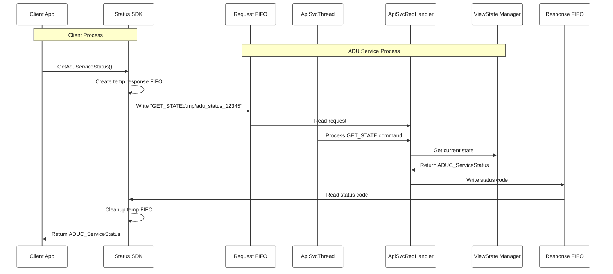
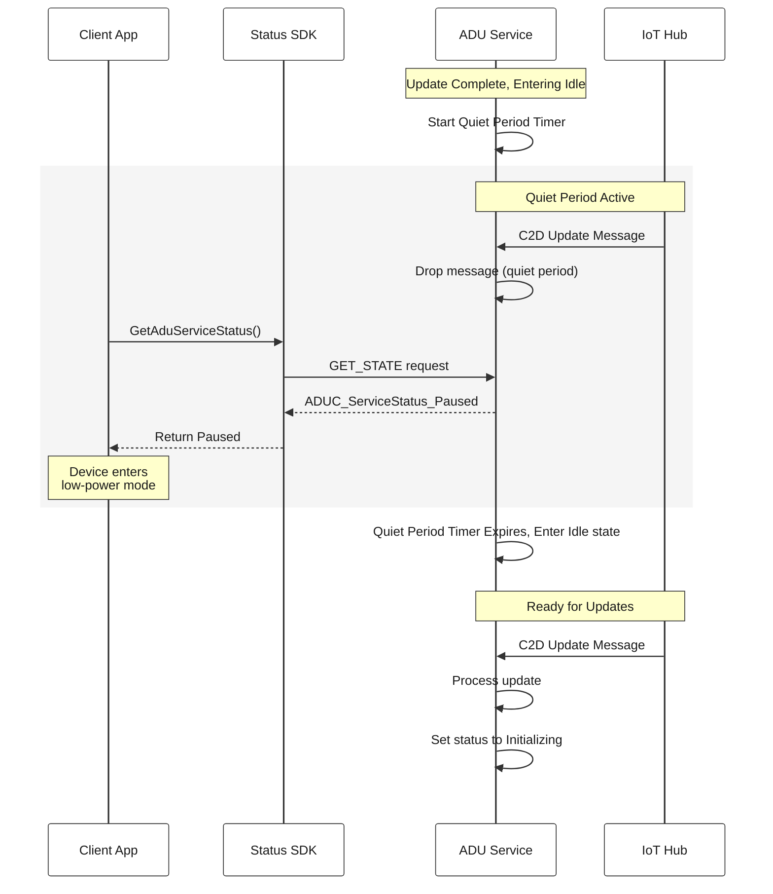
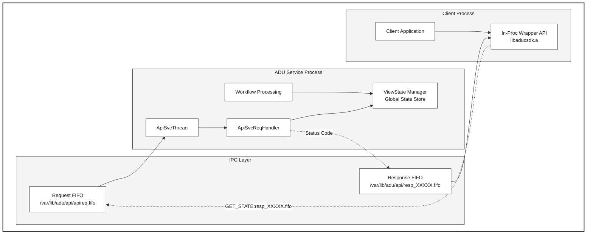
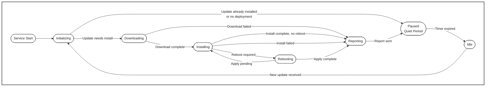

# Service Status API — GetAduServiceStatus

> **See also:**
> [Configuration Guide](configuration-guide.md) ·
> [Architecture Overview](architecture-overview.md) ·
> [Troubleshooting Guide](../how-to-troubleshoot-guide.md)

## Overview

The Service Status API allows **other processes on the device** to query the
ADU agent's current state — Idle, Downloading, Installing, Rebooting, etc. —
without requiring a round-trip to Azure IoT Hub.

### Why Use It?

| Use Case | How It Helps |
|----------|-------------|
| **Power management** | A battery-powered device can check whether the agent is idle before entering low-power / sleep mode, ensuring updates are not interrupted mid-install. |
| **Orchestration** | A device orchestrator or supervisor process can wait until the agent is idle before triggering its own firmware update, factory reset, or configuration change. |
| **Monitoring / diagnostics** | A local dashboard or logging daemon can continuously poll the agent state and report it to a fleet management system. |

### How It Works

The SDK ships as a **static library** (`libaducsdk.a`) that your application
links against. At runtime, the library communicates with the ADU agent daemon
over a local named-pipe (FIFO) — no network calls, no cloud dependency. The
call returns an `ADUC_ServiceStatus` enum value representing the agent's
current view state.

```c
#include <aduc/aducsdk.h>

ADUC_ServiceStatus status = GetAduServiceStatus();
if (status == ADUC_ServiceStatus_Idle) {
    // Safe to enter low-power mode or trigger other operations
}
```

### Pause / Quiet Period

After completing an update, the agent enters a configurable **quiet period**
(`IdlePauseMilliseconds` in `du-config.json`) during which it ignores incoming
cloud-to-device messages. During this window `GetAduServiceStatus()` returns
`ADUC_ServiceStatus_Paused`. Once the timer expires and any queued reports
have been sent, the API returns `ADUC_ServiceStatus_Idle` and the agent
resumes normal operation. This gives client processes a reliable signal that
the device is truly quiescent.

---

## SDK Package Contents

The SDK is a static library devpkg consisting of:
* `aducsdk.h` — public header
* `libaducsdk.a` — static library (handles all IPC)
* `aducsdk.pc` — pkg-config metadata
* `aducsdk-config.cmake` — CMake find-package support

## Building the SDK

### Prerequisites

Install pkg-config for library discovery:

**Ubuntu/Debian:**
```sh
sudo apt update && sudo apt install pkgconfig
```

### Build and Install

```sh
# Build the entire project first (configures CMake and builds all targets)
./scripts/build.sh

# Or, if already configured, build just the SDK target
cmake --build out --target aducsdk

# Install the SDK (headers, static library, pkg-config) system-wide
sudo cmake --build out --target install
```

> **Note:** `./scripts/build.sh -c` performs a **clean build** (deletes the
> `out/` directory first). Use the `-c` flag only when you need a fresh build.

### Build Configuration Options

The SDK supports several build-time configuration options:

#### FIFO Path Configuration
```sh
# Custom FIFO path (default: /var/lib/adu/api/apireq.fifo)
# This is the underlying request FIFO to which SDK requests are written.
cmake -DADUC_API_DEFAULT_FIFO_PATH="/custom/path/to/api/apireq.fifo" ..
./scripts/build.sh -c
```

## API Reference

The SDK header is at [src/sdk/inc/aduc/aducsdk.h](../../src/sdk/inc/aduc/aducsdk.h).

```c
// Query the agent's current state
ADUC_ServiceStatus GetAduServiceStatus(void);

// Convert a status value to a human-readable string
const char* ADUC_ServiceStatusToString(ADUC_ServiceStatus status);
```

The `ADUC_ServiceStatus` enum values are simplified "view states" — a
high-level summary of what the agent is doing, designed for external consumers.
Internally, the `ViewStateManager` component maintains the current state, and
the `ApiSvcReqHandler` reads it in response to `GET_STATE` requests over the
FIFO IPC channel.

## The Cross-Proc Wire Protocol

The SDK libaducsdk.a static lib will write requests to the ADUC request FIFO and read responses from the response FIFO that it sets up.  See more details in [apiproto.h](../../src/utils/apiproto_utils/inc/aduc/apiproto.h)

### Request Format
The request format is: `<ver><type><len><str>`
where ver, type, len are 16-bit values and str is a non-null-terminated utf-8 encoded string of length len (can be 0)
e.g. 00 01 00 01 00 13 '/data/resp1234.fifo' (note: the nibbles on the wire are in network order, i.e. big-endian).
In the uint16_t local variables on a little-endian host, these will be 01 00 01 00 13 00

### Response Format
The Response consists of `<code><ret_val>`, both of which are a double word. e.g. 00 01 00 02 on the wire (01 00 02 00 on LE host) would indicate code 1 (response to query status) and ret_val 2 ([Downloading](../../src/sdk/inc/aduc/aducsdk.h))

## Package Config

pkg-config is a tool used during compilation to provide info about installed libraries that finds the correct compiler and linker flags for the library so developers can avoid having to know to manually specify include paths (-I/usr/include/somelibrary), library paths (-L/usr/lib/x86_64-linux-gnu), library names (-llibsomelib), library dependencies (-lcrypto -lz), and version requirements.

The `aducsdk.pc` pkgconfig file will be installed into `/usr/local/lib/pkgconfig/` (or `/usr/lib/pkgconfig/` for system packages) and contains metadata:

```sh
# Example: aducsdk.pc
prefix=/usr/local
exec_prefix=${prefix}
libdir=/usr/local/lib
includedir=/usr/local/include

Name: aducsdk
Description: Azure Device Update SDK for communicating with the ADU agent service
Version: 1.2.0
URL: https://github.com/Azure/iot-hub-device-update
Requires:
Libs: -L${libdir} -laducsdk
Cflags: -I${includedir}
```

### Using pkg-config

#### Command Line Usage
```sh
# Check if SDK is available
pkg-config --exists aducsdk && echo "SDK found!" || echo "SDK not found"

# Get compilation flags
pkg-config --cflags aducsdk
# Output: -I/usr/local/include

# Get linker flags
pkg-config --libs aducsdk
# Output: -L/usr/local/lib -laducsdk

# Get both together
pkg-config --cflags --libs aducsdk
# Output: -I/usr/local/include -L/usr/local/lib -laducsdk

# Check version
pkg-config --modversion aducsdk
# Output: 1.2.0

# Version checking
pkg-config --atleast-version=1.0 aducsdk && echo "Version OK"
```

#### Compile Applications
```sh
# Simple compilation
gcc myapp.c $(pkg-config --cflags --libs aducsdk) -o myapp

# With additional flags
gcc -Wall -g myapp.c $(pkg-config --cflags --libs aducsdk) -o myapp

# Cross-compilation (use PKG_CONFIG_PATH)
PKG_CONFIG_PATH=/path/to/cross/lib/pkgconfig \
  arm-linux-gnueabihf-gcc myapp.c $(pkg-config --cflags --libs aducsdk) -o myapp
```

#### CMake Integration
```cmake
# In your CMakeLists.txt
cmake_minimum_required(VERSION 3.5)
project(MyApp)

# Find pkg-config
find_package(PkgConfig REQUIRED)

# Find the ADU SDK
pkg_check_modules(ADUCSDK REQUIRED aducsdk)

# Create executable
add_executable(myapp main.c)

# Link with SDK
target_include_directories(myapp PRIVATE ${ADUCSDK_INCLUDE_DIRS})
target_link_libraries(myapp ${ADUCSDK_LIBRARIES})
target_compile_options(myapp PRIVATE ${ADUCSDK_CFLAGS_OTHER})

# Optional: Check version
if(ADUCSDK_VERSION VERSION_LESS "1.0")
    message(FATAL_ERROR "ADU SDK version 1.0 or higher required")
endif()
```

### Yocto Integration
For Yocto integration see [README-Yocto-Integration.md](../../src/sdk/README-Yocto-Integration.md)

## Sequence Diagram for in-proc Wrapper API and GET_STATE cross-proc




## Sequence Diagram for Pause/Quiet period before entering Idle state



## State Flow Diagram: GET_STATE API



## State Flow Diagram: View States and Pause on enter Idle



> **During Quiet Period (Paused):** C2D messages are silently dropped.
> `GetAduServiceStatus()` returns `Paused`. Device can safely enter low-power mode.
>
> **During Idle:** New cloud updates can be processed.
> `GetAduServiceStatus()` returns `Idle`. Device should **not** enter low-power mode.
