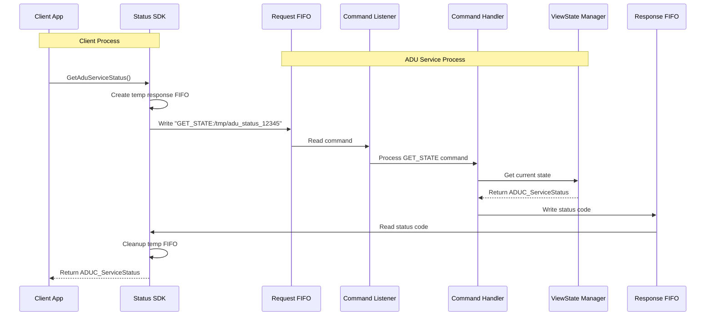
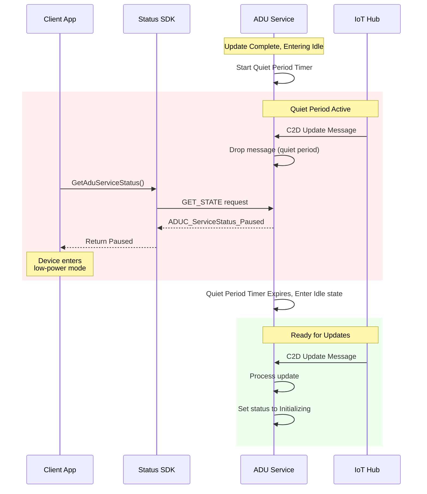
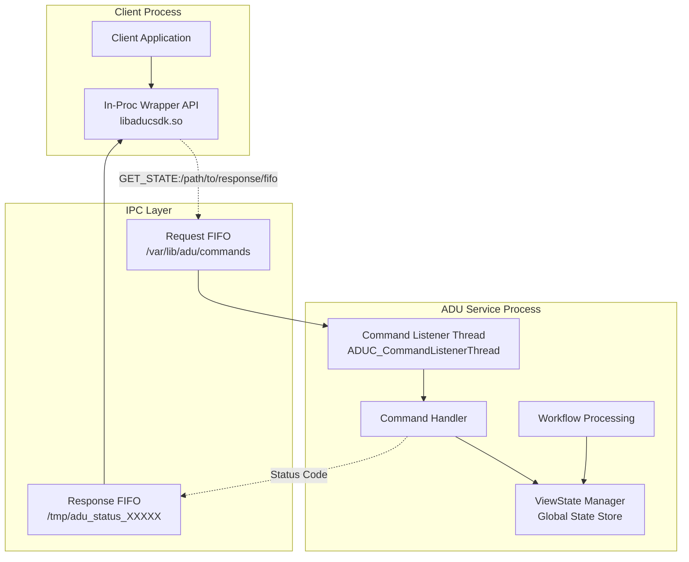
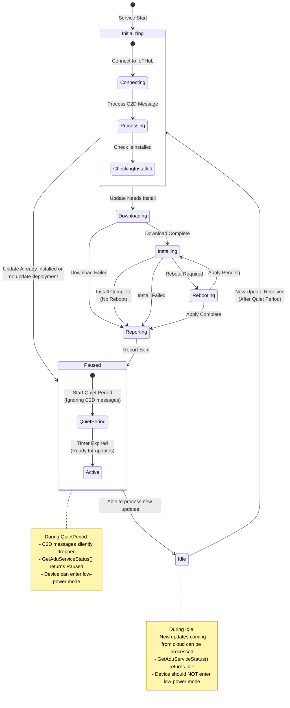

# SDK - GetAduServiceStatus

The SDK is a static library only development package that consists of the following development files:
* aducsdk.h header
* aducsdk.a static library
* aducsdk.pc pkgconfig

The .a static library will take care of all interprocess communication between the calling client process and the AducIotAgent service process.

It will be packaged as both a .deb Debian package as well as a tarball (.tgz) with the following structure:
```
# AMD64(x64) tarball
deviceupdateagent-dev-{ARCH}-1.0.0.tgz
├── /usr/include/aduc/
│   └── aducsdk.h
├── /usr/lib/
│   └── libaducsdk.a
└── /usr/lib/pkgconfig/
    └── aducsdk.pc

deviceupdateagent-dev-{ARCH}-1.0.0.deb
├── /usr/include/aduc/
│   └── aducsdk.h
├── /usr/lib/
│   └── libaducsdk.a
└── /usr/lib/pkgconfig/
    └── aducsdk.pc

where ARCH is x86_64, arm64, etc.
```

## The aducsdk.h development header

```c
#ifndef ADUC_SDK_H_
#define ADUC_SDK_H_

#ifdef __cplusplus
extern "C" {
#endif

/////////////////////
// BEGIN: V1.0 API

typedef enum tagADUC_ServiceStatus
{
    // V1.0 states
    ADUC_ServiceStatus_Initializing = 0,
    ADUC_ServiceStatus_Downloading  = 1,
    ADUC_ServiceStatus_Installing   = 2,
    ADUC_ServiceStatus_Rebooting    = 3,
    ADUC_ServiceStatus_Reporting    = 4,
    ADUC_ServiceStatus_Paused       = 5,
    ADUC_ServiceStatus_Idle         = 6,

    // V1.0 Error codes (10000+)
    ADUC_ServiceStatus_ERROR_UnsupportedApiVersion = 10000,
    ADUC_ServiceStatus_ERROR_AgentServiceNotRunning = 10001,
    ADUC_ServiceStatus_ERROR_AgentServiceBrokenPipe = 10002,
    ADUC_ServiceStatus_ERROR_AgentServicePermission = 10003,
    ADUC_ServiceStatus_ERROR_AgentServiceTimeout = 10004,
    ADUC_ServiceStatus_ERROR_AgentServiceInternal = 10005,
    ADUC_ServiceStatus_ERROR_Unknown = 99999,
} ADUC_ServiceStatus;

/**
 * @brief Gets the ADU IoT Agent service daemon's current status
 * @return Current service status or error code
 */
ADUC_ServiceStatus GetAduServiceStatus(void);

/**
 * @brief Gets human-readable string for status code
 * @param status The status code
 * @return The string representation (do not free the string)
 */
const char* ADUC_ServiceStatusToString(ADUC_ServiceStatus status);

// END: V1.0 API
/////////////////////

#ifdef __cplusplus
}
#endif

#endif // ADU_SDK_H_
```

The states in ADUC_ServiceStatus enum are "view states", a simplified high-level view of the AducIotAgent state.
It is designed for allowing the calling client process to determine if the agent is busy (with a bit more detail) or Idle.
This would allow another process to determine if it's safe to power-down (i.e. not currently installing an update or determining if an update is needed) to a low-power state to save battery, but at the same time ensure that any updates available are applied first.

The in-proc wrapper API will communicate to the AducIotAgent daemon process via IPC. Currently, it is a name-pipe FIFO request for ADU requests.

Internally, the CommandHandler will read the request. In the case of GET_STATE it also reads in the path to the response FIFO for writing the response status code.

Key points in the code will call an internal API to set these "view state" statuses on a ViewStateManager component and the CommandHandler will get the status from it.

## Pause State

The `ADUC_ServiceStatus_Paused` state will be returned from the `GetAduServiceStatus()` API before the agent enters `Idle` state.

The pause period is controlled by the `IdlePausePeriodSeconds` configuration in `du-config.json` for setting a pause period (in seconds).
During this pause period, the agent will ignore any incoming C2D messages. Therefore, no cancel, replacement, or new update deployment can begin during this interval.

Once the pause period timer has timed out, the API will then return `ADUC_ServiceStatus_Idle` and the agent would then be able to start processing any incoming push requests from IoTHub.

## Underlying Inter-Process Communication

The SDK .a static lib will write requests to the ADUC request FIFO and read responsese from the response FIFO that it sets up.
```c
// Command format with version
// "COMMAND:VERSION:ARGS:RESPONSEPATH"
// ARGS can be empty if no arguments
// Examples:
// "GET_STATE:1.0::/tmp/response_fifo_2345" -> Int32
// "SET_PAUSE:1.1:wait_ms=33:/tmp/response_fifo_4567" -> Int32 (example future API with arguments)

// Response format:
// status code as int32_t, 10000+ are error codes.
```

## Package Config
pkg-config is a tool used during compilation to provide info about installed libraries that finds the correct compiler and linker flags for the library so developers can avoid having to know to manually specify include paths (-I/usr/include/somelibrary), library paths (-L/usr/lib/x86_64-linux-gnu), library names (-llibsomelib), library dependencies (-lcrypto -lz), and version requirements.

The `aducsdk.pc` pkgconfig file will be installed into /usr/lib/pkgconfig/ and will contain metadata, e.g.:

```sh
# Example: libadusdk.pc
prefix=/usr
exec_prefix=${prefix}
libdir=${exec_prefix}/lib/aduc
includedir=${prefix}/include/aduc

Name: ADU Client SDK
Description: Azure Device Update SDK for external processes to interact directly with the ADU Client Service Daemon
Version 1.0.0
Libs: -L${libdir} -ladusdk
Cflags: -I${includedir}
```

The pkgcfg can be used in cmdline and CMake:

```sh
# command-line
gcc myapp.c $(pkg-config --cflags --libs libaducsdk)

# CMake CMakeLists.txt
find_package(PkgConfig)
pkg_check_modules(ADUCSDK REQUIRED libaducsdk)
target_link_libraries(myapp ${ADUCSDK_LIBRARIES})

# version checking
pkg-config --atleast-version=1.0 libaducsdk && echo "OK"
pkg-config --modversion libaducsdk  # prints 1.0.0
```


## Sequence Diagram for in-proc Wrapper API and GET_STATE cross-proc




## Sequence Diagram for Pause/Quiet period before entering Idle state



## State Flow Diagram: GET_STATE API



## State Flow Diagram: View States and Pause on enter Idle


