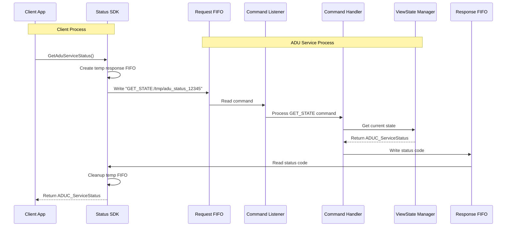
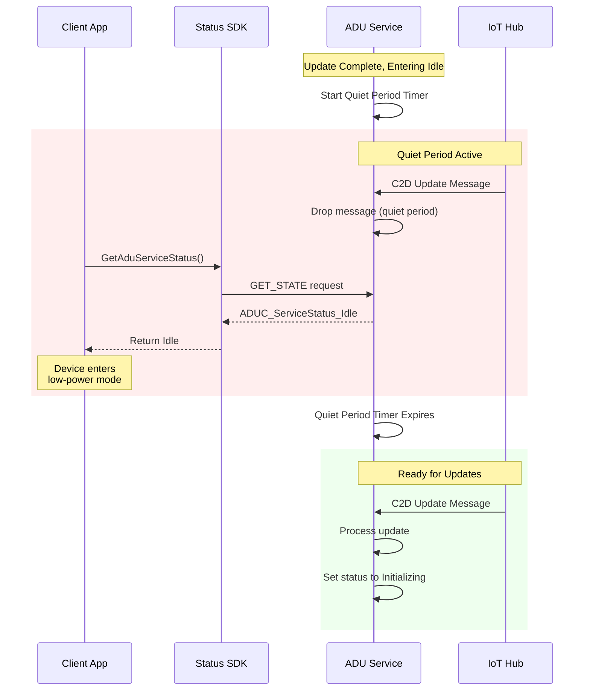
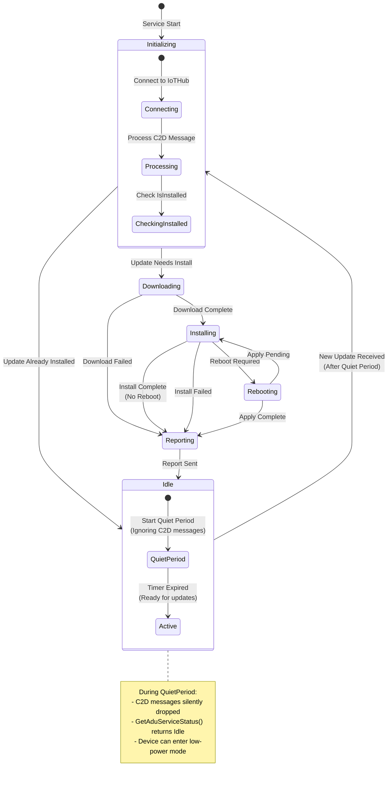

# SDK - GetAduServiceStatus

Consists of SDK devel package with the following wrapper API:

```c
typedef enum tagADUC_ServiceStatus
{
    ADUC_ServiceStatus_Initializing = 0,
    ADUC_ServiceStatus_Downloading  = 1,
    ADUC_ServiceStatus_Installing   = 2,
    ADUC_ServiceStatus_Rebooting    = 3,
    ADUC_ServiceStatus_Reporting    = 4,
    ADUC_ServiceStatus_Idle         = 5,
    ADUC_ServiceStatus_ERROR_AgentServiceNotRunning = 1001,
    ADUC_ServiceStatus_ERROR_AgentServiceBrokenPipe = 1002,
    ADUC_ServiceStatus_ERROR_AgentServiceInsufficientPermission = 1003,
    ADUC_ServiceStatus_ERROR_<others> // put more errors here
} ADUC_ServiceStatus;
 
/* Gets the AducIotAgent service daemon's current status regarding processing of any updates, or idle */
ADUC_ServiceStatus GetAduServiceStatus();
```

The states in ADUC_ServiceStatus enum are "view states", a simplified high-level view of the AducIotAgent state.
It is designed for allowing the calling client process to determine if the agent is busy (with a bit more detail) or Idle.
This would allow another process to determine if it's safe to power-down (i.e. not currently installing an update or determining if an update is needed) to a low-power state to save battery, but at the same time ensure that any updates available are applied first.

There is a `IdlePausePeriod` configuration in du-config.json for setting a pause period (in seconds) that will take effect when entering `Idle` state.
During the Idle Pause Period (IPP), the agent will ignore any other  
 
The in-proc wrapper API will communicate to the AducIotAgent daemon process via IPC. Currently, it is a name-pipe FIFO request for ADU requests.

Internally, the CommandHandler will read the request. In the case of GET_STATE it also reads in the path to the response FIFO for writing the response status code.

The view states are managed by the ViewStateManager:

```c
ADUC_ViewStateManager* ViewStateManager_GetInstance();
void ViewStateManager_SetStatus(ADUC_ServiceStatus status);
ADUC_ServiceStatus ViewStateManager_GetStatus();
```

and `ViewStateManager_SetStatus(status)` will be called at key points.

## Sequence Diagram for in-proc Wrapper API and GET_STATE cross-proc




## Sequence Diagram for Pause/Quiet period after entering Idle state



## State Flow Diagram: GET_STATE API


## State Flow Diagram: View States and Pause on enter Idle


