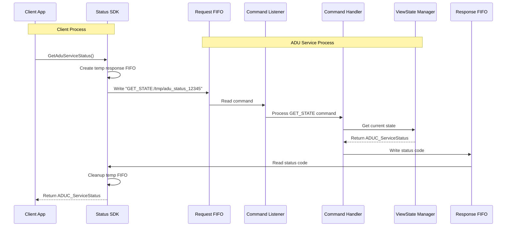
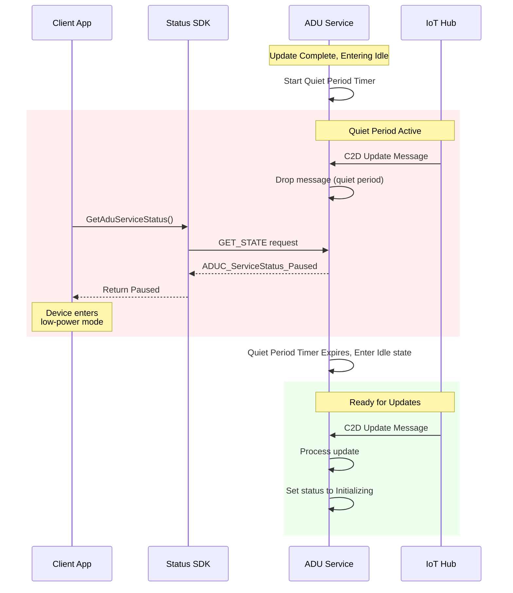
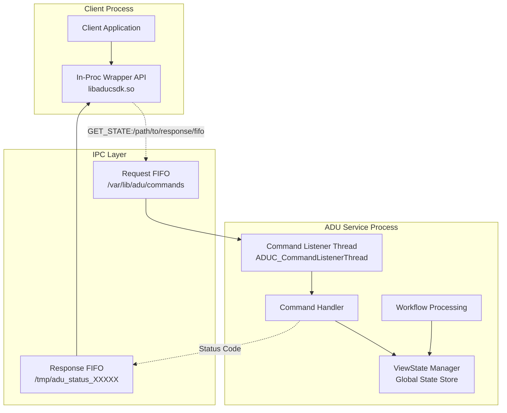
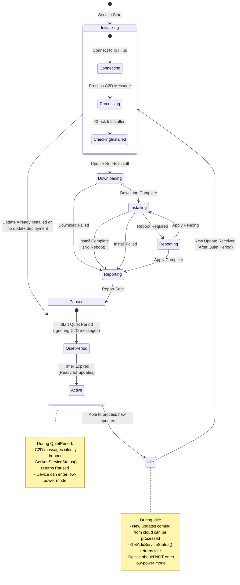

# SDK - GetAduServiceStatus

The SDK is a static library only devpkg consisting of the following files:
* aducsdk.h header
* libaducsdk.a static library
* aducsdk.pc pkgconfig
* aducsdk-config.cmake

The .a static library will take care of all interprocess communication between the calling client process and the AducIotAgent service process and the .h has the supported API.

## Building the SDK

### Prerequisites

Install pkg-config for library discovery:

**Ubuntu/Debian:**
```sh
sudo apt update && sudo apt install pkgconfig
```

**CentOS/RHEL/Fedora:**
```sh
sudo yum install pkgconfig  # CentOS/RHEL 7
sudo dnf install pkgconfig  # Fedora/RHEL 8+
```

### Build and Install

```sh
# Build the entire project (includes SDK)
./scripts/build.sh -c

# Or build just the SDK
cmake --build out --target aducsdk

# Install system-wide
sudo cmake --build out --target install
```

### Build Configuration Options

The SDK supports several build-time configuration options:

#### Request Timeout Configuration
```sh
# Set 30-second API cross-proc request timeout (default: 30 seconds)
cmake -DADUC_SDK_REQUEST_FIFO_TIMEOUT_SECS=15 ..
./scripts/build.sh -c
```

#### FIFO Path Configuration
```sh
# Custom FIFO path (default: /var/lib/adu/api/apireq.fifo)
cmake -DADUC_API_DEFAULT_FIFO_PATH="/custom/path/to/api/apireq.fifo" ..
./scripts/build.sh -c
```

## The aducsdk.h development header

The SDK header is at [src/sdk/inc/aduc/aducsdk.h](../../src/sdk/inc/aduc/aducsdk.h)
It consists of the ADUC_ServiceStatus enum, the integer values of which are returned from SDK API:
`ADUC_ServiceStatus GetAduServiceStatus(void);`
You can get a human-readable string for it with:
`const char* ADUC_ServiceStatusToString(ADUC_ServiceStatus status);`

The states in ADUC_ServiceStatus enum are "view states", a simplified high-level view of the AducIotAgent state.
It is designed for allowing the calling client process to determine if the agent is busy (with a bit more detail) or Idle.
This would allow another process to determine if it's safe to, e.g. power-down (i.e. not currently installing an update or determining if an update is needed) to a low-power state to save battery, but at the same time ensure that any updates available are applied first.

The in-proc wrapper API will communicate to the AducIotAgent daemon process via IPC. Currently, it is a name-pipe FIFO request for ADU requests.

Internally, the CommandHandler will read the request. In the case of GET_STATE it also reads in the path to the response FIFO for writing the response status code.

Key points in the code will call an internal API to set these "view state" statuses on a ViewStateManager component and the CommandHandler will get the status from it.

## Pause State

The `ADUC_ServiceStatus_Paused` state will be returned from the `GetAduServiceStatus()` API before the agent enters `Idle` state.

The pause period is controlled by the `IdlePauseMilliseconds` configuration in `du-config.json`.
During this pause period, the agent will ignore any incoming C2D messages. Therefore, no cancel, replacement, or new update deployment can begin during this interval.

Once the pause period timer has timed out and any queued reporting of results in C2D messaging have been sent, the API will then return `ADUC_ServiceStatus_Idle` and the agent would then be able to start processing any incoming push requests from IoTHub.

## The Cross-Proc wire protocol

The SDK libaducsdk.a static lib will write requests to the ADUC request FIFO and read responsese from the response FIFO that it sets up.  See more details in [apiproto.h](../../src/agent/api/inc/aduc/apiproto.h)

### Request Format
The request format is: `<ver><type><len><str>`
where ver, type, len are 16-bit values and str is a non-null-terminated utf-8 encoded string of length len (can be 0)
e.g. 0x01 0x01 0x13 '/data/resp1234.fifo' (note: the nibbles are in network order)

### Response Format
The Response consists of `<code><ret_val>`, both of which are a double word. e.g. 0x01 0x02 would indicate code 1 (response to query status) and ret_val 2 ([Downloading](../../src/sdk/inc/aduc/aducsdk.h))

## Package Config

pkg-config is a tool used during compilation to provide info about installed libraries that finds the correct compiler and linker flags for the library so developers can avoid having to know to manually specify include paths (-I/usr/include/somelibrary), library paths (-L/usr/lib/x86_64-linux-gnu), library names (-llibsomelib), library dependencies (-lcrypto -lz), and version requirements.

The `aducsdk.pc` pkgconfig file will be installed into `/usr/local/lib/pkgconfig/` (or `/usr/lib/pkgconfig/` for system packages) and contains metadata:

```sh
# Example: aducsdk.pc
prefix=/usr/local
exec_prefix=${prefix}
libdir=/usr/local/lib
includedir=/usr/local/include

Name: aducsdk
Description: Azure Device Update SDK for communicating with the ADU agent service
Version: 1.2.0
URL: https://github.com/Azure/iot-hub-device-update
Requires:
Libs: -L${libdir} -laducsdk
Cflags: -I${includedir}
```

### Using pkg-config

#### Command Line Usage
```sh
# Check if SDK is available
pkg-config --exists aducsdk && echo "SDK found!" || echo "SDK not found"

# Get compilation flags
pkg-config --cflags aducsdk
# Output: -I/usr/local/include

# Get linker flags
pkg-config --libs aducsdk
# Output: -L/usr/local/lib -laducsdk

# Get both together
pkg-config --cflags --libs aducsdk
# Output: -I/usr/local/include -L/usr/local/lib -laducsdk

# Check version
pkg-config --modversion aducsdk
# Output: 1.2.0

# Version checking
pkg-config --atleast-version=1.0 aducsdk && echo "Version OK"
```

#### Compile Applications
```sh
# Simple compilation
gcc myapp.c $(pkg-config --cflags --libs aducsdk) -o myapp

# With additional flags
gcc -Wall -g myapp.c $(pkg-config --cflags --libs aducsdk) -o myapp

# Cross-compilation (use PKG_CONFIG_PATH)
PKG_CONFIG_PATH=/path/to/cross/lib/pkgconfig \
  arm-linux-gnueabihf-gcc myapp.c $(pkg-config --cflags --libs aducsdk) -o myapp
```

#### CMake Integration
```cmake
# In your CMakeLists.txt
cmake_minimum_required(VERSION 3.5)
project(MyApp)

# Find pkg-config
find_package(PkgConfig REQUIRED)

# Find the ADU SDK
pkg_check_modules(ADUCSDK REQUIRED aducsdk)

# Create executable
add_executable(myapp main.c)

# Link with SDK
target_include_directories(myapp PRIVATE ${ADUCSDK_INCLUDE_DIRS})
target_link_libraries(myapp ${ADUCSDK_LIBRARIES})
target_compile_options(myapp PRIVATE ${ADUCSDK_CFLAGS_OTHER})

# Optional: Check version
if(ADUCSDK_VERSION VERSION_LESS "1.0")
    message(FATAL_ERROR "ADU SDK version 1.0 or higher required")
endif()
```

### Yocto Integration
For Yocto integration see [README-Yocto-Integration.md](../../src/sdk/README-Yocto-Integration.md)

## Sequence Diagram for in-proc Wrapper API and GET_STATE cross-proc




## Sequence Diagram for Pause/Quiet period before entering Idle state



## State Flow Diagram: GET_STATE API



## State Flow Diagram: View States and Pause on enter Idle


