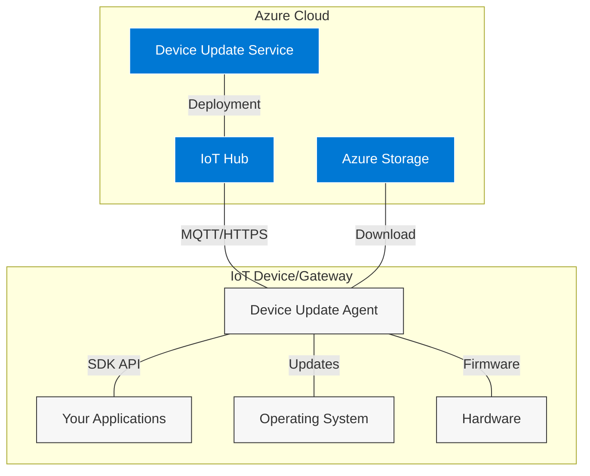

# Device Update for IoT Hub - Reference Agent Documentation

## Overview

Device Update for IoT Hub is an Azure service that enables secure, scalable over-the-air (OTA) updates for IoT devices. This repository contains the **reference implementation** of the Device Update agent - a comprehensive, production-ready agent that demonstrates best practices for integrating Device Update capabilities into IoT devices and applications.

> 📖 **For service documentation and tutorials**, visit [Device Update for IoT Hub on Microsoft Learn](https://docs.microsoft.com/azure/iot-hub-device-update/)

## What is the Device Update Agent?

The Device Update agent is a **local service** that runs on your IoT device and handles:

- **Secure Communication** with Azure IoT Hub using MQTT/MQTT-WS
- **Update Orchestration** including download, verification, and installation
- **Extensible Update Types** through pluggable handlers (APT, SWUpdate, scripts, etc.)
- **Security & Integrity** via cryptographic signature verification
- **Rollback & Recovery** for resilient update operations
- **Status Reporting** back to the Azure cloud service

## Why Use the Reference Agent?

### 🏗️ **Production Ready**

- Battle-tested codebase used by Microsoft and partners
- Comprehensive security model with root key validation
- Robust error handling and recovery mechanisms
- Extensive logging and diagnostics

### 🔧 **Highly Extensible**

- Plugin architecture for custom update types
- Multiple authentication methods (SAS, X.509, Azure Identity Service)
- Configurable transport protocols and download methods
- SDK for external application integration

### 🛡️ **Security First**

- End-to-end cryptographic validation
- Hierarchical trust model with root keys
- Secure sandbox execution environment
- Certificate-based device authentication

### 🚀 **Enterprise Features**

- Multi-component update support
- IoT Edge integration
- Power management for battery devices
- Comprehensive monitoring and diagnostics

## How Device Update Fits in IoT Architecture



## Documentation Structure

This documentation is organized to take you from concepts to implementation:

### 🎯 **Getting Started**

1. **[Architecture Overview](architecture-overview.md)** - Core components and communication flows
2. **[Quick Start Guide](quick-start.md)** - Get the agent running in 15 minutes
3. **[Configuration Guide](configuration-guide.md)** - Complete configuration reference

### 🏗️ **Core Concepts**

1. **[Agent Workflow](agent-workflow.md)** - How updates are processed end-to-end
2. **[Communication Model](communication-model.md)** - IoT Hub integration and protocols
3. **[Security Model](security-model.md)** - Cryptographic validation and trust chains
4. **[Extensibility Framework](extensibility-framework.md)** - Plugin architecture deep dive

### 🔧 **Implementation**

1. **[Building the Agent](how-to-build-agent-code.md)** - Build system, dependencies, and options
2. **[Running the Agent](how-to-run-agent.md)** - Deployment, service management, and monitoring
3. **[Authentication Setup](authentication-setup.md)** - SAS, X.509, and AIS configuration
4. **[Extension Development](extension-development.md)** - Creating custom update handlers

### 📱 **Integration**

1. **[SDK Integration](sdk-integration.md)** - Using the ADU SDK in your applications
2. **[IoT Edge Integration](iot-edge-integration.md)** - Module deployment and edge scenarios
3. **[Power Management](power-management.md)** - Battery optimization and status monitoring

### 🔍 **Operations**

1. **[Monitoring & Diagnostics](monitoring-diagnostics.md)** - Logging, telemetry, and troubleshooting
2. **[Update Manifest Schema](update-manifest-schema.md)** - Understanding update packages
3. **[Troubleshooting Guide](troubleshooting-guide.md)** - Common issues and solutions

### 📚 **Reference**

1. **[Configuration Schema](configuration-schema-reference.md)** - Complete JSON schema documentation
2. **[API Reference](api-reference.md)** - SDK APIs and extension interfaces
3. **[Error Codes](device-update-agent-extended-result-codes.md)** - Complete error code reference
4. **[Security Root Keys](security-rootkey-package.md)** - Root key package system

## Quick Navigation

### By Role

- **🔰 New to Device Update**: Start with [Architecture Overview](architecture-overview.md) → [Quick Start](quick-start.md)
- **📱 App Developer**: [SDK Integration](sdk-integration.md) → [Power Management](power-management.md)
- **🔧 Device Integrator**: [Building the Agent](how-to-build-agent-code.md) → [Authentication Setup](authentication-setup.md)
- **🏗️ Extension Developer**: [Extensibility Framework](extensibility-framework.md) → [Extension Development](extension-development.md)
- **🛠️ DevOps Engineer**: [Running the Agent](how-to-run-agent.md) → [Monitoring & Diagnostics](monitoring-diagnostics.md)

### By Scenario

- **🚀 Quick Evaluation**: [Quick Start Guide](quick-start.md)
- **🏭 Production Deployment**: [Security Model](security-model.md) → [Authentication Setup](authentication-setup.md)
- **🔋 Battery-Powered Devices**: [Power Management](power-management.md) → [SDK Integration](sdk-integration.md)
- **🌐 Edge Computing**: [IoT Edge Integration](iot-edge-integration.md)
- **🔧 Custom Update Types**: [Extension Development](extension-development.md)

## Key Features by Version

| Feature | Agent v1.1 | Agent v1.2+ | Description |
|---------|------------|-------------|-------------|
| **Basic Updates** | ✅ | ✅ | APT, SWUpdate, Script handlers |
| **Multi-Component** | ✅ | ✅ | Proxy updates and component enumeration |
| **X.509 Auth** | ⚠️ Limited | ✅ | Full certificate authentication |
| **SDK API** | ❌ | ✅ | External application integration |
| **Power Management** | ❌ | ✅ | Battery optimization features |
| **Enhanced Security** | ✅ | ✅ | Root key package validation |
| **Schema Version** | 1.1 | 1.2 | Configuration schema |

## Prerequisites

### System Requirements

- **Linux**: Ubuntu 18.04+, Debian 10+, or equivalent
- **Architecture**: x64, ARM32, ARM64
- **Memory**: 128MB RAM minimum, 256MB recommended
- **Storage**: 100MB for agent, additional space for updates
- **Network**: Internet connectivity for Azure IoT Hub

### Development Requirements

- **Compiler**: GCC 7.4+ or Clang 6.0+
- **CMake**: 3.5 or later
- **OpenSSL**: 1.1.1+ for cryptographic operations
- **curl**: For HTTP/HTTPS downloads (optional)

## Getting Help

### Community & Support

- **📖 Documentation**: [Microsoft Learn - Device Update](https://docs.microsoft.com/azure/iot-hub-device-update/)
- **🐛 Issues**: [GitHub Issues](https://github.com/Azure/iot-hub-device-update/issues)
- **💬 Discussions**: [GitHub Discussions](https://github.com/Azure/iot-hub-device-update/discussions)
- **📧 Support**: [Azure Support](https://azure.microsoft.com/support/)

### Contributing

- **🤝 Contributing Guide**: [CONTRIBUTING.md](../../CONTRIBUTING.md)
- **📋 Code of Conduct**: [CODE_OF_CONDUCT.md](../../CODE_OF_CONDUCT.md)
- **🔒 Security**: [SECURITY.md](../../SECURITY.md)

## Sample Configurations

### Basic Configuration (Connection String)

```json
{
  "schemaVersion": "1.2",
  "aduShellTrustedUsers": ["adu", "do"],
  "iotHubProtocol": "mqtt",
  "agents": [
    {
      "name": "main",
      "runas": "adu",
      "connectionSource": {
        "connectionType": "string",
        "connectionData": "HostName=hub.azure-devices.net;DeviceId=device01;SharedAccessKey=..."
      },
      "manufacturer": "Contoso",
      "model": "Smart-Vacuum-v1"
    }
  ]
}
```

### X.509 Certificate Authentication

```json
{
  "schemaVersion": "1.2",
  "aduShellTrustedUsers": ["adu", "do"],
  "iotHubProtocol": "mqtt",
  "agents": [
    {
      "name": "main",
      "runas": "adu",
      "connectionSource": {
        "connectionType": "X509",
        "connectionData": "HostName=hub.azure-devices.net;DeviceId=device01;x509=true",
        "connectionX509CertFilePath": "/etc/adu/certs/client.pem",
        "connectionX509PrivateKeyFilePath": "/etc/adu/certs/client.key",
        "connectionX509CaCertFilePath": "/etc/adu/certs/ca.pem"
      },
      "manufacturer": "Contoso",
      "model": "Smart-Vacuum-v1"
    }
  ]
}
```

### Power Management Configuration

```json
{
  "schemaVersion": "1.2",
  "aduShellTrustedUsers": ["adu", "do"],
  "iotHubProtocol": "mqtt",
  "idlePauseMilliseconds": 30000,
  "agents": [
    {
      "name": "main",
      "runas": "adu",
      "connectionSource": {
        "connectionType": "string",
        "connectionData": "HostName=hub.azure-devices.net;DeviceId=battery-device;SharedAccessKey=..."
      },
      "manufacturer": "Contoso",
      "model": "Battery-Sensor-v2"
    }
  ]
}
```

---

> **Next Steps**: Start with the [Architecture Overview](architecture-overview.md) to understand the core concepts, then proceed to the [Quick Start Guide](quick-start.md) to get hands-on experience.
