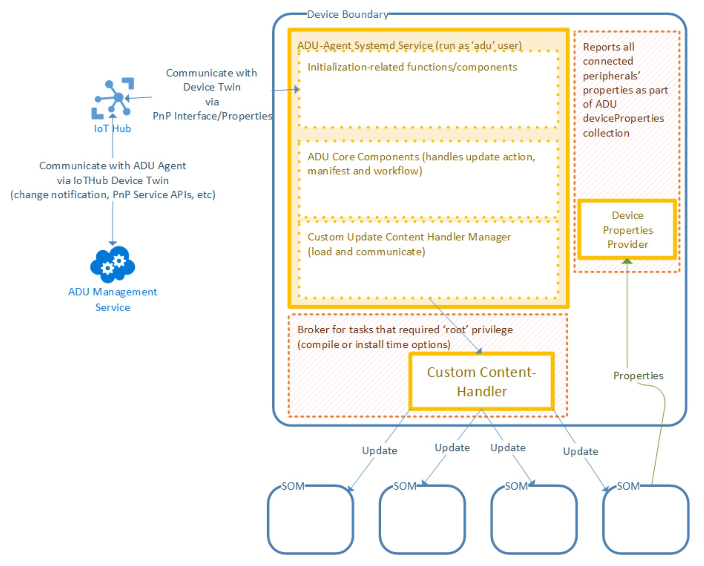

# Device Update Agent Core Library

## Quick Jump

- [Design Goals](#design-goals)
- [Architecture Diagram](#device-update-agent-architecture-diagram)
  
## Design Goals

- Support multiple update agent processes. See [Multiple Update Agent Processes](#multiple-update-agent-processes)
- Improve agent configurability. See [Configuration Manager](./configuration-manager.md)

### Device Update Agent Architecture Diagram

The following diagram demonstrates high level architecture of **Device Update Agent v0.6.0 public preview**.  
Note that the two supported Update Content Handlers are statically linked into the Agent executable. Only one handler can be included in the Agent, and selected at compile time.

## What's New?

The following diagram demonstrates high level architecture of **Device Update Agent v0.7.0 public preview**.  
This new version contains many new features such as PnP Module Id support, improved extensibility, multiple instances of Device Agent on the same device, a complex update scenarios such as Multi-Component Update.

### Multiple Child Agent Processes

The new Device Update Agent supports multiple child processes where each process communicates to IoT Hub using a separate Module Identity.  

This enables a scenario where multiple updates can be deployed to the same device but target different agents. Each agent can be classified differently and belongs to a separate targetable group.  

See [Configuration Manager](./configuration-manager.md) for more detail.

### Update Content Handler Extensions

The `Update Content Handler Manager` will dynamically load a Custom Update Content Handler based on the Update Type specified in the `Update Manifest`.  

The existing two Content Handlers, Microsoft APT Update Handler and Microsoft SWUpdate Handler now become the shared libraries.  

See [Update Content Handler](./update-content-handler.md) for more detail.

### Multi-Component Update

With the new extensibility model, Device Builder can implement a customized Update Content Handler that can deliver an update to one or more brown-field devices connected to the hub or host device.  
  
The following diagram demonstrates a high-level overview of Device Update Agent with the Custom Content Handler that can install updates on four connected devices.  

The [`Component Enumerator`](../multi-component-update/component-enumerator.md) (shown as Device Properties Provider), developed by Device Builder, can reports additional component information to IoT Hub Module Twin (e.g., per-component update result details)

See [Multi Component Update](../multi-component-update/overview.md) for more detail.
