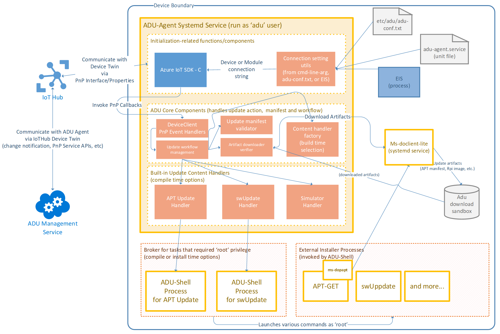
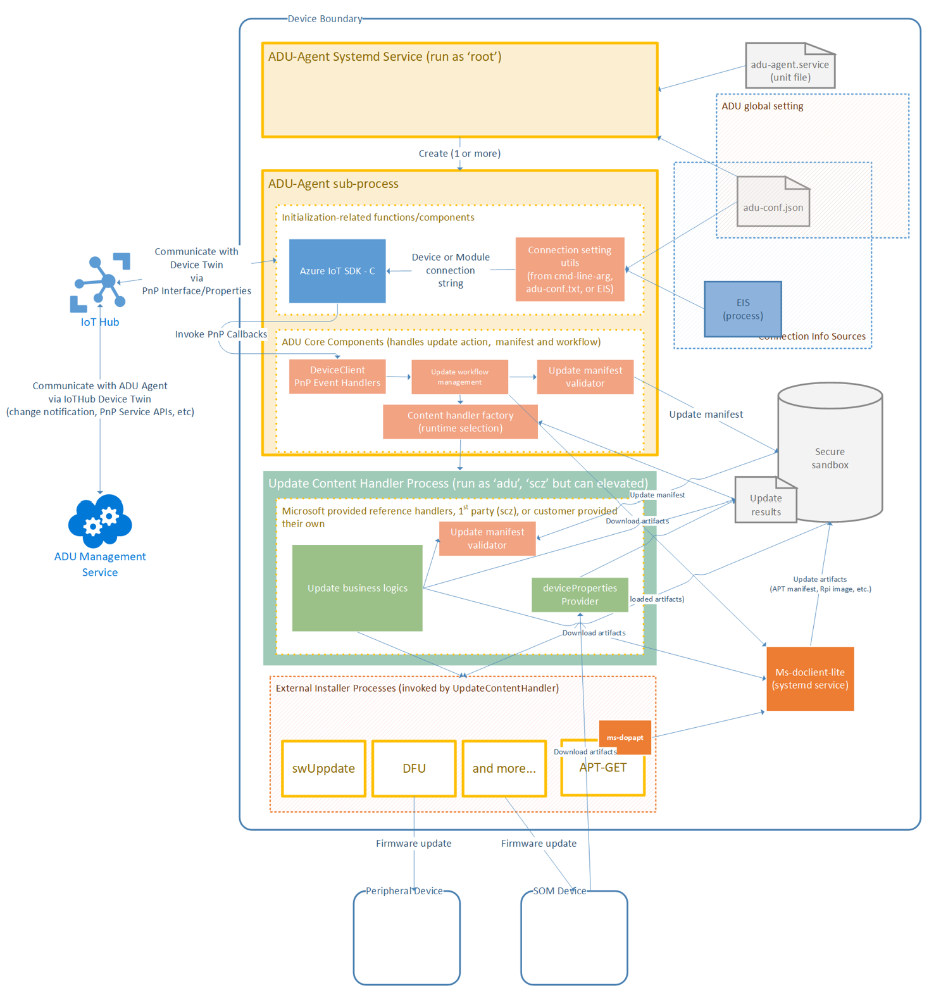

# Update Content Handler Extension
To support various software installation technologies and tools, the 2021 Q2 release of the Device Update Agent will support the Update Content Handler extension.  
  
The older versions of Device Update Agent only support two Update Types, `microsoft/apt:1`, and `microsoft/swupdate:1`, and only accepting one Update Type (selected at build time) per each flavor of the agent.
  
E.g., deviceupdate-agent Debian Package only supports `microsoft/apt:1` Update Type. The Device Update agent built as part of the reference Yocto Raspberry Pi 3 image only supports `microsoft/swupdate:1`.

## Quick Jump
- [What's New](#whats-new)
- [Device Update Agent With Plug-in Support](#device-update-agent-with-plug-in-support)
- [How To Implement An Update Content Handler](#how-to-implement-an-update-content-handler)
- [Installing a  Update Content Handler](#installing-an-update-content-handler)
- [Registering The Update Content Handler with Device Update Agent](#Registering-The-Update-Content-Handler-with-Device-Update-Agent)
- [List Of Supported Update Content Handler](#list-of-supported-update-content-handler)
## What's New?
### Device Update Agent (Pubic Preview) Architecture Diagram
For reference, the following diagram demonstrates high level architecture of **Device Update Again v0.6.0 public preview**.  
Note that the two supported Update Content Handlers are statically linked into the Agent executable. Only one handler can be included in the Agent, and selected at compile time.



### Device Update Agent With Plug-In Support
The following diagram demonstrates high level architecture of **Device Update Agent v0.7.0 public preview**.  
The `Update Content Handler Manager` will dynamically loads a Custom Update Content Handler that can handle the Update Type specified in the `Update Manifest`.


A simplified diagram with [`Component Enumerator`](../multi-component-update/component-enumerator.md) (shown as Device Properties Provider)


### How To Implement An Update Content Handler
The Update Content Handler is a linux shared library that support following APIs:

```

/**
 * @interface ContentHandler
 * @brief Interface for content specific handler implementations.
 */
class ContentHandler
{
public:
    // Delete copy ctor, copy assignment, move ctor and move assignment operators.
    ContentHandler(const ContentHandler&) = delete;
    ContentHandler& operator=(const ContentHandler&) = delete;
    ContentHandler(ContentHandler&&) = delete;
    ContentHandler& operator=(ContentHandler&&) = delete;

    virtual ~ContentHandler() = default;

    virtual ADUC_Result Prepare(const ADUC_PrepareInfo* prepareInfo) = 0;
    virtual ADUC_Result Download() = 0;
    virtual ADUC_Result Install() = 0;
    virtual ADUC_Result Apply() = 0;
    virtual ADUC_Result Cancel() = 0;
    virtual ADUC_Result IsInstalled(const std::string& installedCriteria) = 0;

protected:
    ContentHandler() = default;
};

/**
 * @brief Constructor
 * This function instantiates and returns ContentHandler object.
 */
std::unique_ptr<ContentHandler> CreateUpdateContentHandlerExtension(const ContentHandlerCreateData& data)

```

See [Microsoft APT Update Content Handler](../../../src/content_handlers/apt_handler) for example.

### Installing An Update Content Handler
All Update Content Handlers should be install at:

```
/usr/lib/adu/handlers.d/<first part of Update Type>/<second part of Update Type>/<update type version>/` directory.  
```

For example, `libmicrosoft-apt-1.so` is a handler for the `microsoft/apt:1` Update Type.  
This handler should be installed at:  
```
/usr/lib/adu/handlers.d/microsoft/apt/1/libmicrosoft-apt-1.so
```

### Registering The Update Content Handler with Device Update Agent
In order for the Device Update Agent to trust an installed handler, the Device Build must add the handler's information in [Device Update Agent Configuration File](./configuration-manager.md#configuration-file-format) under `updateHandlers` section.  
  
For example:
```
"updateHandlers":[
    {
        "updateType":"microsoft/apt:1",
        "path":"/user/lib/adu/handlers.d/microsoft-apt-1/libmicrosoft-apt-1.so",
        "sha256":"xAbsdf802x3233="
    },
```

> Note that the specified `sha256` hash will be used to validate the handler file integrity.

## List Of Supported Update Content Handler
- Microsoft APT Update Content Handler
- Microsoft SWUpdate Content Handler
- [Microsoft Multi Component Update Content Handler](../multi-component-update/overview.md)