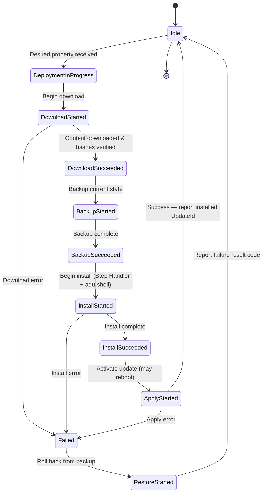

# Azure Device Update Agent — Architecture Overview

> **Applies to:** ADU agent v1.3.0-rc1

This document provides a high-level overview of the Device Update for IoT Hub agent
architecture: its components, communication model, extension system, security layers,
and update lifecycle. For build instructions see
[how-to-build-agent-code.md](how-to-build-agent-code.md).

---

## Agent Components

The agent is composed of three main layers:

| Component | Description |
|-----------|-------------|
| **Agent process** (`AducIotAgent`) | Long-running daemon that connects to Azure IoT Hub, receives deployments via device-twin desired properties, orchestrates the update workflow, and reports status through reported properties. Registers three PnP components: `deviceUpdate`, `deviceInformation`, and `diagnosticInformation`. |
| **adu-shell** | A sandboxed child process that executes privileged operations (e.g., `apt-get install`, custom scripts) on behalf of the agent. The agent never runs package-manager commands directly — all such work is delegated to adu-shell to limit the attack surface. |
| **Extensions (plugins)** | Dynamically-loaded shared libraries (`.so` / `.dll`) that implement content downloading, update installation, delta processing, and component enumeration. See [Extension Plugin Architecture](#extension-plugin-architecture) below and [device-update-agent-extensibility-points.md](device-update-agent-extensibility-points.md) for details. |

### Key Source Directories

```
src/
├── agent/                  # Entry point (main.c), PnP helper, device info
├── adu_workflow/            # Update state machine & goal-state processing
├── adu-shell/               # Sandboxed execution environment
├── communication_managers/  # IoT Hub transport (MQTT / MQTT-WS)
├── extensions/              # All plugin types (see below)
├── rootkey_workflow/         # Root key package lifecycle
├── utils/                   # JWS, crypto, config, hashing utilities
├── sdk/                     # Service Status API (GetAduServiceStatus)
└── platform_layers/         # OS-specific implementations (Linux, Windows)
```

---

## Communication Flow

```
┌──────────────────────┐         MQTT / MQTT-WS          ┌──────────────────────┐
│   ADU Agent          │◄────────────────────────────────►│   Azure IoT Hub      │
│                      │   desired props (deployment)     │                      │
│  ┌────────────────┐  │   reported props (status)        │  Device Update       │
│  │ PnP Components │  │   direct methods (diagnostics)   │  service backend     │
│  └────────────────┘  │                                  └──────────────────────┘
│          │           │
│          ▼           │         HTTPS (libcurl / DO)     ┌──────────────────────┐
│  ┌────────────────┐  │◄────────────────────────────────►│  Azure Blob Storage  │
│  │ Content        │  │   Download update payloads       │  (update content)    │
│  │ Downloader     │  │                                  └──────────────────────┘
│  └────────────────┘  │
└──────────────────────┘
```

1. **Receive deployment** — The IoT Hub service sets a desired property on the
   device twin containing the update action and a signed update manifest (v4).
2. **Download** — The agent's content downloader fetches payloads from Azure
   Blob Storage over HTTPS (optionally via the Delta Download Handler).
3. **Install & Apply** — The appropriate Step Handler and adu-shell execute the
   update on the device.
4. **Report status** — The agent writes workflow state, result codes, and the
   installed update ID back to IoT Hub as reported properties.

The agent authenticates to IoT Hub using either a **connection string** or
**X.509 client certificates** (new in 1.3.0 —
see [how-to-x509-authentication.md](how-to-x509-authentication.md)).

---

## Extension Plugin Architecture

All extensions are loaded at runtime via `dlopen` / `LoadLibrary` and must export
a `GetContractInfo` symbol for version negotiation. The Extension Manager
(`src/extensions/extension_manager/`) coordinates loading and invocation.

| # | Extension Type | Purpose | Example Implementations |
|---|----------------|---------|-------------------------|
| 1 | **Content Downloader** | Downloads a file entity from a URL to a local work folder. | `curl_downloader` (default in 1.3.0), `deliveryoptimization_downloader` |
| 2 | **Download Handler** | Pre-processes downloaded content (e.g., applies a binary delta to reconstruct the full payload). Runs *before* the Content Downloader when metadata indicates a delta is available. | `microsoft_delta_download_handler` |
| 3 | **Step Handler** | Performs the actual install/apply for a single update step (backup → install → apply → restore on failure). | `apt_handler`, `script_handler`, `swupdate_handler_v2`, `simulator_handler` |
| 4 | **Update Manifest Handler** | Parses and validates the update manifest, then dispatches each step to the correct Step Handler. | `steps_handler` (built-in, handles manifest v4 "steps" type) |
| 5 | **Component Enumerator** | Enumerates device sub-components (e.g., sensors, MCUs) so the agent can target multi-component updates. | Custom implementations per device class |

For a deep dive into writing custom extensions, see
[device-update-agent-extensibility-points.md](device-update-agent-extensibility-points.md).

---

## Security Model

### Cryptographic Verification

Every update manifest received from the service is wrapped in a **JWS (JSON Web
Signature, RFC 7515)**. The agent validates the signature before any content is
downloaded or installed.

```
Root Key Package (from service)
  │
  ├─ Self-verified JWS
  │
  ▼
Trusted Root Keys
  │
  ├─ Verify intermediate Signed JSON Web Keys (SJWK)
  │
  ▼
Signing Key
  │
  ├─ Verify Update Manifest JWS
  │
  ▼
Update Manifest (trusted)
  │
  ├─ Contains SHA-256 hashes of each payload file
  │
  ▼
Downloaded content integrity check
```

**Key components:**

- **Root Key Package** (`src/rootkey_workflow/`, `src/utils/rootkeypackage_utils/`) —
  A signed bundle of trusted root public keys, fetched from the service and
  verified via its own JWS. Also carries a disabled-key list for revocation.
- **JWS utilities** (`src/utils/jws_utils/`) — `VerifyJWSWithSJWK()`,
  `VerifyJWSWithKey()`, and `IsSigningKeyDisallowed()` implement the full
  trust-chain verification.
- **Content hashing** — After download, each payload file's SHA-256 hash is
  compared against the hash declared in the verified manifest.

### Sandboxing (adu-shell)

The main agent process runs with limited privileges. All privileged operations
(package installs, script execution, file-system modifications) are delegated to
**adu-shell**, which runs as a separate child process. This ensures that a
compromised extension cannot directly escalate privileges within the agent
process.

---

## Update Lifecycle

The agent's workflow engine (`src/adu_workflow/`) implements the following state
machine. For goal-state processing details, see
[goal-state-support.md](goal-state-support.md).



**Lifecycle summary:**

1. **Idle** — Agent is connected to IoT Hub, waiting for work.
2. **Deployment received** — A desired-property update carries the signed manifest.
3. **Download** — Content Downloader (and optionally the Delta Download Handler)
   fetches payloads; hashes are checked against the manifest.
4. **Backup** — Current device state is saved so it can be restored on failure.
5. **Install** — The matched Step Handler invokes adu-shell to apply packages or
   run scripts.
6. **Apply** — The update is activated (may trigger a device reboot).
7. **Report** — The agent reports success (with the new UpdateId) or failure
   (with extended result codes) to IoT Hub.
8. **Idle** — The agent returns to the idle state, ready for the next deployment.

---

## Key 1.3.0 Features

| Feature | Summary | More Info |
|---------|---------|-----------|
| **X.509 client certificate authentication** | Authenticate to IoT Hub using device certificates instead of connection strings — required for production deployments at scale. | [how-to-x509-authentication.md](how-to-x509-authentication.md) |
| **Delta Download Handler** | Downloads only the binary difference between the currently installed version and the target, significantly reducing bandwidth. Falls back to a full download if delta reconstruction fails. | [building-with-delta-handler.md](building-with-delta-handler.md) |
| **Service Status API (CrossProc)** | A shared-library API (`GetAduServiceStatus()`) that allows other processes on the device to query the agent's current state (Idle, Downloading, Installing, etc.) without IoT Hub round-trips. | [GetAduServiceStatus.md](GetAduServiceStatus.md) |
| **curl as default Content Downloader** | `curl_downloader` replaces Delivery Optimization as the default content downloader, reducing external dependencies while supporting proxies and standard HTTPS. | [how-to-build-agent-code.md](how-to-build-agent-code.md) |

---

## Further Reading

- [how-to-build-agent-code.md](how-to-build-agent-code.md) — Building the agent from source
- [device-update-agent-extensibility-points.md](device-update-agent-extensibility-points.md) — Extension contracts and registration
- [goal-state-support.md](goal-state-support.md) — Goal-state and multi-step processing
- [update-manifest-v4-schema.md](update-manifest-v4-schema.md) — Update manifest format reference
- [device-update-agent-extended-result-codes.md](device-update-agent-extended-result-codes.md) — Error and result code reference
