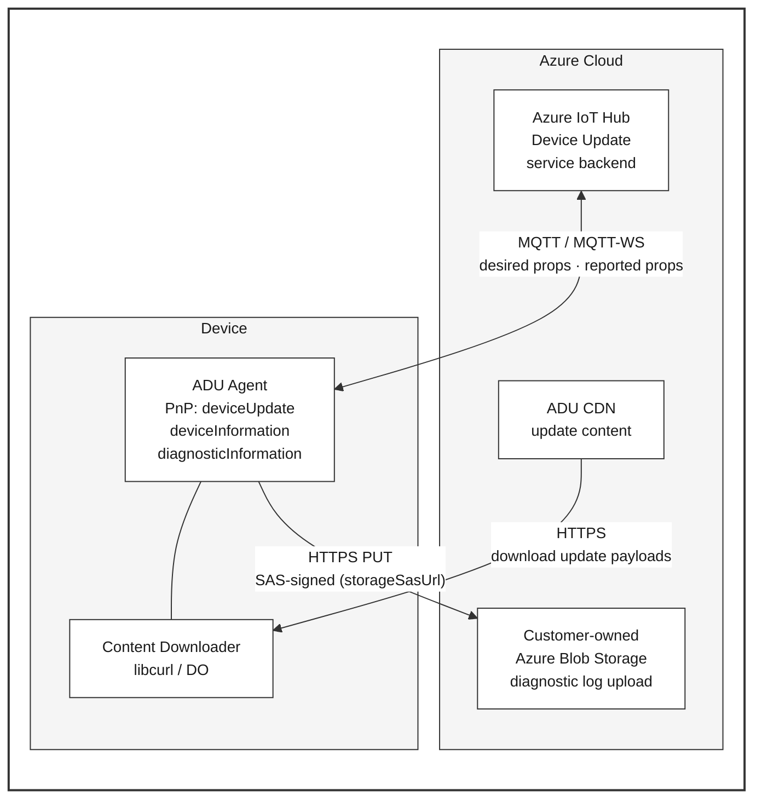
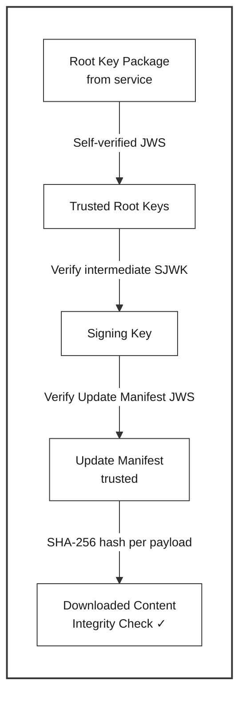
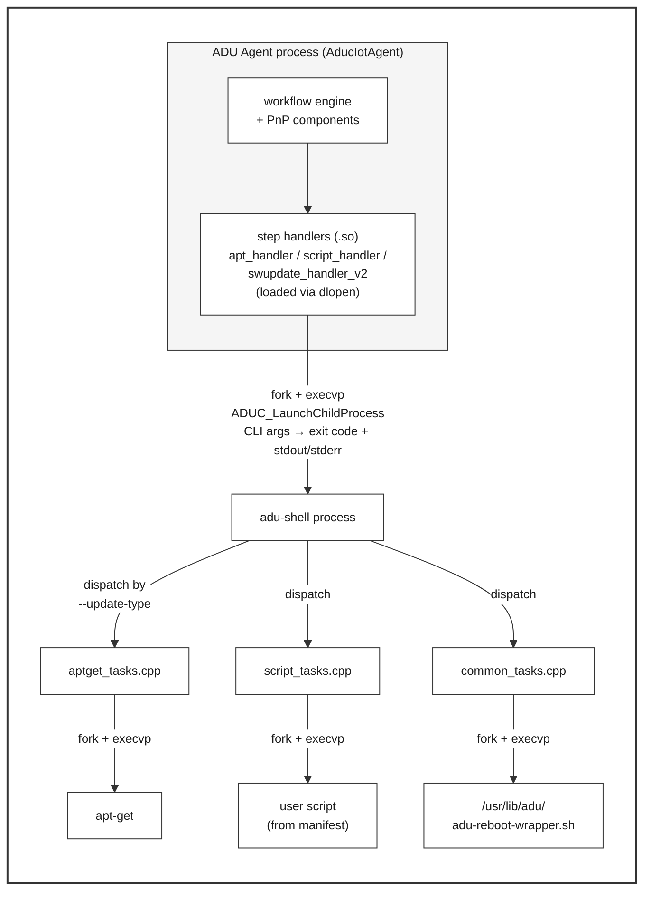
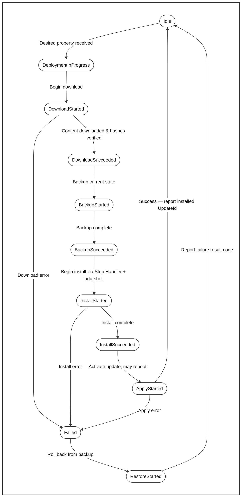
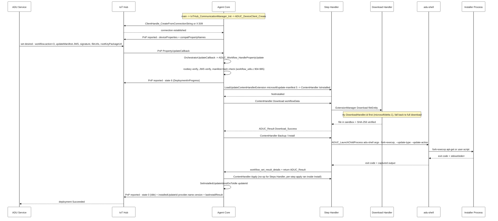
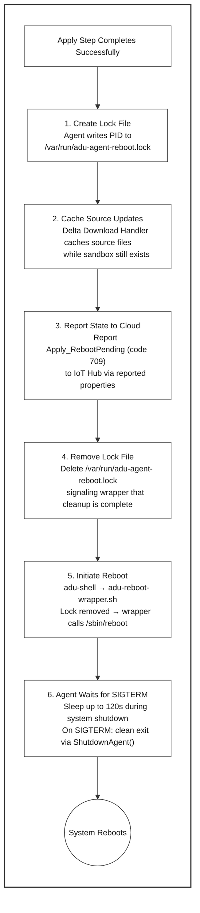

# Azure Device Update Agent — Architecture Overview

> **Applies to:** ADU agent v1.3.0-rc1

This document provides a high-level overview of the Device Update for IoT Hub agent
architecture: its components, communication model, extension system, security layers,
and update lifecycle. For build instructions see
[how-to-build-agent-code.md](how-to-build-agent-code.md).

---

## Table of Contents

- [Agent Components](#agent-components)
  - [Key Source Directories](#key-source-directories)
- [Communication Flow](#communication-flow)
- [Extension Plugin Architecture](#extension-plugin-architecture)
- [Security Model](#security-model)
  - [Cryptographic Verification](#cryptographic-verification)
  - [Process Model & adu-shell](#process-model--adu-shell)
- [Update Lifecycle](#update-lifecycle)
- [End-to-End Flow](#end-to-end-flow)
  - [Happy-path sequence](#happy-path-sequence)
  - [1. Establishing the IoT Hub Connection](#1-establishing-the-iot-hub-connection)
  - [2. Receiving Desired-Property Updates](#2-receiving-desired-property-updates)
  - [3. Trust Chain and Content Verification](#3-trust-chain-and-content-verification)
  - [4. Processing a Deployment or Cancellation](#4-processing-a-deployment-or-cancellation)
  - [5. Downloading Payloads and the Download Handler](#5-downloading-payloads-and-the-download-handler)
  - [6. Workflow Orchestration and State Transitions](#6-workflow-orchestration-and-state-transitions)
  - [7. Multi-Step Update Iteration](#7-multi-step-update-iteration)
  - [8. Process Management and Privilege Elevation](#8-process-management-and-privilege-elevation)
  - [9. Context and Result Hand-Off Across Boundaries](#9-context-and-result-hand-off-across-boundaries)
  - [10. Reporting State and Result to IoT Hub](#10-reporting-state-and-result-to-iot-hub)
  - [⚠️ Idle requires an accurate `installedUpdateId`](#️-idle-requires-an-accurate-installedupdateid)
- [Update Manifest v5 — Field → Agent Consumption Map](#update-manifest-v5--field--agent-consumption-map)
  - [Twin envelope (delivered to the agent over PnP `deviceUpdate.service`)](#twin-envelope-delivered-to-the-agent-over-pnp-deviceupdateservice)
  - [Manifest body (inside the signed `updateManifest` JWS payload)](#manifest-body-inside-the-signed-updatemanifest-jws-payload)
- [Reported Properties Contract](#reported-properties-contract)
  - [Which states reach the wire](#which-states-reach-the-wire)
  - [Authoritative JSON shape](#authoritative-json-shape)
  - [Field-by-field semantics](#field-by-field-semantics)
  - [Worked examples](#worked-examples)
  - [Service expectations](#service-expectations)
- [Key 1.3.0 Features](#key-130-features)
- [Graceful Reboot Flow](#graceful-reboot-flow)
  - [Sequence](#sequence)
  - [Key Files](#key-files)
  - [Wrapper Timeout & Safety](#wrapper-timeout--safety)
- [Further Reading](#further-reading)

---

## Agent Components

The agent is composed of three main layers:

| Component | Description |
|-----------|-------------|
| **Agent process** (`AducIotAgent`) | Long-running daemon that connects to Azure IoT Hub, receives deployments via device-twin desired properties, orchestrates the update workflow, and reports status through reported properties. Registers three PnP components: `deviceUpdate`, `deviceInformation`, and `diagnosticInformation`. |
| **adu-shell** | A **separate child process** (not a library) that executes privileged on-device operations on behalf of the agent — package-manager commands (`apt-get`), user scripts, and the reboot wrapper. The agent invokes it via `fork()` + `execvp()` and reads back the exit code plus captured stdout/stderr. See [Process Model & adu-shell](#process-model--adu-shell) for the full picture. |
| **Extensions (plugins)** | Dynamically-loaded shared libraries (`.so` / `.dll`) loaded **in-process** via `dlopen` / `LoadLibrary`. They implement content downloading, update installation, delta processing, and component enumeration. Because they run in-process, agent ↔ extension communication is direct function calls — there is no IPC overhead, but a misbehaving extension can crash the agent. See [Extension Plugin Architecture](#extension-plugin-architecture) below and [device-update-agent-extensibility-points.md](device-update-agent-extensibility-points.md) for details. |

### Key Source Directories

```
src/
├── agent/                  # Entry point (main.c), PnP helper, device info
├── adu_workflow/            # Update state machine & goal-state processing
├── adu-shell/               # Sandboxed execution environment
├── communication_managers/  # IoT Hub transport (MQTT / MQTT-WS)
├── extensions/              # All plugin types (see below)
├── rootkey_workflow/         # Root key package lifecycle
├── utils/                   # JWS, crypto, config, hashing utilities
├── sdk/                     # Service Status API (GetAduServiceStatus)
└── platform_layers/         # OS-specific implementations (Linux, Windows)
```

---

## Communication Flow



1. **Receive deployment** — The IoT Hub service sets a desired property on the
   device twin containing the update action and a signed update manifest
   (v4 or v5).
2. **Download** — The agent's content downloader fetches payloads from the
   **ADU CDN** over HTTPS (optionally via the Delta Download Handler).
3. **Install & Apply** — The appropriate Step Handler and adu-shell execute the
   update on the device. (On-device process boundaries are shown in
   [Process Model & adu-shell](#process-model--adu-shell).)
4. **Report status** — The agent writes workflow state, result codes, and the
   installed update ID back to IoT Hub as reported properties on the
   `deviceUpdate` PnP component.
5. **Diagnostic log upload (separate flow)** — When the operator triggers a
   diagnostic log collection from the portal, the service writes a SAS URL
   (`storageSasUrl`) and `operationId` onto the `diagnosticInformation`
   component's desired property. The agent uploads collected logs directly to
   the **customer-owned Azure Blob Storage** account named in that SAS URL
   (see `src/diagnostics_component/diagnostics_interface/src/diagnostics_interface.c`).

The agent authenticates to IoT Hub using either a **connection string** or
**X.509 client certificates** (new in 1.3.0 —
see [how-to-x509-authentication.md](how-to-x509-authentication.md)).

---

## Extension Plugin Architecture

All extensions are loaded at runtime via `dlopen` / `LoadLibrary` and must export
a `GetContractInfo` symbol for version negotiation. The Extension Manager
(`src/extensions/extension_manager/`) coordinates loading and invocation.

| # | Extension Type | Purpose | Example Implementations |
|---|----------------|---------|-------------------------|
| 1 | **Content Downloader** | Downloads a file entity from a URL to a local work folder. | `curl_downloader` (default in 1.3.0), `deliveryoptimization_downloader` |
| 2 | **Download Handler** | Can produce a payload from another source (e.g., reconstruct it from a binary delta plus a source file) before the agent falls back to a full content download. Invoked by `ExtensionManager::Download` when the manifest file entity has a `downloadHandler.id`. | `microsoft_delta_download_handler` |
| 3 | **Step Handler** | Performs the actual install/apply for a single update step (backup → install → apply → restore on failure). | `apt_handler`, `script_handler`, `swupdate_handler_v2`, `simulator_handler` |
| 4 | **Update Manifest Handler** | Parses and validates the update manifest, then dispatches each step to the correct Step Handler. | `steps_handler` (built-in, registered for `microsoft/update-manifest`, `microsoft/update-manifest:4`, `microsoft/update-manifest:5` — see [steps-handler.md](steps-handler.md)) |
| 5 | **Component Enumerator** | Enumerates device sub-components (e.g., sensors, MCUs) so the agent can target multi-component updates. | Custom implementations per device class |

For a deep dive into writing custom extensions, see
[device-update-agent-extensibility-points.md](device-update-agent-extensibility-points.md).

---

## Security Model

### Cryptographic Verification

Every update manifest received from the service is wrapped in a **JWS (JSON Web
Signature, RFC 7515)**. The agent validates the signature before any content is
downloaded or installed.



**Key components:**

- **Root Key Package** (`src/rootkey_workflow/`, `src/utils/rootkeypackage_utils/`) —
  A signed bundle of trusted root public keys, fetched from the service and
  verified via its own JWS. Also carries a disabled-key list for revocation.
- **JWS utilities** (`src/utils/jws_utils/`) — `VerifyJWSWithSJWK()`,
  `VerifyJWSWithKey()`, and `IsSigningKeyDisallowed()` implement the full
  trust-chain verification.
- **Content hashing** — After download, each payload file's SHA-256 hash is
  compared against the hash declared in the verified manifest.

### Process Model & adu-shell

The main agent process runs with limited privileges and loads step handlers
**in-process** as shared libraries (so calls between the agent and a step
handler are direct function calls, not IPC). Privileged on-device work —
package-manager commands, user scripts, and reboot — is delegated to a
**separate `adu-shell` child process**.



**Agent → adu-shell contract** (see
[`src/adu-shell/inc/adushell_const.hpp`](../../src/adu-shell/inc/adushell_const.hpp) and
[`src/adu-shell/src/adushell_action.cpp`](../../src/adu-shell/src/adushell_action.cpp)):

- **Invocation**: `ADUC_LaunchChildProcess(config->aduShellFilePath, args, output)` —
  a `fork()` + `execvp()` (`src/utils/process_utils/src/process_utils.cpp:106,130`).
- **Inputs (CLI flags)**: `--update-type {microsoft/apt | microsoft/script | common}`,
  `--update-action {initialize | download | install | apply | cancel | rollback | remove | reboot | execute}`,
  `--target-data`, `--target-options`, `--target-log-folder`, `--config-folder`.
  Each `--update-type` only accepts the actions its task module implements.
- **Outputs**: process exit code + captured stdout/stderr (no shared memory, no sockets, no pipes between calls).

**adu-shell → external processes**:

| Task module | External program(s) | Code |
|---|---|---|
| `microsoft/apt` | `apt-get update / install / remove` | `src/adu-shell/src/aptget_tasks.cpp` |
| `microsoft/script` | The script file path supplied via `--target-data` | `src/adu-shell/src/script_tasks.cpp` |
| `common` (reboot) | `/usr/lib/adu/adu-reboot-wrapper.sh` | `src/adu-shell/src/common_tasks.cpp` |

This split keeps the agent itself unprivileged: a compromised extension can
issue an `adu-shell` invocation, but only with the action vocabulary listed
above — it cannot directly `exec()` arbitrary binaries from the agent process.

---

## Update Lifecycle

The agent's workflow engine (`src/adu_workflow/`) implements the following state
machine. The diagram is a **conceptual** view of the per-phase transitions; when
the default Update Manifest Handler (Steps Handler) is in use, the parent-level
`Apply` is a no-op and the actual per-step Apply runs **inside** the parent
`Install` phase. See [steps-handler.md](steps-handler.md) and
[goal-state-support.md](goal-state-support.md) for details.



**Lifecycle summary:**

1. **Idle** — Agent is connected to IoT Hub, waiting for work.
2. **Deployment received** — A desired-property update carries the signed manifest.
3. **Download** — Content Downloader (and optionally the Delta Download Handler)
   fetches payloads; hashes are checked against the manifest.
4. **Backup** — Current device state is saved so it can be restored on failure.
5. **Install** — The matched Step Handler invokes adu-shell to apply packages or
   run scripts. For multi-step manifests, the **Steps Handler** iterates over
   each (component × step) pair and invokes the per-step Apply inline; see
   [steps-handler.md](steps-handler.md) for the full per-phase contract.
6. **Apply** — The update is activated. If a reboot is required, the agent uses
   a [lock-file synchronization protocol](#graceful-reboot-flow) to report
   state to the cloud and cache files before the system reboots.
7. **Report** — The agent reports success (with the new UpdateId) or failure
   (with extended result codes) to IoT Hub.
8. **Idle** — The agent returns to the idle state, ready for the next deployment.

---

## End-to-End Flow

A narrative walkthrough of a deployment from the moment the agent process starts to the moment the cloud sees a terminal result. Each subsection is short on purpose — it points into deeper reference sections (Update Lifecycle, the v5 field map, Reported Properties Contract, `steps-handler.md`, `goal-state-support.md`) for the full contract.

### Happy-path sequence



### 1. Establishing the IoT Hub Connection

The agent does **not** perform DPS enrollment in the connection-string path. `main()` (`src/agent/src/main.c:797,821`) calls `IoTHub_CommunicationManager_Init` (`src/communication_managers/iothub_communication_manager/src/iothub_communication_manager.c:127`), which calls `ADUC_DeviceClient_Create` (`:437`), which in turn calls `ClientHandle_CreateFromConnectionString` (`src/communication_abstraction/src/client_handle_helper.c:55`) for the configured `ADUC_ConnType` (Device or Module). The X.509 path (new in 1.3.0; see [how-to-x509-authentication.md](how-to-x509-authentication.md)) substitutes the credential source but uses the same client-handle plumbing. When the IoT Hub link comes up, `AzureDeviceUpdateCoreInterface_Connected` (`adu_core_interface.c:301`) fires and sends only the startup `deviceProperties` + `compatPropertyNames` (see [Reported Properties Contract](#reported-properties-contract)).

### 2. Receiving Desired-Property Updates

PnP property-update events are routed into the `deviceUpdate` component's callback, which dispatches to `OrchestratorUpdateCallback` (`adu_core_interface.c:354`) and then `ADUC_Workflow_HandlePropertyUpdate` (`agent_workflow.c`). The callback parses the **unprotected** part of the payload (`workflow_parse_peek_unprotected_workflow_properties`) to obtain `workflow.action`, `workflow.id`, and `rootKeyPackageUrl` — enough to decide whether to act, reject, retry, or short-circuit the special `nodeployment` cancel. The signed `updateManifest` body is **not trusted** until the security checks in §3 pass.

### 3. Trust Chain and Content Verification

Three independent checks must succeed before any payload runs:

1. **Root-key package update** (`src/rootkey_workflow/`, `src/utils/rootkeypackage_utils/`) — fetched via `rootKeyPackageUrl`, self-verified by its own JWS, and merged into the trusted-key store (also carries a disabled-key list for revocation).
2. **Manifest JWS verification** — `updateManifestSignature` is a JWS whose payload is the SHA-256 of `updateManifest`. `jws_utils.c` (`VerifyJWSWithSJWK`, `VerifyJWSWithKey`) verifies the signature, then `workflow_utils.c:904-985` recomputes the manifest hash and compares.
3. **Per-file content hash** — after each download, `ExtensionManager::Download` (`extension_manager.cpp`) hashes the file with `src/utils/hash_utils/` and compares to `files.<id>.hashes.sha256` from the verified manifest. Mismatch aborts the workflow.

### 4. Processing a Deployment or Cancellation

`ADUC_Workflow_HandleUpdateAction` (`agent_workflow.c:657-779`) is the single entry point for both actions:

- **`ProcessDeployment` (3)** — chosen when the action is non-Cancel and no normal cancellation is in flight. The agent first calls the matched handler's `IsInstalled`; if installed, it short-circuits to Idle via `SetInstalledUpdateIdAndGoToIdle`; otherwise it transitions to `DeploymentInProgress` and begins orchestration (§6).
- **`Cancel` (255)** — handled in the cancel branch (`:683-718`). If an operation is in progress, the agent flips the `WORKFLOW_PROPERTY_FIELD_CANCEL_REQUESTED` flag on the workflow handle so per-step handlers can self-terminate; otherwise it just returns to Idle.
- **Replace / Retry** — a new desired payload arriving while a workflow is in flight triggers `ADUC_WorkflowCancellationType_Replacement` (new workflowId) or `_Retry` (same id, different `retryTimestamp`). See `AgentOrchestration_IsRetryApplicable` and `workflow_update_retry_deployment`.
- **`nodeployment` NOOP** — `adu_core_interface.c:426-430` silently drops Cancel + `workflow.id == "nodeployment"` (a service signal that "this device group has no deployment").

### 5. Downloading Payloads and the Download Handler

`ExtensionManager::Download` (`src/extensions/extension_manager/src/extension_manager.cpp`) is the per-file pipeline:

1. Skip-if-already-present check (file exists + hash matches → success without re-download).
2. If the file entity carries `downloadHandler.id` (v5), load the matching Download Handler extension (e.g. `microsoft/delta:1`) and ask it to produce the target file — typically by reconstructing it from a smaller delta payload plus the previously-installed source file. On `ADUC_Result_Download_Handler_RequiredFullDownload` (or any DH failure) it falls back to the standard Content Downloader.
3. Standard Content Downloader (`src/extensions/content_downloaders/`) — `curl_downloader` is the default in 1.3.0 (replacing Delivery Optimization).
4. Final SHA-256 verification against the manifest before declaring success.

### 6. Workflow Orchestration and State Transitions

State transitions are table-driven by `workflowHandlerMap` (`agent_workflow.c`), keyed by `ADUCITF_WorkflowStep` (`ProcessDeployment → Download → Backup → Install → Apply` / `Restore`). Each step:

1. `ADUC_Workflow_TransitionWorkflow` looks up the step in the map, allocates an `ADUC_MethodCall_Data` on the heap (lives for the entire — possibly async — call), spawns a worker thread, and invokes the step's `OperationFunc`.
2. When the handler completes (synchronously or via `WorkCompletionCallback`), `ADUC_Workflow_WorkCompletionCallback` records the result on the workflow handle and asks `AgentOrchestration_GetWorkflowStep` for the next step.
3. Intermediate states (`DownloadStarted`, `BackupSucceeded`, etc.) are tracked internally but **not** reported (see `AgentOrchestration_ShouldNotReportToCloud` — only `Idle`, `DeploymentInProgress`, `Failed` reach the wire). See the [Update Lifecycle](#update-lifecycle) state-machine diagram.

### 7. Multi-Step Update Iteration

When `manifestVersion >= 4`, the parent workflow's update type is implicitly `microsoft/steps:1`, handled by the **Steps Handler** (`libmicrosoft_steps_1.so`). It builds a tree of `ADUC_WorkflowHandle` objects (parent → step children → grandchild steps for reference steps), and iterates **outer loop = component × inner loop = step** in `StepsHandler_Install`. Each per-step `Install` calls `Backup`, then `Install`, then `Apply` in line — which is why the parent-level `Apply` is a no-op. Reference-step children download a **detached child manifest**, verify it, parse it, and recurse one level (no further nesting permitted). Full contract: [steps-handler.md](steps-handler.md).

### 8. Process Management and Privilege Elevation

Step handlers run **in-process** inside the agent; privileged work goes out through `adu-shell` (`fork()` + `execvp()`). The CLI vocabulary (`--update-type` / `--update-action` / `--target-data` / `--target-options`) constrains what a compromised extension can actually invoke. Full picture, including which `adu-shell` task modules launch which external program: [Process Model & adu-shell](#process-model--adu-shell).

### 9. Context and Result Hand-Off Across Boundaries

There are **two** distinct hand-off boundaries; the docs sometimes conflate them.

**(a) Agent core ↔ content handler — in-process, by reference.** The orchestrator loads the handler via `ExtensionManager::LoadUpdateContentHandlerExtension`, which `dlopen`s the `.so` and resolves the factory symbol `CreateUpdateContentHandlerExtension` (`src/extensions/inc/aduc/exports/extension_content_handler_export_symbols.h:24`). The factory returns a `ContentHandler*` whose virtual methods (`IsInstalled`, `Download`, `Backup`, `Install`, `Apply`, `Restore`, `Cancel`) are called directly. Each call receives an `ADUC_WorkflowDataToken` that wraps `ADUC_WorkflowData` / `ADUC_WorkflowHandle`; the handler returns `ADUC_Result { ResultCode, ExtendedResultCode }`. **Result details flow back through the workflow handle, not the `ADUC_Result` struct** — the handler calls `workflow_set_result_details(handle, "...")` (`workflow_utils.c:3383`); the reporter (`GetReportingJsonValue`) later reads them via `workflow_peek_result_details` and serializes them as `lastInstallResult.resultDetails` / `stepResults.step_N.resultDetails`. Step children attach their results to their own child handles; the Steps Handler aggregates them into the parent at the end of each phase.

**(b) Content handler ↔ adu-shell ↔ external installer — process boundary.** A `fork()`+`execvp()` of `adu-shell` with CLI args; no shared memory, no pipes between calls. The reply is the OS-level exit code plus captured stdout/stderr (`src/utils/process_utils/src/process_utils.cpp:106,130`). adu-shell internally does the same `fork()`+`execvp()` again to launch `apt-get` / user script / reboot wrapper. Failure information from the external process is plain text, which the handler must parse and forward via `workflow_set_result_details` to make it visible to the cloud.

### 10. Reporting State and Result to IoT Hub

Two reporters exist:

- `ReportStartupMsg` — runs once per connect; sends only `deviceProperties` + `compatPropertyNames`.
- `GetReportingJsonValue` → `AzureDeviceUpdateCoreInterface_ReportStateAndResultAsync` — runs on every meaningful state transition, but `AgentOrchestration_ShouldNotReportToCloud` filters everything except `Idle (0)`, `DeploymentInProgress (6)`, and `Failed (255)`. The reported JSON shape — `state` + `workflow{action,id,retryTimestamp?}` + optional `installedUpdateId` + `lastInstallResult{resultCode,extendedResultCode,extendedResultCodes,resultDetails,stepResults?}` — is fully documented in [Reported Properties Contract](#reported-properties-contract). Step-level results are aggregated by walking the workflow handle's children (`stepResults.step_0`, `step_1`, …).

### ⚠️ Idle requires an accurate `installedUpdateId`

> **Service contract.** When the agent reports `state = Idle (0)` while a deployment is active, the service **requires** `installedUpdateId` to match the deployment's `updateId` (`{provider,name,version}`). If `installedUpdateId` is **omitted** (the field is left out — the agent never writes it as JSON `null`) or **does not match**, the service treats the deployment as **failed**, regardless of `lastInstallResult.resultCode`.

This is why the codebase carefully gates Idle reporting on the update being verifiably installed:

- The only call site that supplies a non-NULL `installedUpdateId` to the reporter is `ADUC_Workflow_SetInstalledUpdateIdAndGoToIdle` (`agent_workflow.c:1353+`). It is invoked from exactly two places: (i) after the Apply step succeeds (`ADUC_Workflow_AutoTransitionWorkflow`), and (ii) on startup when the step handler's `IsInstalled` already reports the deployment as installed (`HandleStartupWorkflowData`, `HandleUpdateAction`).
- The agent **delays** reporting Idle around reboot / agent-restart sequences so that the post-reboot Idle is paired with the (now correct) `installedUpdateId`. See `agent_workflow.c:628-631` and `:1170-1183` — the comments explicitly note that an Idle reported without the matching id would be interpreted as failure by ADU Service.
- All non-success state transitions report Idle with `installedUpdateId = NULL`, which causes the field to be **omitted entirely** from the reported JSON (`GetReportingJsonValue` `:785-793` — there is **no** `json_object_set_null` for this field). The service distinguishes "no installed id" from "wrong installed id" purely by absence vs. value mismatch.

**Implication for handler / orchestrator authors:** never call `ReportStateAndResultAsyncCallback` with `ADUCITF_State_Idle` and a non-NULL `installedUpdateId` unless you have verified — via the step handler's `IsInstalled` — that the deployment is actually installed. Conversely, when Apply genuinely succeeds, you **must** report Idle paired with the correct `installedUpdateId` (`workflow_get_expected_update_id_string`), or the cloud will mark the deployment failed.

---

## Update Manifest v5 — Field → Agent Consumption Map

A v5 update manifest is delivered to the device as a **signed JWS** sitting inside the IoT Hub device-twin desired properties. The agent verifies the signature, parses the payload, and walks each field through one or more workflow phases. For the schema reference (and v4 vs v5 deltas) see [update-manifest-v5-schema.md](update-manifest-v5-schema.md); the public schema lives at <https://json.schemastore.org/azure-deviceupdate-import-manifest-5.0.json>.

### Twin envelope (delivered to the agent over PnP `deviceUpdate.service`)

| Field | Purpose | Parsed by | Workflow phase that consumes it | If absent / invalid |
|---|---|---|---|---|
| `workflow.action` | `3 = ProcessDeployment`, `255 = Cancel` | `workflow_parse_peek_unprotected_workflow_properties` (`workflow_utils.c`) | Read before any phase; chooses `HandleUpdateAction` branch | `Undefined` → ignored |
| `workflow.id` | Service-assigned deployment id. Special value `"nodeployment"` paired with `Cancel` means "no work for this device group" | same | Echoed back in every reported `workflow.id` | Cancel + `"nodeployment"` is silently dropped (`adu_core_interface.c:426-430`) |
| `workflow.retryTimestamp` | Service-supplied retry token. A change in this value enables same-workflow retry processing via `AgentOrchestration_IsRetryApplicable` / `workflow_update_retry_deployment` | same | `ADUC_Workflow_HandlePropertyUpdate` re-runs the workflow when the token changes | Optional |
| `updateManifest` | JSON **string** containing the v5 manifest body | `workflow_parse` | All phases parse fields from this object | Parse failure ⇒ `Failed` |
| `updateManifestSignature` | JWS whose signed payload is the SHA-256 hash of `updateManifest`. Verified by `jws_utils.c` (`VerifyJWSWithSJWK` / `VerifyJWSWithKey`); the hash check is in `workflow_utils.c` | `jws_utils.c`, `workflow_utils.c:904-985` | Verified before any download | Verification failure ⇒ `Failed`, no content fetched |
| `fileUrls` | Map of `fileId` → download URL (HTTP or HTTPS — the agent does not enforce the scheme) | `workflow_get_entity_workfolder_filepath`, `extension_manager.cpp` | Download phase, per file entity | Missing URL for required file ⇒ download failure |
| `rootKeyPackageUrl` | URL to the signed root-key package | `rootkey_workflow` | Run before manifest signature verification | Failure ⇒ continues with on-disk root keys (best-effort) |

### Manifest body (inside the signed `updateManifest` JWS payload)

| Field | Purpose | Parsed by | Workflow phase that consumes it | If absent / invalid |
|---|---|---|---|---|
| `manifestVersion` | `"4.0"` or `"5.0"` | `workflow_get_update_manifest_version` | Selects Update Manifest Handler `microsoft/update-manifest:<n>`; falls back to default `microsoft/update-manifest` if the versioned variant fails to load (`linux_adu_core_impl.cpp:128-147`) | Unsupported ⇒ no handler ⇒ `Failed` |
| `updateId.{provider,name,version}` | Globally unique update identity (`ADUC_UpdateId`) | `workflow_get_expected_update_id` | Reported as `installedUpdateId` **only after** successful Apply (`SetInstalledUpdateIdAndGoToIdle`) | Required; missing ⇒ parse failure |
| `compatibility[]` | Service uses this for targeting; agent uses it (child manifest only) for component selection through the registered Component Enumerator | `workflow_get_compatibility` | Reference-step processing (level 1) only | Level 0: not consumed at runtime |
| `instructions.steps[]` | Ordered list of inline / reference steps. Top-level update has no `updateType`; agent implicitly uses `microsoft/steps:1` | `workflow_get_instructions_steps_count`, `workflow_get_step` | Iterated in Download / Install (per Steps Handler) | Empty ⇒ nothing to do; not currently treated as failure |
| `instructions.steps[].type` | `"inline"` (default) or `"reference"` | `workflow_peek_step_type` | Steps Handler chooses inline-handler load vs detached-manifest download + recursion | Missing ⇒ defaults to `"reference"` in `workflow_peek_step_type` but `workflow_is_inline_step` treats anything not `"reference"` as inline — be explicit |
| `instructions.steps[].handler` (inline) | e.g. `microsoft/swupdate:2`, `microsoft/apt:1`, `microsoft/script:1` | same | Inline step → `LoadUpdateContentHandlerExtension(handler)` then run handler's `IsInstalled` → `Download` → `Backup` → `Install` → `Apply` | Missing for inline step ⇒ load failure ⇒ `Failed` |
| `instructions.steps[].handlerProperties` | Free-form bag of args forwarded to the step handler (e.g. installedCriteria, scriptFileName, arguments) | `workflow_peek_step_handler_property` | Read by the **selected step handler** (not by Steps Handler itself) | Handler-specific |
| `instructions.steps[].files[]` | File IDs from the parent `files` map that this step needs | `PrepareStepsWorkflowDataObject` | Inline-step child workflow is created with this **subset** of file entities | Empty ⇒ no payload for the step |
| `instructions.steps[].updateId` (reference) | Identifies the **child** update to recurse into | `workflow_get_update_id` (child manifest) | Reference step → triggers detached-manifest download and child workflow | Required for reference steps |
| `instructions.steps[].detachedManifestFileId` (reference) | `fileId` of the child manifest payload | `workflow_get_step_detached_manifest_file` | Steps Handler downloads + verifies the child manifest before recursing | Required for reference steps |
| `files` (map of `fileId` → entry) | Payload index | `workflow_get_update_file`, `workflow_get_update_files_count` | Download phase enumerates this map | Empty / id mismatch ⇒ download failure |
| `files.<id>.fileName` | File name to use under the sandbox work folder | same | Download phase | Required |
| `files.<id>.sizeInBytes` | Expected file size | same | Validated by content downloader after fetch | Mismatch ⇒ `Failed` |
| `files.<id>.hashes` (e.g. `sha256`) | Map of algorithm → hash | `parser_utils.c`, `hash_utils.c` | Hash check after download (full or delta-reconstructed) | Mismatch ⇒ `Failed` |
| `files.<id>.arguments` | Per-file arguments forwarded to handler | `workflow_get_update_file` (sets `ADUC_FileEntity.Arguments`) | Step handler specific | Optional |
| `files.<id>.relatedFiles` (**v5**) | Map of `relatedFileId` → entry (auxiliary payloads consumed by a Download Handler — e.g. delta source-file metadata + hashes). Parsed only when the file entity declares a `downloadHandler` | `workflow_get_related_files` | Download Handler phase only | If a `downloadHandler` references missing `relatedFiles` ⇒ Download Handler fails ⇒ fall back to full download |
| `files.<id>.relatedFiles.<rid>.properties` (**v5**) | Free-form map (e.g. `microsoft.sourceFileHashAlgorithm`, `microsoft.sourceFileHash` for Microsoft Delta). **Required** by `workflow_utils.c:521-533` when a related file is present | same | Read by the Download Handler implementation | Parse failure on missing `properties` |
| `files.<id>.downloadHandler.id` (**v5**) | Identifies a registered Download Handler extension (e.g. `microsoft/delta:1`) | `parser_utils.c` (sets `ADUC_FileEntity.DownloadHandlerId`) | `ExtensionManager::Download` attempts the Download Handler **first**; on `ADUC_Result_Download_Handler_RequiredFullDownload` (or any download-handler failure) it falls back to the standard Content Downloader | Unknown id ⇒ fall back to full download |
| `createdDateTime`, `mimeType` | Service / schema metadata | parsed but not used in the runtime workflow | — | Not enforced |

> The Steps Handler builds a **tree** of `ADUC_WorkflowHandle` objects: the parent at level 0, one child per top-level step at level 1, and (for reference steps only) grandchild steps at level 2. The same seven `ContentHandler` virtual methods (`IsInstalled`, `Download`, `Backup`, `Install`, `Apply`, `Restore`, `Cancel`) are dispatched at every level; the `.so` itself only exports the factory symbol `CreateUpdateContentHandlerExtension`. See [steps-handler.md](steps-handler.md) for the full phase-by-phase contract.

---

## Reported Properties Contract

The agent reports back to the ADU service by writing IoT Hub PnP **reported properties** on the component `deviceUpdate`, property `agent`. There are only two reporters in the codebase:

| Reporter | Function | When it fires | What it sends |
|---|---|---|---|
| **Startup / device properties** | `ReportStartupMsg` (`src/agent/adu_core_interface/src/adu_core_interface.c:192-258`) | Every successful IoT Hub connect | `deviceProperties` + `compatPropertyNames` only. **No** `state`, no `workflow`, no `lastInstallResult`, no `installedUpdateId`. |
| **State + result** | `GetReportingJsonValue` (same file, `:638-909`) via `AzureDeviceUpdateCoreInterface_ReportStateAndResultAsync` | Each workflow state transition (filtered by `AgentOrchestration_ShouldNotReportToCloud`) | `state`, `workflow{action,id,retryTimestamp?}`, `installedUpdateId?`, `lastInstallResult{…}` |

### Which states reach the wire

`AgentOrchestration_ShouldNotReportToCloud` (`src/agent_orchestration/src/agent_orchestration.c:52-55`) filters all state transitions: **only** these three states are ever sent as reported properties:

| State | Numeric | When set |
|---|---:|---|
| `Idle` | `0` | Workflow complete (success → with `installedUpdateId`; failure → without; cancel → without). Also reported on startup when an existing twin deployment is already installed or carries `action=Cancel`. |
| `DeploymentInProgress` | `6` | First ack after `ProcessDeployment` is accepted. |
| `Failed` | `255` | Any terminal failure that is not auto-rolled to Idle. |

Intermediate states (`DownloadStarted`, `DownloadSucceeded`, `BackupStarted`, `InstallStarted`, `ApplyStarted`, `RestoreStarted`, …) are tracked internally but never reach IoT Hub. This is by design (goal-state model — see [goal-state-support.md](goal-state-support.md)).

### Authoritative JSON shape

From the in-source schema comment in `GetReportingJsonValue`:

```json
{
  "state": 6,
  "workflow": {
    "action": 3,
    "id": "<service workflow id>",
    "retryTimestamp": "<iso8601>"
  },
  "installedUpdateId": "{\"provider\":\"...\",\"name\":\"...\",\"version\":\"...\"}",
  "lastInstallResult": {
    "resultCode": 600,
    "extendedResultCode": 0,
    "extendedResultCodes": "00000000,00000000",
    "resultDetails": "",
    "stepResults": {
      "step_0": {
        "resultCode": 603,
        "extendedResultCode": 0,
        "extendedResultCodes": "00000000",
        "resultDetails": ""
      },
      "step_1": { "...": "..." }
    }
  }
}
```

Wrapped in the PnP envelope as written on the twin:

```json
{
  "deviceUpdate": {
    "__t": "c",
    "agent": { /* one of the payloads above */ }
  }
}
```

### Field-by-field semantics

| Field | Always present? | Notes |
|---|---|---|
| `state` | ✅ Yes, in every state/result report | `0`, `6`, or `255` only (see filter above). |
| `workflow.action` | ✅ When `workflow.id` is non-empty | The last action the agent processed (`3` for ProcessDeployment; `255` for Cancel). |
| `workflow.id` | ✅ When the agent has a workflow handle with a non-empty id | Echoed from the service desired property. **Absent** for the very first connect with no deployment ever processed. |
| `workflow.retryTimestamp` | Optional | Written only if the service supplied a non-empty value. |
| `installedUpdateId` | **Omitted** when not set | The C source uses `json_object_set_string` only when the pointer is non-NULL; there is **no** `json_object_set_null` for this field. So the JSON key simply does not appear, rather than being `null`. The only code path that supplies a real value is `ADUC_Workflow_SetInstalledUpdateIdAndGoToIdle` — called after a successful Apply, **and** during pre-flight when the step handler's `IsInstalled` already reports the deployment installed. |
| `lastInstallResult` | ✅ Yes (whenever a state/result report is emitted at all) | Object — always populated. For `DeploymentInProgress`, the `resultCode`/`extendedResultCode` reflect the in-flight workflow's current root result. |
| `lastInstallResult.resultCode` | ✅ | See [device-update-agent-extended-result-codes.md](device-update-agent-extended-result-codes.md) and the Steps Handler result-code table in [steps-handler.md](steps-handler.md#result-code-conventions). |
| `lastInstallResult.extendedResultCode` | ✅ | Integer (32-bit). |
| `lastInstallResult.extendedResultCodes` | ✅ | **String** of 8-hex-digit groups separated by commas. Built by `construct_extended_result_codes_str`; first group is the root ERC, with extra groups appended for soft-failing fallback paths (Download Handler, root-key mgmt, etc.). |
| `lastInstallResult.resultDetails` | ✅ | Normally an empty string `""` (because `ADUC_Workflow_Init` initializes `workflow.ResultDetails` to `""`). Only emitted as JSON `null` when the C pointer passed to `_json_object_set_update_result` is actually `NULL`. |
| `lastInstallResult.stepResults` | Conditional | Set to JSON `null` on `DeploymentInProgress` (and `DownloadStarted`, though that state never reaches the wire) to clear stale results. Otherwise added **only when** `workflow_get_children_count(handle) > 0`. Keys are `step_0`, `step_1`, … (the agent renames child workflows to avoid IoT Hub map-key character restrictions on `:` and `-`). |
| `stepResults.step_N.{resultCode,extendedResultCode,extendedResultCodes,resultDetails}` | Per-step | Same shape as the top-level result; `extendedResultCodes` for a child is a single 8-hex group. |

### Worked examples

**(a) First boot, no deployment ever processed** — only the startup message fires; no state/result report at all:

```json
{
  "deviceUpdate": {
    "__t": "c",
    "agent": {
      "__t": "c",
      "deviceProperties": {
        "manufacturer": "Contoso",
        "model": "IoT-Device-v1",
        "interfaceId": "",
        "contractModelId": "dtmi:azure:iot:deviceUpdate;2"
      },
      "compatPropertyNames": "manufacturer,model"
    }
  }
}
```

**(b) ProcessDeployment ack — `DeploymentInProgress`** — `stepResults` is `null` to clear any prior results; `installedUpdateId` is omitted:

```json
{
  "deviceUpdate": { "__t": "c", "agent": {
    "state": 6,
    "workflow": { "action": 3, "id": "aaaa-bbbb-cccc-dddd" },
    "lastInstallResult": {
      "resultCode": 0,
      "extendedResultCode": 0,
      "extendedResultCodes": "00000000",
      "resultDetails": "",
      "stepResults": null
    }
  }}
}
```

**(c) Success terminal — `Idle` with installed update id** (mirrors `src/agent/adu_core_interface/tests/testdata/workflow_reboot/expectedClientReportingStringAfterReboot.json`):

```json
{
  "deviceUpdate": { "__t": "c", "agent": {
    "state": 0,
    "workflow": { "action": 3, "id": "e99c69ca-3188-43a3-80af-310616c7751d" },
    "installedUpdateId": "{\"provider\":\"Contoso\",\"name\":\"Virtual-Vacuum\",\"version\":\"20.0\"}",
    "lastInstallResult": {
      "resultCode": 700,
      "extendedResultCode": 0,
      "extendedResultCodes": "00000000",
      "resultDetails": ""
    }
  }}
}
```

**(d) Failure terminal — `Failed` with per-step results**:

```json
{
  "deviceUpdate": { "__t": "c", "agent": {
    "state": 255,
    "workflow": { "action": 3, "id": "aaaa-bbbb-cccc-dddd" },
    "lastInstallResult": {
      "resultCode": 0,
      "extendedResultCode": 808452097,
      "extendedResultCodes": "30303001",
      "resultDetails": "swupdate handler: install failed",
      "stepResults": {
        "step_0": {
          "resultCode": 603,
          "extendedResultCode": 0,
          "extendedResultCodes": "00000000",
          "resultDetails": ""
        },
        "step_1": {
          "resultCode": 0,
          "extendedResultCode": 808452097,
          "extendedResultCodes": "30303001",
          "resultDetails": "swupdate handler: install failed"
        }
      }
    }
  }}
}
```

### Service expectations

- **Success** requires `state=0` accompanied by `installedUpdateId` matching the deployment's `updateId`. Code comments at `agent_workflow.c:1170-1171, 1182-1183` make this contract explicit: if Idle is reported without the matching id, the service treats the deployment as failed.
- `state=0` **without** `installedUpdateId` is the agent's signal for "no work in progress" (e.g. cancel, NOOP startup) — but in the context of an active deployment row, the service interprets it as a failed end state (see `agent_workflow.c:628-631`).
- `state=255` is failure; the service surfaces `resultCode` / `extendedResultCode` / `extendedResultCodes` / `resultDetails` (and `stepResults`) in the portal "Failed deployments" view.
- `state=6` is the agent's "I've started" ack; the deployment shows `In Progress` until the agent reports a terminal state (`0` or `255`).
- "No deployment active for this device" is inferred service-side from the absence of a deployment row, not from any agent-reported state.

---

## Key 1.3.0 Features

| Feature | Summary | More Info |
|---------|---------|-----------|
| **X.509 client certificate authentication** | Authenticate to IoT Hub using device certificates instead of connection strings — required for production deployments at scale. | [how-to-x509-authentication.md](how-to-x509-authentication.md) |
| **Delta Download Handler** | Downloads only the binary difference between the currently installed version and the target, significantly reducing bandwidth. Falls back to a full download if delta reconstruction fails. | [building-with-delta-handler.md](building-with-delta-handler.md) |
| **Service Status API (CrossProc)** | A shared-library API (`GetAduServiceStatus()`) that allows other processes on the device to query the agent's current state (Idle, Downloading, Installing, etc.) without IoT Hub round-trips. | [GetAduServiceStatus.md](GetAduServiceStatus.md) |
| **curl as default Content Downloader** | `curl_downloader` replaces Delivery Optimization as the default content downloader, reducing external dependencies while supporting proxies and standard HTTPS. | [how-to-build-agent-code.md](how-to-build-agent-code.md) |
| **Graceful Reboot Synchronization** | A lock-file protocol between the agent and a reboot wrapper script ensures the agent completes cloud reporting and cache operations before the system reboots. | See [Graceful Reboot Flow](#graceful-reboot-flow) below |

---

## Graceful Reboot Flow

When an update's Apply step requires a device reboot, the agent must complete
several housekeeping tasks **before** the system shuts down — cloud state
reporting, download cache preservation, and resource cleanup. In v1.3.0, a
lock-file synchronization protocol between the agent process and an external
reboot-wrapper script ensures a clean shutdown without crashes or segfaults.

### Sequence



> **Note:** The agent does _not_ report Idle state before rebooting — the cloud
> would misinterpret it as a failure since the UpdateId has not been confirmed
> yet. After reboot, the agent starts up, verifies the update, and then reports
> Idle with the new UpdateId.

### Key Files

| File | Role |
|------|------|
| `src/adu-shell/scripts/adu-reboot-wrapper.sh` | Wrapper that polls for lock removal, then calls `/sbin/reboot` |
| `src/adu-shell/src/common_tasks.cpp` | adu-shell's Reboot action — launches the wrapper |
| `src/adu_workflow/src/agent_workflow.c` | Lock creation, cloud report, lock removal, reboot initiation |
| `src/agent/src/main.c` | SIGTERM/SIGINT handler, graceful main-loop exit |
| `src/shutdown_service/` | `ShouldKeepRunning()` / `RequestShutdown()` flag |

### Wrapper Timeout & Safety

The reboot wrapper has a configurable timeout (default 60 seconds, set via
`ADU_REBOOT_TIMEOUT` environment variable). If the lock is not removed within
the timeout, the wrapper forces a reboot. Additionally, the wrapper checks
whether the agent PID (written in the lock file) is still alive — if the
agent crashes, the stale lock is removed immediately and the reboot proceeds.

---

## Further Reading

- [how-to-build-agent-code.md](how-to-build-agent-code.md) — Building the agent from source
- [device-update-agent-extensibility-points.md](device-update-agent-extensibility-points.md) — Extension contracts and registration
- [goal-state-support.md](goal-state-support.md) — Goal-state and multi-step processing
- [steps-handler.md](steps-handler.md) — Steps Handler (default Update Manifest Handler) phase-by-phase reference
- [update-manifest-v5-schema.md](update-manifest-v5-schema.md) — Update manifest format reference
- [device-update-agent-extended-result-codes.md](device-update-agent-extended-result-codes.md) — Error and result code reference
