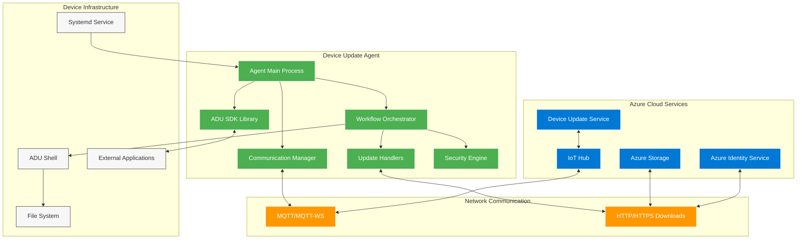
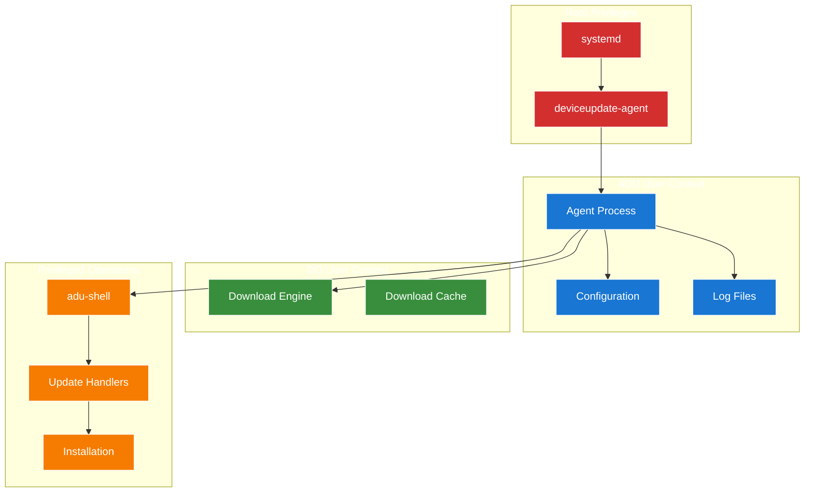
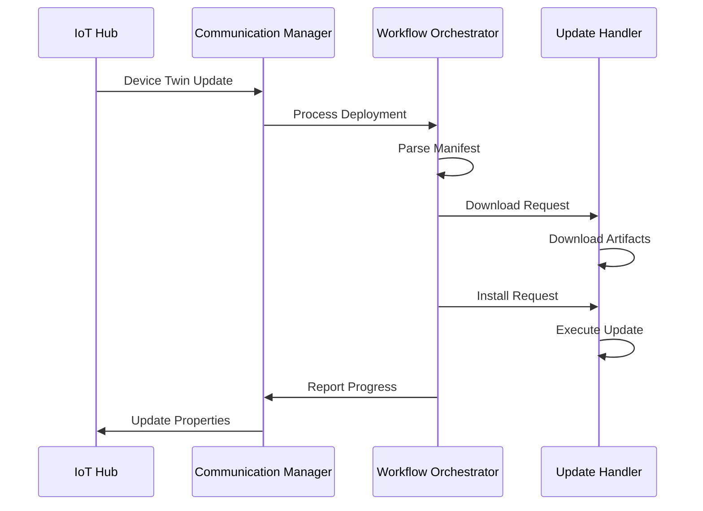
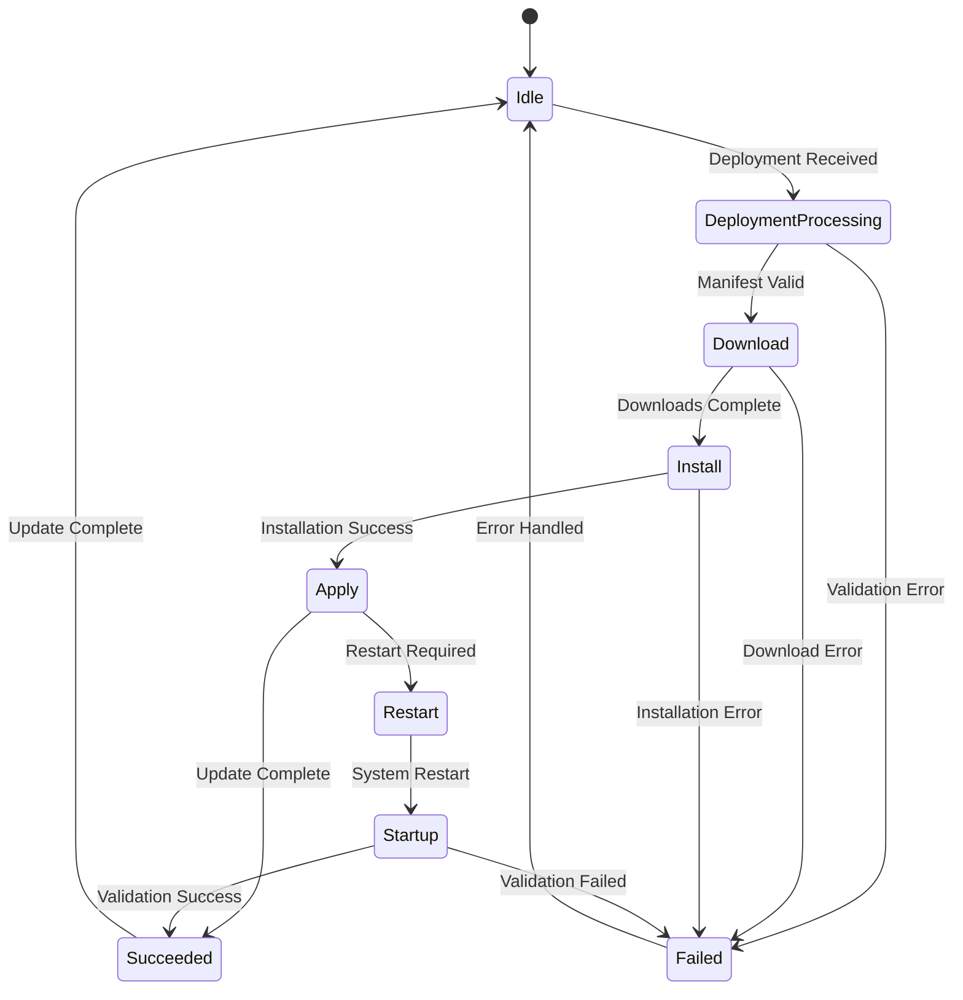

# Architecture Overview

This document provides a comprehensive overview of the Device Update agent architecture, including core components, communication flows, and system interactions.

## High-Level Architecture

The Device Update agent is designed as a modular, extensible system that orchestrates over-the-air updates while maintaining security, reliability, and flexibility.



## Core Components

### 1. Agent Main Process

**Purpose**: The central orchestrator that manages the agent lifecycle and coordinates all subsystems.

**Key Responsibilities**:
- Configuration parsing and validation
- Component initialization and lifecycle management
- Cross-component communication coordination
- Error handling and recovery
- Status reporting and diagnostics

**Key Files**:
- `src/agent/src/main.cpp` - Entry point and main loop
- `src/agent/src/adu_core_* .cpp` - Core agent functionality
- `src/communication_managers/` - Communication subsystem

### 2. Communication Manager

**Purpose**: Handles all communication with Azure IoT Hub using multiple protocols and authentication methods.

**Key Responsibilities**:
- IoT Hub connection management (MQTT/MQTT-WS)
- Device twin synchronization
- Telemetry and property reporting
- Command and method handling
- Connection resilience and retry logic

**Authentication Support**:
- **Connection String**: Shared Access Key authentication
- **X.509 Certificates**: Certificate-based authentication with PKCS#11 HSM support
- **Azure Identity Service**: Token-based authentication for IoT Edge scenarios

**Key Files**:
- `src/communication_managers/iot_hub_communication_manager/` - IoT Hub integration
- `src/communication_abstraction/` - Communication abstraction layer

### 3. Workflow Orchestrator

**Purpose**: Manages the end-to-end update workflow from deployment notification to completion reporting.

**Core Workflow States**:
1. **Idle**: Waiting for deployment instructions
2. **Deployment Processing**: Parsing and validating update manifest
3. **Download**: Acquiring update artifacts
4. **Install**: Executing update handlers
5. **Apply**: Finalizing the update
6. **Restart**: System restart if required
7. **Startup**: Post-restart validation

**Key Responsibilities**:
- Update manifest parsing and validation
- Multi-component update orchestration
- State persistence and recovery
- Progress tracking and reporting
- Error handling and rollback coordination

**Key Files**:
- `src/adu_workflow/` - Core workflow implementation
- `src/agent_orchestration/` - Multi-agent orchestration

### 4. Update Handlers (Extension System)

**Purpose**: Pluggable components that implement specific update mechanisms for different update types.

**Built-in Handlers**:
- **APT Handler**: Debian package management
- **SWUpdate Handler**: Embedded system updates
- **Script Handler**: Custom script execution
- **Simulator Handler**: Testing and development

**Handler Interface**:
- **Download**: Acquire update artifacts
- **Install**: Perform the update operation
- **Apply**: Finalize and activate the update
- **IsInstalled**: Verify update completion

**Key Responsibilities**:
- Update-type-specific logic implementation
- Artifact validation and integrity checking
- Update execution and error handling
- Rollback and recovery support

**Key Files**:
- `src/extensions/update_handlers/` - Handler implementations
- `src/inc/aduc/update_handler.h` - Handler interface definition

### 5. Security Engine

**Purpose**: Ensures cryptographic integrity and security throughout the update process.

**Security Features**:
- **Signature Verification**: Update manifest and payload validation
- **Root Key Management**: Hierarchical trust chain validation
- **Certificate Handling**: X.509 certificate processing
- **Secure Storage**: Sensitive data protection

**Root Key Package System**:
- Downloadable key packages for signature validation
- Hierarchical trust model with root, intermediate, and leaf certificates
- Automatic key rotation and updates
- Offline signature verification capabilities

**Key Files**:
- `src/rootkey_workflow/` - Root key package management
- `src/utils/crypto_utils/` - Cryptographic utilities
- Security model documented in [Security Root Keys](security-rootkey-package.md)

### 6. ADU SDK Library

**Purpose**: Provides external applications with APIs to interact with the Device Update agent.

**Key APIs**:
- **GetAduServiceStatus()**: Query agent status and update progress
- **Power Management**: Battery optimization and idle control
- **Status Notifications**: Real-time update event notifications

**Use Cases**:
- Battery management integration
- Application-aware update scheduling
- User interface development
- System monitoring and diagnostics

**Integration Methods**:
- **Static Linking**: `libaducsdk.a` library
- **Dynamic Loading**: Runtime library integration
- **IPC Communication**: FIFO-based inter-process communication

**Key Files**:
- `src/libaducpal/` - Platform abstraction layer
- SDK integration documented in [SDK Integration](sdk-integration.md)

## Process Architecture

### Agent Daemon Model

The Device Update agent runs as a systemd service with privilege separation:



**Security Model**:
- **Root Process**: Minimal privileged daemon for service management
- **ADU User**: Main agent process with restricted permissions
- **DO User**: Download operations with network access only
- **Privileged Shell**: Controlled execution of system-level operations

### Multi-Agent Support (TO BE DISCONTINUED)

The agent supports multiple agent instances for complex scenarios:

- **Primary Agent**: Handles device-level updates
- **Module Agents**: Handle component-specific updates
- **Proxy Agents**: Coordinate updates across device hierarchies

## Communication Flows

### 1. Device Twin Synchronization



### 2. Update Workflow Execution



### 3. Error Handling and Recovery

**Error Categories**:
- **Transient Errors**: Network timeouts, temporary service unavailability
- **Configuration Errors**: Invalid settings, missing dependencies
- **Security Errors**: Signature validation failures, certificate issues
- **System Errors**: Disk space, permission issues, hardware failures

**Recovery Strategies**:
- **Automatic Retry**: Exponential backoff for transient failures
- **State Persistence**: Recovery from unexpected shutdowns
- **Rollback Mechanisms**: Handler-specific rollback procedures
- **Safe Mode**: Minimal operation mode for critical failures

## Configuration Architecture

The agent uses a structured JSON configuration system with schema validation:

### Configuration Hierarchy

```
/etc/adu/
├── du-config.json           # Main configuration
├── du-diagnostics-config.json  # Diagnostics settings
├── certs/                   # X.509 certificates
│   ├── client.pem
│   ├── client.key
│   └── ca.pem
└── extensions/              # Extension configurations
    ├── sources.list.d/
    └── update_handlers/
```

### Schema Evolution

- **Schema 1.1**: Basic agent configuration
- **Schema 1.2**: Enhanced X.509 support, power management, SDK integration

Key improvements in Schema 1.2:
- Full X.509 certificate authentication
- Power management controls (`idlePauseMilliseconds`)
- SDK API integration (`apiRequestFifoPath`)
- Enhanced authentication options

## Extensibility Points

### 1. Update Handlers

**Interface**: Standardized handler interface for custom update types
**Examples**: Custom firmware updaters, application-specific installers
**Documentation**: [Extension Development](extension-development.md)

### 2. Communication Protocols

**Interface**: Pluggable communication managers
**Examples**: Custom IoT platforms, edge-specific protocols
**Current**: IoT Hub MQTT/MQTT-WS implementation

### 3. Download Engines

**Interface**: Configurable download mechanisms
**Examples**: Custom CDNs, peer-to-peer distribution
**Current**: Delivery Optimization (DO) integration

### 4. Security Providers

**Interface**: Pluggable security and authentication
**Examples**: Custom HSMs, enterprise certificate authorities
**Current**: OpenSSL, PKCS#11 support

## Performance and Scalability

### Resource Management

**Memory Usage**:
- Base agent: ~50MB RSS
- Handler execution: Variable by update type
- Download cache: Configurable size limits

**CPU Usage**:
- Idle state: Minimal CPU usage with configurable sleep intervals
- Active updates: Burst usage during download/install phases
- Background tasks: Periodic telemetry and status reporting

**Network Usage**:
- Control traffic: Minimal MQTT messaging
- Download traffic: Optimized with Delivery Optimization
- Certificate handling: Periodic CRL and OCSP validation

### Deployment Scalability

**Device Scale**:
- Single device: Individual agent instances
- Device fleets: Centralized deployment management
- Edge hierarchies: Proxy agent coordination

**Update Types**:
- OS updates: Full system image replacement
- Application updates: Package management integration
- Firmware updates: Hardware-specific handlers
- Configuration updates: Settings and certificate management

## Monitoring and Observability

### Logging System

**Log Levels**: Error, Warning, Info, Debug, Verbose
**Log Destinations**: Syslog, systemd journal, file output
**Structured Logging**: JSON format with correlation IDs

### Telemetry and Metrics

**Agent Metrics**:
- Update success/failure rates
- Download performance statistics
- Communication latency and reliability
- Resource usage monitoring

**Device Health**:
- System resource availability
- Network connectivity status
- Security validation results
- Handler-specific metrics

### Diagnostics Integration

**Built-in Diagnostics**:
- Configuration validation
- Connectivity testing
- Security certificate verification
- Handler capability detection

**External Tools**:
- **adu-diag.sh**: Comprehensive diagnostic script
- **Azure IoT Explorer**: Device twin and telemetry visualization
- **Azure Monitor**: Cloud-based monitoring and alerting

## Security Considerations

### Threat Model

**Protected Assets**:
- Update integrity and authenticity
- Device configuration and credentials
- System availability and reliability

**Threat Vectors**:
- Man-in-the-middle attacks
- Malicious update packages
- Privilege escalation attempts
- Denial of service attacks

### Security Controls

**Cryptographic Validation**:
- End-to-end signature verification
- Certificate chain validation
- Root key package verification
- Secure hash verification

**Access Control**:
- User privilege separation
- File system permissions
- Network access restrictions
- Service isolation

**Secure Communications**:
- TLS encryption for all network traffic
- Certificate-based authentication
- Token-based authorization
- Secure key storage

## Next Steps

Now that you understand the overall architecture, explore these detailed topics:

1. **[Quick Start Guide](quick-start.md)** - Get hands-on experience with the agent
2. **[Configuration Guide](configuration-guide.md)** - Learn about configuration options
3. **[Agent Workflow](agent-workflow.md)** - Deep dive into update processing
4. **[Security Model](security-model.md)** - Understand security mechanisms
5. **[Extension Development](extension-development.md)** - Create custom update handlers

For implementation guidance:
- **[Building the Agent](how-to-build-agent-code.md)** - Build system and dependencies
- **[Running the Agent](how-to-run-agent.md)** - Deployment and service management
- **[SDK Integration](sdk-integration.md)** - External application integration
