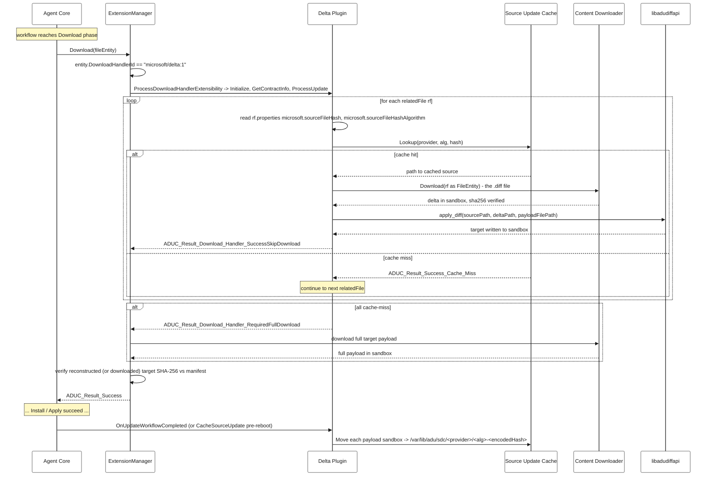

# Microsoft Delta Download Handler — Runtime Deep-Dive

> **Scope.** This document describes how the ADU agent processes a v5 update that uses the **Microsoft Delta Download Handler** (`microsoft/delta:1`) at runtime: how the agent decides to invoke the handler, how the handler decides a delta is applicable to the device, how the full target payload is reconstructed, and how the agent's trust chain is preserved.
>
> For **build / package / install** instructions see [building-with-delta-handler.md](./building-with-delta-handler.md).
> For the **`relatedFiles` field shape** in the update manifest see [update-manifest-v5-schema.md](./update-manifest-v5-schema.md).
> For the general Download Handler extensibility contract see [download_handlers/README.md](../../src/extensions/download_handlers/README.md).

---

## Table of Contents

- [1. Three questions this document answers](#1-three-questions-this-document-answers)
- [2. Vocabulary](#2-vocabulary)
- [3. How the agent knows to invoke a download handler](#3-how-the-agent-knows-to-invoke-a-download-handler)
- [4. How the delta handler knows a delta is applicable](#4-how-the-delta-handler-knows-a-delta-is-applicable)
- [5. How the target payload is reconstructed](#5-how-the-target-payload-is-reconstructed)
- [6. Result codes and fallback semantics](#6-result-codes-and-fallback-semantics)
- [7. Source-update cache: layout and lifecycle](#7-source-update-cache-layout-and-lifecycle)
- [8. Trust chain](#8-trust-chain)
- [9. Sequence diagram (happy path: cache hit)](#9-sequence-diagram-happy-path-cache-hit)
- [10. Delta plugin exports](#10-delta-plugin-exports)
- [11. Worked manifest example](#11-worked-manifest-example)
- [12. Operational notes](#12-operational-notes)

---

## 1. Three questions this document answers

1. **How does the agent know an update contains a delta?** It doesn't, in any delta-specific sense. The agent only sees that a payload `files.<id>` carries a `downloadHandler.id`, and dispatches to whatever extension is registered for that id. Delta semantics live entirely inside the `microsoft/delta:1` plugin.
2. **How does the plugin know the delta is applicable to this device?** Each `relatedFiles.<rid>` advertises a candidate source by `microsoft.sourceFileHash` + `microsoft.sourceFileHashAlgorithm`. The plugin asks the source-update cache "do you have a readable file at `<provider>/<alg>-<hash>`?". If yes, that delta is applicable.
3. **How is the full target reconstructed?** The plugin downloads the small `.diff` file via the agent's standard content downloader (so its own hash is verified), then calls `libadudiffapi` to apply the diff against the cached source, producing the target file in the sandbox. The agent then verifies the reconstructed target's SHA-256 against `files.<id>.hashes.sha256` from the manifest, exactly as it would for a fully-downloaded file.

---

## 2. Vocabulary

| Term | Meaning |
|---|---|
| **Target payload** | The full update file the manifest's `files.<id>` entry describes. With a delta, this file is *produced locally* and is **never** downloaded from the network. |
| **Delta / diff file** | A small binary patch produced by the Delta Diff Generation tool. Advertised in the manifest as a `relatedFiles.<rid>` entry under the target payload. Always downloaded from the network. |
| **Source payload** | A previously-installed full target payload that this device has cached. The delta reconstructs the new target from it. |
| **Source-update cache (sdc)** | Disk location where successfully-applied target payloads are retained so they can serve as sources for future deltas. Default: `${ADUC_DATA_FOLDER}/sdc` = `/var/lib/adu/sdc` (CMakeLists.txt). |
| **`libadudiffapi`** | The Diff API library from the [iot-hub-device-update-delta](https://github.com/Azure/iot-hub-device-update-delta) repo. The plugin calls it to apply a diff. |

---

## 3. How the agent knows to invoke a download handler

The decision is made in `ExtensionManager::Download` (`src/extensions/extension_manager/src/extension_manager.cpp`):

```cpp
// First, attempt to produce the update using download handler if
// download handler exists in the entity (metadata).
if (!IsNullOrEmpty(entity->DownloadHandlerId))
{
    result = ProcessDownloadHandlerExtensibility(workflowHandle, entity, targetUpdateFilePath.c_str());
    ...
}
```

`entity->DownloadHandlerId` is populated from `files.<id>.downloadHandler.id` when the v5 manifest is parsed. `ProcessDownloadHandlerExtensibility` (`extension_manager_helper.cpp`) then:

1. `DownloadHandlerFactory::GetInstance()->LoadDownloadHandler(id)` — looks up the registered `.so` for that id and dlopens it (registry lives at `/var/lib/adu/extensions/download_handlers/`). The factory caches a singleton plugin per id.
2. `plugin->GetContractInfo(&contractInfo)` — requires `ADUC_V1_CONTRACT_MAJOR_VER/MINOR_VER`. Mismatches fail closed.
3. `plugin->ProcessUpdate(workflowHandle, entity, targetUpdateFilePath)` — the handler does its work and returns an `ADUC_Result`.

There is no special case in the agent for `microsoft/delta:1`. Any extension registered for any id can be invoked the same way. The delta plugin is just the first reference implementation.

> **Note.** `relatedFiles` are parsed regardless of whether a `downloadHandler` is present, but they are only ever read by the download handler — there is no agent-side consumer (`workflow_utils.c`).

---

## 4. How the delta handler knows a delta is applicable

`MicrosoftDeltaDownloadHandler_ProcessUpdate` (`microsoft_delta_download_handler.c`) iterates `fileEntity->RelatedFiles[]`. Each related file is a candidate delta from a different source version. For each candidate, the handler:

1. Reads two well-known properties from `relatedFile.Properties` (`microsoft_delta_download_handler_utils.c`):

   | Property | Required | Used for |
   |---|---|---|
   | `microsoft.sourceFileHash` | yes — missing ⇒ `ADUC_ERC_DDH_RELATEDFILE_BAD_OR_MISSING_HASH_PROPERTIES` | Cache lookup key |
   | `microsoft.sourceFileHashAlgorithm` | yes — same | Cache lookup key |

   > Other property names (e.g. `microsoft.sourceVersion`) are **not** consumed by this handler. Treat any other property as informational only.

2. Calls `ADUC_SourceUpdateCache_Lookup(provider, hash, alg, basePath, &outPath)` (`source_update_cache.c`). The cache key is the triple **(target update `provider`, `microsoft.sourceFileHashAlgorithm`, `microsoft.sourceFileHash`)** — the `provider` comes from the current target update's `updateId` (`microsoft_delta_download_handler_utils.c`). A source cached under a different provider will **not** match.

3. The lookup is **file-exists + read-permission only** (`source_update_cache.c`); the cached file's content hash is not recomputed during lookup. Result codes:

   | Outcome | `ResultCode` |
   |---|---|
   | Cached file exists and is readable by the agent user | `ADUC_Result_Success` → applicable |
   | No file at the derived path, or not readable | `ADUC_Result_Success_Cache_Miss` → try next `relatedFile` |
   | Path computation / I/O error | `ADUC_Result_Failure` → try next `relatedFile` |

If every `relatedFile` misses, the handler returns `ADUC_Result_Download_Handler_RequiredFullDownload` and the agent falls back to a normal download (see §6).

---

## 5. How the target payload is reconstructed

For the first `relatedFile` whose source lookup succeeds (`microsoft_delta_download_handler_utils.c`):

1. **Download the delta.** `MicrosoftDeltaDownloadHandlerUtils_DownloadDeltaUpdate` wraps the relatedFile as a synthetic `ADUC_FileEntity` and calls `ExtensionManager_Download`. This is the agent's normal content-download path, so the **delta file's own SHA-256 is verified** against the hash in `relatedFiles.<rid>.hashes`.
2. **Apply the diff.** `processDeltaUpdateFn` (wired to `MicrosoftDeltaDownloadHandlerUtils_ProcessDeltaUpdate`) calls `libadudiffapi` with `(sourcePath, deltaPath, payloadFilePath)`. The reconstructed target is written to `payloadFilePath` — the same sandbox path the agent would have written to had it downloaded the full file.
3. **Return.** Plugin returns `ADUC_Result_Download_Handler_SuccessSkipDownload` (`microsoft_delta_download_handler.c`). The agent skips the standard download for this payload.

The agent then verifies the reconstructed file's SHA-256 against `files.<id>.hashes.sha256` from the manifest at `extension_manager.cpp`, exactly as for a network-downloaded file. A hash mismatch here fails the workflow.

> **Why this preserves the trust chain.** The source file is implicitly trusted at lookup time (the cache is owned by the `adu` user; only files moved in after a *previously verified, successful* workflow are present — see §7-8). The delta file is verified by the agent's standard download path. The reconstructed target is verified by the agent against the signed manifest. A hostile or corrupt source can produce a wrong-bit target, but that target will fail the final hash check and the workflow will fail.

---

## 6. Result codes and fallback semantics

`ADUC_Result_Download_Handler_RequiredFullDownload` is a **success-bucket** code, not a failure. `extension_manager.cpp` reacts to four cases:

| `plugin->ProcessUpdate` return | Agent behavior |
|---|---|
| `ADUC_Result_Download_Handler_SuccessSkipDownload` (success, ≠ RequiredFullDownload) | Skip full download. Proceed to final target-hash verification. |
| `ADUC_Result_Download_Handler_RequiredFullDownload` (success bucket) | Fall through to the standard content downloader; treat the full payload as the source of truth. |
| Any failure `ResultCode` (negative bucket) | Same fallback as above — log the ERC against the workflow, then attempt the full download. |
| Handler / contract lookup itself failed | Same fallback. |

After the fallback download completes successfully, the agent runs the same final target-hash check. Either path converges on the same workflow state from here on.

---

## 7. Source-update cache: layout and lifecycle

### Path format

Computed by `ADUC_SourceUpdateCacheUtils_CreateSourceUpdateCachePath` (`source_update_cache_utils.c`):

```
${updateCacheBasePath}/${provider}/${alg}-${encodedHash}
```

- `updateCacheBasePath` defaults to `ADUC_DELTA_DOWNLOAD_HANDLER_SOURCE_UPDATE_CACHE_DIR`, set in `CMakeLists.txt` to `${ADUC_DATA_FOLDER}/sdc`. With default `ADUC_DATA_FOLDER=/var/lib/adu`, this is **`/var/lib/adu/sdc`**.
- `provider` and `alg` are sanitized by `PathUtils_SanitizePathSegment`.
- `encodedHash` is base64 with `+`, `/`, `=` replaced by `_2B`, `_2F`, `_3D` so the value is safe as a single filename segment (`source_update_cache_utils.c`).

Example: a SHA-256 source hash `XlqWB1...g=` advertised by provider `Contoso` resolves to roughly:
```
/var/lib/adu/sdc/Contoso/sha256-XlqWB1...g_3D
```

A `.info` sidecar is written next to each cached file with a UTC timestamp (`source_update_cache_utils.c`).

### When entries are added

After a workflow ends successfully, the plugin moves *every* payload of the target update from the sandbox into the cache (`MicrosoftDeltaDownloadHandler_OnUpdateWorkflowCompleted` → `ADUC_SourceUpdateCache_Move` → `ADUC_SourceUpdateCacheUtils_MoveToUpdateCache`, `source_update_cache_utils.c`). The cache key for each payload is the payload's own `files.<id>.hashes` entry — so this becomes the *source* that any *future* delta's `microsoft.sourceFileHash` must match.

Two distinct call sites in `agent_workflow.c`:

| Caller | Call site | Why |
|---|---|---|
| `OnUpdateWorkflowCompleted` | `agent_workflow.c` (after successful Apply) | Normal post-success path — agent stays up, sandbox still exists. |
| `CacheSourceUpdate` | `agent_workflow.c` (immediately before reboot/agent-restart triggered by Apply) | Pre-reboot path — must run **before** the sandbox is wiped/the agent dies. `CacheSourceUpdate` is unconditional (does not check installed-criteria first). |

If both fire for the same workflow (e.g. cache before reboot, then re-evaluate after reboot), the move is idempotent: `MoveToUpdateCache` checks for an existing cached file at the destination, verifies its hash, and skips if already correct (`source_update_cache_utils.c`).

### When entries are removed

There is no built-in eviction in the source-update cache. Operators are expected to manage disk usage out-of-band. The `OnUpdateWorkflowCompleted` move uses `rename(2)` first and falls back to a copy across mount-point boundaries (`source_update_cache_utils.c`).

---

## 8. Trust chain

| Artifact | How it is trusted |
|---|---|
| **Update manifest** | JWS signature verified against the device's root keys before any payload is touched (`workflow_utils.c`). |
| **Delta file** | SHA-256 from `relatedFiles.<rid>.hashes` verified by the agent's standard content downloader at download time. |
| **Source file (cache hit)** | Not re-hashed at lookup time. Trusted because: (a) the cache directory is owned by the `adu` user; (b) the lookup additionally checks the file is readable by the agent user (`source_update_cache.c` calls `PermissionUtils_VerifyFilemodeBitmask(...S_IRUSR)`); (c) entries are only added by the agent itself after a previously verified, successful workflow. *Insertion* paths re-verify hashes after the rename/copy (`source_update_cache_utils.c`). |
| **Reconstructed target** | SHA-256 from `files.<id>.hashes` verified by the agent after `ProcessUpdate` returns (`extension_manager.cpp`), identically to a network-downloaded file. **This is the final integrity gate.** A wrong-bit target — regardless of cause — fails here and the workflow fails. |

---

## 9. Sequence diagram (happy path: cache hit)



---

## 10. Delta plugin exports

The plugin `.so` exports the symbols defined in `extension_download_handler_export_symbols.h`. Of these, **only `ProcessUpdate` is strictly required** by the contract — the wrapper layer treats other symbols as optional and substitutes safe defaults when an export is missing (`download_handler_plugin.cpp` for `CacheSourceUpdate`; similar pattern elsewhere).

| Export | Called by | When | Required? |
|---|---|---|---|
| `Initialize(logLevel)` | Plugin ctor (`download_handler_plugin.cpp`) | At plugin load | Recommended |
| `GetContractInfo(out)` | `extension_manager_helper.cpp` | Before first `ProcessUpdate` | Required — contract version check |
| `ProcessUpdate(workflow, fileEntity, targetPath)` | `extension_manager_helper.cpp` | Download phase for each file with a matching `downloadHandler.id` | Required |
| `OnUpdateWorkflowCompleted(workflow)` | `agent_workflow.c` (via `CallDownloadHandlerOnUpdateWorkflowCompleted`) | After successful Apply, for each payload that had a `downloadHandler.id` | Recommended — without it the cache is never populated post-success |
| `CacheSourceUpdate(workflow)` | `agent_workflow.c` | Immediately before reboot/agent-restart | Optional — `download_handler_plugin.cpp` returns success if missing |
| `Cleanup()` | Plugin dtor (`download_handler_plugin.cpp`) | At plugin unload | Recommended |

The Microsoft Delta Download Handler implements all six (`microsoft_delta_download_handler_plugin.EXPORTS.c`).

---

## 11. Worked manifest example

Showing the v5 `files` entry for a 800 MB SWUpdate target that ships a 50 MB delta for source version `v1.0` (whose `.swu` is already in the device cache). The `fileUrls` map is supplied separately by the service; both the target payload id and every related-file id must have a corresponding URL there (`workflow_utils.c`).

```json
{
  "manifestVersion": "5.0",
  "updateId": {
    "provider": "Contoso",
    "name": "ToasterFirmware",
    "version": "2.0.0"
  },
  "instructions": {
    "steps": [
      {
        "handler": "microsoft/swupdate:2",
        "files": ["TARGET_SWU"],
        "handlerProperties": {
          "scriptFileName": "install.sh",
          "swuFileName": "toaster-2.0.swu",
          "installedCriteria": "2.0.0"
        }
      }
    ]
  },
  "files": {
    "TARGET_SWU": {
      "fileName": "toaster-2.0.swu",
      "sizeInBytes": 838860800,
      "hashes": { "sha256": "<sha256 of toaster-2.0.swu>" },
      "downloadHandler": { "id": "microsoft/delta:1" },
      "relatedFiles": {
        "DELTA_FROM_V1": {
          "fileName": "v1.0-to-v2.0.diff",
          "sizeInBytes": 52428800,
          "hashes": { "sha256": "<sha256 of v1.0-to-v2.0.diff>" },
          "properties": {
            "microsoft.sourceFileHashAlgorithm": "sha256",
            "microsoft.sourceFileHash": "<sha256 of toaster-1.0.swu>"
          }
        }
      }
    }
  }
}
```

Key observations:

- `files.TARGET_SWU` is the **target**. It is described by the manifest but never appears on the wire as a download unless the cache misses and the agent falls back.
- `relatedFiles` is a **JSON object/map keyed by related-file id**, not an array (`workflow_utils.c`). The id `DELTA_FROM_V1` must have a download URL in the parent update's `fileUrls` map.
- `properties` and `hashes` are **required by the parser** for every related file (`workflow_utils.c`); `fileName` must also be present (`workflow_utils.c`).
- Add another entry under `relatedFiles` (e.g. `DELTA_FROM_V1_5`) to cover devices on v1.5 with a different cached source. The plugin tries each in array order and stops at the first applicable one (`microsoft_delta_download_handler.c`).

For a brand-new device with nothing cached, omit `downloadHandler` (and `relatedFiles`) entirely and ship the target as a normal v4-style full payload. The agent will download it, install it, and cache it on success — making it available as a source for the next delta release.

---

## 12. Operational notes

- **Producing deltas.** Use the Diff Generation tool from [iot-hub-device-update-delta](https://github.com/Azure/iot-hub-device-update-delta) to produce the `.diff` file and the recompressed target `.swu`. Both source and target SWU files must be recompressed with `zstd`, and `swupdate` on-device must be built with `CONFIG_ZSTD=y`.
- **Bootstrapping the source cache.** Three options: (a) bake the first source `.swu` into the OS image at the cache path computed in §7; (b) ship the first update as a full update — the agent caches it on success; (c) use a preceding step in a multi-step update that drops a recompressed source into the cache directory before the delta step runs.
- **Operating without a delta library.** If `ADUC_BUILD_DELTA_HANDLER` is `OFF` at build time, no `microsoft/delta:1` extension is registered. The agent treats a `downloadHandler.id` of `microsoft/delta:1` the same as any unknown extension: `LoadDownloadHandler` returns null, the helper logs a warning, and the agent falls back to a full download (`extension_manager_helper.cpp` → `extension_manager.cpp`). Deltas degrade safely.
- **Diagnosing cache misses.** The plugin logs `[DELTA] Source update cache miss for delta <i>` with the offending ERC `ADUC_ERC_DDH_SOURCE_UPDATE_CACHE_MISS` (`microsoft_delta_download_handler.c`); these flow into the workflow ERC list and surface in the reported `lastInstallResult.extendedResultCodes`. A miss usually means: (a) the device has never installed an update whose `files.<id>.hashes.sha256` equals the relatedFile's `microsoft.sourceFileHash` under the same `provider`; or (b) the cache file was deleted out-of-band.
