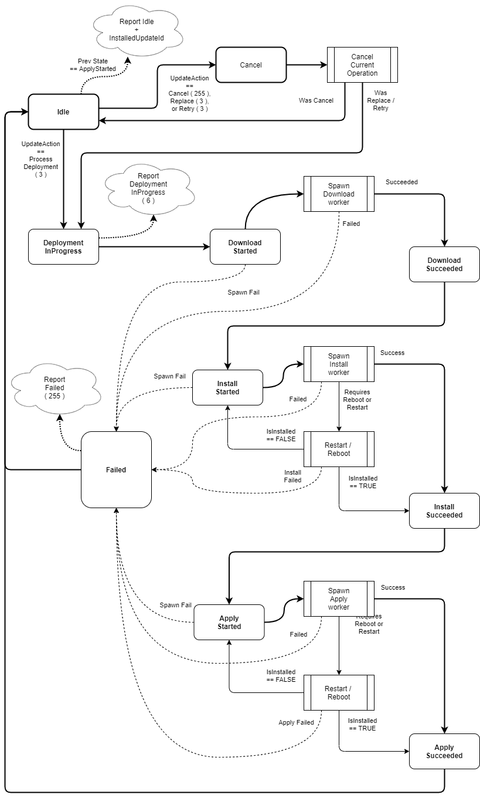

# Goal State Deployment Support in Device Update Agent

## What is **Goal State**?

Goal state is the new update workflow processing protocol for dynamic deployments.
In this model, devices belong to a device group and compatibility set (a way of "tagging" devices by a combination of the device's DeviceProperties property values).

When deploying an update, Service operators target a set of devices in the Azure portal by choosing a device group and an update compatibility set.

The compatibility set is configured per agent (i.e. per device) via the `compatPropertyNames` property and set to a backward-compatible default value of `manufacturer, model` when not configured.

As devices are added to the group, the service will push an UpdateAction of ProcessDeployment(3) to the DU Agent on the device along with data required for all phases (download, install, apply) of the workflow processing.

The service will ensure the desired action in the digital twin is at the latest applicable goal state per device group + compatibility group combination.

The agent in turn will evaluate and ensure the device is at the latest goal state whenever a PNP property update is pushed to it (when it first starts up and whenever there is a change to the goal state) and on other events such as plugging in a component (e.g. a camera component device plugging into a host device).

#### Changes from CBO (Cloud-based orchestration)

##### Agent-based vs cloud-based orchestration
In goal state, all orchestration of update processing is done locally on the client.

Previously in the public preview protocol, the cloud would push a separate UpdateAction for each individual step (e.g. download, install, apply) and the agent would report to the cloud after every workflow step completion.

Each of these steps is now a local workflow step in the agent's workflow processing state machine (see more details below).

##### Client Reporting
Another change is the client only reports the status of workflow processing when it starts processing and when it fails or succeeds the entire update processing. Previously, it would report for each step (i.e. download, install, apply). This reduces consumption of message quota with a tradeoff of reduced granularity of insight into progress of the update processing (e.g. the service operator will see that the update is in-progress but won't know which step in the processing it's on).

## Agent's Goal State Workflow

##### High-level summary
When the agent receives a property update from PnP either on agent process startup or when the desired action in the digital twin changes, the agent will:
- Parse the desired update metadata in the twin
- Load the appropriate content handler extension for the update type
- Call IsInstalled exported function on the content handler
- If not installed, the agent will:
  - report the deployment is in progress
  - initiate download, install, and apply operations in that order, which will invoke the corresponding exports on the content handler.
  - it will report the final status to the cloud upon failure or success.

If an install or apply requires agent restart or system reboot (as dictated by return status from the content handler), then it will do so. Upon startup, the goal state in the twin is processed as before (it is treated idempotently). If the content handler deems that there is still more work to do, processing will continue from the beginning (it is up to the content handler to return success for any steps already done such as download); otherwise, it will report the results of workflow processing to the cloud.

Processing of the goal state update workflow starts with the service updating the digital twin's desired section
with the `ProcessDeployment ( 3 )` ProcessWorkflow UpdateAction. See `ADUCITF_UpdateAction` enum in [update_content.h](../../src/adu_types/inc/aduc/types/update_content.h).

The Agent state machine will go through the different steps locally without further communication with the cloud.

Either on failure, or once the entire workflow processing is done (note: it could span system reboots and/or agent restarts) and agent is in Idle state again, the Agent will report the results of the workflow processing to the cloud. Until this occurs, the portal UI will show the workflow as "In-Progress".

## Workflow Processing State Machine

### Workflow Steps
There are logical steps of the workflow processing.  The update workflow processing state machine steps are defined in the `ADUCITF_WorkflowStep` enum in [update_content.h](../../src/adu_types/inc/aduc/types/update_content.h).

### Workflow Step High-level Details
Here is each workflow step and what it does at a high-level:
- `ADUCITF_WorkflowStep_ProcessDeployment`
    - Sends cloud an acknowledgement of `ADUCITF_State_DeploymentInProgress(6)` along with the workflowId that was sent by the cloud in the desired section of twin
    - Transitions to `ADUCITF_State_DeploymentInProgress` state
    - Auto-Transitions to `ADUCITF_WorkflowStep_Download`
- `ADUCITF_WorkflowStep_Download`
    - Sets current state to `ADUCITF_State_DownloadStarted`
    - Kicks off Download worker thread, which will call the content handler's `Download()` method to download the update content to the work folder download sandbox.
    - On success, it will set the state to `ADUCITF_State_DownloadCompleted` and auto-transitions to `ADUCITF_WorkflowStep_InstallStarted`
    - On failure, it sets the state to `ADUCITF_State_Failed` and reports the failure.
- `ADUCITF_WorkflowStep_Install`
    - Sets the current state to `ADUCITF_State_InstallStarted`
    - Kicks off Install worker thread, which will call the content handler's `Install()` method to install the content that is in the work folder
    - On success, it will:
        - Reboot the system if the result code is either
            - `ADUC_Result_Install_RequiredImmediateReboot` or
            - `ADUC_Result_Install_RequiredReboot`
        - Restart the agent if the result code is either
            - `ADUC_Result_Install_RequiredImmediateAgentRestart` or
            - `ADUC_Result_Install_RequiredAgentRestart`
        - Otherwise, it will Auto-transition to `ADUCITF_WorkflowStep_Apply`
- `ADUCITF_WorkflowStep_Apply`
    - Sets the current state to `ADUCITF_State_ApplyStarted`
    - Kicks off Apply worker thread, which will call the content handler's `Apply()` method
    - On success, it will:
        - Reboot the system if the result code is either
            - `ADUC_Result_Apply_RequiredImmediateReboot` or
            - `ADUC_Result_Apply_RequiredReboot`
        - Restart the agent if the result code is either
            - `ADUC_Result_Apply_RequiredImmediateAgentRestart` or
            - `ADUC_Result_Apply_RequiredAgentRestart`
        - Otherwise, it will auto-transition to idle state

### State Machine States
The states of the state machine are defined in the `ADUCITF_State` enum in [update_content.h](../../src/adu_types/inc/aduc/types/update_content.h).

### State Transitions

A state transition is describe by the `ADUC_WorkflowHandlerMapEntry` struct in [agent_workflow.c](../../src/agent/adu_core_interface/src/agent_workflow.c).

The state transitions are defined in the `workflowHandlerMap` array in [agent_workflow.c](../../src/agent/adu_core_interface/src/agent_workflow.c).

### State Machine Diagram

## Handling Service-Initiated Replacement

If the service operator initiates a new goal state for the device group before a device completes processing the current workflow, the agent will try to cancel the current processing.

Once processing is done, or cancel completes, it will start processing the new workflow.

Note:

Ideally, the content handler's Cancel method should be able to send a cancel message/signal to the thread/process executing the current operation (e.g. install operation). If the cancellation is successful, the thread/process should still call `WorkCompletionCallback` so that the state machine can transition to the next state and report to the cloud as appropriate for final states (failure, cancellation, success).

## Handling Service-Initiated Retry

Similarly, if the service operator issues a retry, the agent will cancel any current workflow processing and restart the processing.

## Handling Service-Initiated Cancel Request

When a service operator issues a cancellation of the current workflow processing, the agent will attempt to cancel it. This leads to a call to the Cancel method of the ContentHandler that is registered for the update's update type.

The content handler should interupt the current in-progress operation (e.g. Download) so that the operation exits and calls WorkCompletionCallback to complete the current operation.

The agent will then report to the cloud a result code of ADUC_Result_Failure_Cancelled(-1) and transition to Idle state.
