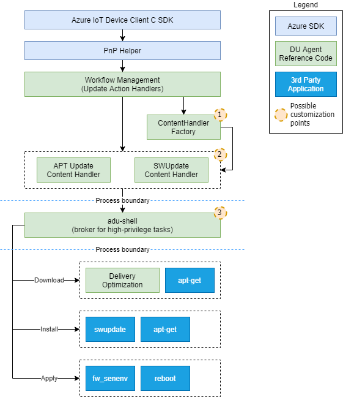

# How To Build the Device Update Agent

Take a look at [dependencies](how-to-build-agent-code.md#dependencies-of-device-update-agent) before you get started. You can build the Device Update agent as a standlone solution or integrate it in your existing application or solution.

* [Dependencies](how-to-build-agent-code.md#dependencies-of-device-update-agent)
* [As a standalone solution](how-to-build-agent-code.md#as-a-standalone-solution)
* [Integrate the Device Update agent in your existing application or solution](how-to-build-agent-code.md#integrate-the-device-update-agent-in-your-existing-application-or-solution)

Take a look at [dependancies](how-to-build-agent-code.md#dependencies-of-device-update-agent) before you get started. You can build the Device Update agent as a standlone solution or integrate it in your existing application or solution.

* [Dependencies](how-to-build-agent-code.md#dependencies-of-device-update-agent)
* [As a standalone solution](how-to-build-agent-code.md#as-a-standalone-solution)
* [Integrate the Device Update agent in your existing application or solution](how-to-build-agent-code.md#integrate-the-device-update-agent-in-your-existing-application-or-solution)

# Dependencies of Device Update Agent

## Required Dependencies

* Azure IoT C SDK
* Delivery Optimization SDK

## Azure IoT C SDK

Use the [Azure IoT C
SDK](https://github.com/Azure/azure-iot-sdk-c)
to connect to IoT Hub and call Azure IoT Plug and Play APIs.

## Delivery Optimization

The [Delivery Optimization
SDK](https://github.com/microsoft/do-client)
SDK provides a robust way for the client to download an update.

## Building the Device Update Agent for Linux

### Installing Dependencies

Use the [scripts/install-deps.sh](../../scripts/install-deps.sh) Linux shell
script for a convenient way to install the dependencies of the Device Update for IoT Hub agent for most use cases.

**Note**: You may be prompted for sudo password or GitHub username and password
when running `install-deps.sh`. If your GitHub account has two factor auth
enabled, use a personal access token (PAT) as the password.

To install all dependencies run:

```shell
./scripts/install-deps.sh -a
```

**Note:**: `--use-ssh` can be used to clone dependencies from the Git repo using SSH instead of https.

To install only the dependencies necessary for the agent:

```shell
./scripts/install-deps.sh --install-aduc-deps --install-packages
```

If you want to install dependencies for a different distro other than Ubuntu 18.04 (the default option), use option `-d`, for example  `--deps-distro ubuntu2004`. (Installing DO dependencies using
[bootstrap script in do-client](https://github.com/microsoft/do-client/blob/v0.8.2/build/scripts/bootstrap.sh))

`install-deps.sh` also provides several options for installing individual
dependencies.  To see the usage info:

```shell
./scripts/install-deps.sh -h
```

## As a standalone solution

### Device Update Linux Build System

The Device Update for IoT Hub reference agent code utilizes CMake for building. An example build script is provided at [scripts/build.sh](../../scripts/build.sh).

#### Build Using build.sh

To build the reference agent integrated with Delivery Optimization for
downloads but still mocks the `Install` and `Apply` actions:

```shell
./scripts/build.sh -c -p linux
```

To see additional build options with build.sh:

```shell
build.sh -h
```

### Build the agent using CMake

Alternatively, you can build using CMake directly. Set the required product values
for ADUC_DEVICEINFO_MANUFACTURER and ADUC_DEVICEINFO_MODEL in the top-level
[CMakeLists.txt](../../CMakeLists.txt) before building.  Optional CMake values can be found there as well.

```shell
mkdir -p build && pushd build
cmake ..
cmake --build .
popd > /dev/null
```

or using Ninja

```shell
mkdir -p build && pushd build
cmake -G Ninja ..
ninja
popd > /dev/null
```

## Install the Device Update Agent

To install the Device Update Agent after building:

```shell
sudo cmake --build out --target install
```

or using Ninja

```shell
pushd out > /dev/null
sudo ninja install
popd > /dev/null
```

**Note** If the Device Update Agent was built as a daemon, the install targets will install and register the Device Update Agent as a daemon.

## Run Device Update Agent

Run Device Update Agent by following these [instructions](./how-to-run-agent.md)

## Integrate the Device Update agent in your existing application or solution

### Pre-concepts

Before integrating the Device Update agent in your existing application or solution review the below concepts.

* Learn how the Device Update service will communicate with the device client using IoT Hub Plug and Play properties to orchestrate over-the-air update actions from [here](../../src/adu_workflow/src/agent_workflow.c).
* Understand the update manifest to be able to write code to [respond to update actions from your client](update-manifest.md).
* Understand how to implement  'ADU Core' interface for the Device Update service to [communicate with your client on the Device](device-update-plug-and-play.md).

### Steps

1. Create an IoT Hub C-SDK Plug and Play client: Your application needs to support IoT Hub Plug and Play as shown in this [example](https://docs.microsoft.com/en-us/azure/iot-pnp/tutorial-multiple-components?pivots=programming-language-ansi-c) to be used by Device Update for over-the-air updating.
2. Once you have a IoT Hub Plug and Play enabled device, implement the 'ADU Core' interfaces for your application, see reference code [here](../../src/adu_workflow/src/agent_workflow.c).
3. Review the below Device Update agent implementation and source code so that you can modify your application to replicate the same behaviors:

* Agent Architecture


* Workflow phases and source code

Download phase:


Install phase:


Apply phase:


* [Source code](../../src/adu_workflow/src/agent_workflow.c)

4.The result reported from your application should be in this format so that the Device Update service can work with your application. Learn more about [plug and play format](https://docs.microsoft.com/azure/iot-hub-device-update/device-update-plug-and-play), and Device Update agent [workflow](../../src/adu_workflow/src/agent_workflow.c).
