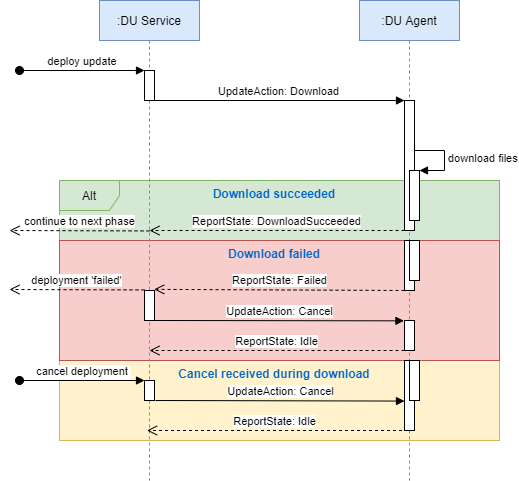
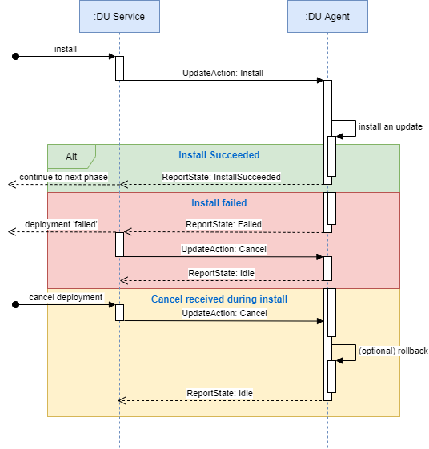
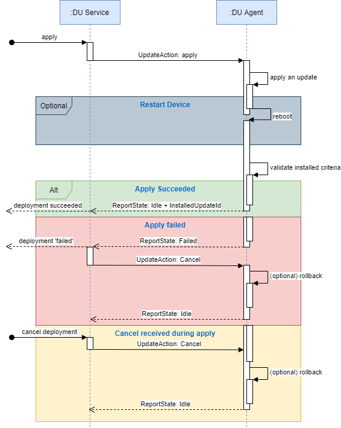

# How To Build the Device Update Agent

Take a look at [dependencies](how-to-build-agent-code.md#dependencies-of-device-update-agent) before you get started. You can build the Device Update agent as a standlone solution or integrate it in your existing application or solution.

-   [Dependencies](how-to-build-agent-code.md#dependencies-of-device-update-agent)
-   [As a standalone solution](how-to-build-agent-code.md#as-a-standalone-solution)
-   [Integrate the Device Update agent in your existing application or solution](how-to-build-agent-code.md#integrate-the-device-update-agent-in-your-existing-application-or-solution)

## Dependencies of Device Update Agent

### Required Dependencies

-   Azure IoT C SDK
-   Delivery Optimization SDK
-   Azure Blob Storage File Upload Utility
-   IotHub Device Update Delta

### Azure IoT C SDK

Use the [Azure IoT C
SDK](https://github.com/Azure/azure-iot-sdk-c)
to connect to IoT Hub and call Azure IoT Plug and Play APIs.

### Delivery Optimization

The [Delivery Optimization
SDK](https://github.com/microsoft/do-client)
provides a robust way for the client to download an update.

## Building the Device Update Agent for Linux

### Installing Dependencies

Use the [scripts/install-deps.sh](../../scripts/install-deps.sh) Linux shell
script for a convenient way to install the dependencies of the Device Update for IoT Hub agent for most use cases.

**Note**: You may be prompted for sudo password or GitHub username and password
when running `install-deps.sh`. If your GitHub account has two factor auth
enabled, use a personal access token (PAT) as the password.

To install all dependencies run:

```shell
./scripts/install-deps.sh -a
```

**Note:**: `--use-ssh` can be used to clone dependencies from the Git repo using SSH instead of https.

To install only the dependencies necessary for the agent:

```shell
./scripts/install-deps.sh --install-aduc-deps --install-packages --install-do
```

`install-deps.sh` also provides several options for installing individual
dependencies. To see the usage info:

```shell
./scripts/install-deps.sh -h
```

#### Build Azure IotHub SDK for C WebSockets static library

By default, both MQTT (`libiothub_client_mqtt_transport.a`) and MQTT over WebSockets(`libiothub_client_mqtt_ws_transport.a`) static libraries are built by `install-deps.sh` via the `use_mqtt` and `use_wsio` -D configs.

```shell
# Verify mqtt transport static lib exists
$ locate libiothub_client_mqtt_transport.a | \
    grep '/usr/local/lib/'
/usr/local/lib/libiothub_client_mqtt_transport.a
```

```shell
# Verify mqtt over websockets static lib exists
$ locate libiothub_client_mqtt_ws_transport.a | \
    grep '/usr/local/lib/'
/usr/local/lib/libiothub_client_mqtt_ws_transport.a
```

## As a standalone solution

### Device Update Linux Build System

The Device Update for IoT Hub reference agent code utilizes CMake for building. An example build script is provided at [scripts/build.sh](../../scripts/build.sh).

#### Build Using build.sh

To build the reference agent with the default parameters:

```shell
./scripts/build.sh -c
```

To see additional build options with build.sh:

```shell
build.sh -h
```

### Build and Run the unit tests

To build and run the unit tests:

```shell
./scripts/build.sh -c -u
pushd out
ctest
```

For more test run options:

```shell
ctest -h
```

### Build the Debian package

To build the debian package (will be output to the `out` directory):

```shell
./scripts/build.sh --build-packages
```

### Build the agent using CMake

Alternatively, you can build using CMake directly. Set the required product values
for ADUC_DEVICEINFO_MANUFACTURER and ADUC_DEVICEINFO_MODEL in the top-level
[CMakeLists.txt](../../CMakeLists.txt) before building. Optional CMake values can be found there as well.

```shell
mkdir -p build && pushd build
cmake ..
cmake --build .
popd > /dev/null
```

or using Ninja

```shell
mkdir -p build && pushd build
cmake -G Ninja ..
ninja
popd > /dev/null
```

You can do incremental builds with Ninja:

```shell
pushd out && ninja
popd
```

### Build Options for MQTT and MQTT over WebSockets IotHub Transport Providers

#### Allow MQTT or MQTT over Websockets IotHub Transport Protocols Driven from Config

By Default, both mqtt and mqtt/WebSockets will be linked into the AducIotAgent binary agent and driven by the `"iotHubProtocol"` config property with valid values of `"mqtt"` or `"mqtt/ws"`, for MQTT and MQTT over WebSockets, respectively.

Here is the default in top-level `CMakeLists.txt`:

```shell
set (
    ADUC_IOT_HUB_PROTOCOL
    "IotHub_Protocol_from_Config"
    CACHE
        STRING
        "The protocol for Azure IotHub SDK communication. Options are MQTT, MQTT_over_WebSockets, and IotHub_Protocol_from_Config")
```

Sample `/etc/adu/du-config.json` that selects `MQTT` value for the `iotHubProtocol` property:

```json
{
  ...
  "iotHubProtocol": "mqtt"
}
```

Sample `/etc/adu/du-config.json` that selects `MQTT over WebSockets` value for the `iotHubProtocol` property:

```json
{
  ...
  "iotHubProtocol": "mqtt/ws"
}
```

#### Use only MQTT IotHub Transport Protocol

If using only `MQTT`, then choosing `MQTT` for `ADUC_IOT_HUB_PROTOCOL` in the top-level `CMakeLists.txt` will reduce the size of Type=SizeMinRel AducIotAgent binary by about 60 KB, which is relatively small compared to the overall footprint that is on the order of 2-3 megabytes.

To link in only MQTT transport provider, set this in the top-level `CMakeLists.txt`:

```shell
set (
    ADUC_IOT_HUB_PROTOCOL
    "MQTT"
    CACHE
        STRING
        "The protocol for Azure IotHub SDK communication. Options are MQTT, MQTT_over_WebSockets, and IotHub_Protocol_from_Config")
```

#### Use only MQTT over WebSockets IotHub Transport Protocol

After enabling WebSockets above using install-deps.sh so that it builds libiothub_client_mqtt_ws_transport.a static library, modify the top-level CMakeLists.txt to use MQTT_over_WebSockets:

```shell
set (
    ADUC_IOT_HUB_PROTOCOL
    "MQTT_over_WebSockets"
    CACHE
        STRING
        "The protocol for Azure IotHub SDK communication. Options are MQTT, MQTT_over_WebSockets, and IotHub_Protocol_from_Config")
```

Doing ./build.sh after setting this to `"MQTT_over_WebSockets"` will have the MQTT traffic go over a websocket on port `443`.
Using `"MQTT"` will use SecureMQTT over port `8883`.

## Install the Device Update Agent

### Install the Device Update Agent after building

```shell
sudo cmake --build out --target install
```

or using Ninja

```shell
pushd out > /dev/null
sudo ninja install
popd > /dev/null
```

**Note** If the Device Update Agent was built as a daemon, the install targets will install and register the Device Update Agent as a daemon.

### Install the Device Update Agent and Extensions from Debian Package

After building the Debian package using `build.sh --build-packages`, do:

```shell
sudo apt install ./out/{PKG_NAME}.deb
```

## Run Device Update Agent

Run Device Update Agent by following these [instructions](./how-to-run-agent.md)

### Verify MQTT Port

If using MQTT, run the following netstat command to verify that it is connecting to the remote MQTT port of 8883:

```shell
$ sudo ./out/bin/AducIotClient -l0 -e > /dev/null 2>&1 &
$ sudo netstat -pantu | grep Adu
tcp        0      0 <LOCAL IP ADDR>:<LOCAL PORT>       <REMOTE IP ADDR>:8883         ESTABLISHED <PID>/./out/bin/Aduc
$ fg
<ctrl-c>
```

### Verify MQTT over WebSockets Port

If using MQTT over WebSockets, run the following netstat command to verify that it is connecting to the remote WebSockets port of 443:

```shell
$ sudo ./out/bin/AducIotClient -l0 -e > /dev/null 2>&1 &
$ sudo netstat -pantu | grep Adu
tcp        0      0 <LOCAL IP ADDR>:<LOCAL PORT>       <REMOTE IP ADDR>:443         ESTABLISHED <PID>/./out/bin/Aduc
$ fg
<ctrl-c>
```

## Integrate the Device Update agent in your existing application or solution

### Pre-concepts

Before integrating the Device Update agent in your existing application or solution review the below concepts.

-   Learn how the Device Update service will communicate with the device client using IoT Hub Plug and Play properties to orchestrate over-the-air update actions from [here](../../src/adu_workflow/src/agent_workflow.c).
-   Understand the update manifest to be able to write code to [respond to update actions from your client](update-manifest.md).
-   Understand how to implement 'ADU Core' interface for the Device Update service to [communicate with your client on the Device](device-update-plug-and-play.md).

### Steps

1. Create an IoT Hub C-SDK Plug and Play client: Your application needs to support IoT Hub Plug and Play as shown in this [example](https://docs.microsoft.com/en-us/azure/iot-pnp/tutorial-multiple-components?pivots=programming-language-ansi-c) to be used by Device Update for over-the-air updating.
2. Once you have a IoT Hub Plug and Play enabled device, implement the 'ADU Core' interfaces for your application, see reference code [here](../../src/adu_workflow/src/agent_workflow.c).
3. Review the below Device Update agent implementation and source code so that you can modify your application to replicate the same behaviors:

-   Workflow phases and source code

Download phase:


Install phase:


Apply phase:


-   [Source code](../../src/adu_workflow/src/agent_workflow.c)

    4.The result reported from your application should be in this format so that the Device Update service can work with your application. Learn more about [plug and play format](https://docs.microsoft.com/azure/iot-hub-device-update/device-update-plug-and-play), and Device Update agent [workflow](../../src/adu_workflow/src/agent_workflow.c).
