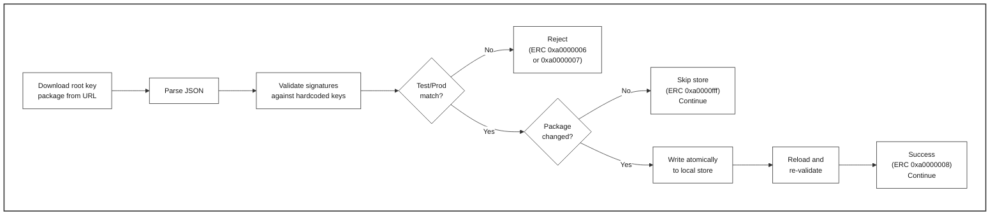

# Root Key Security

> **See also:** [Architecture Overview — Security Trust Chain](architecture-overview.md#security-trust-chain) · [Configuration Guide](configuration-guide.md) · [Extended Result Codes](device-update-agent-extended-result-codes.md)

This document describes how the Azure Device Update agent uses **root key packages** to establish a cryptographic trust chain for validating update manifests.

## Overview

Every deployment the agent receives includes a `rootKeyPackageUrl` pointing to a signed bundle of trusted root public keys. Before processing any update, the agent downloads this package, validates it against keys compiled into the agent binary, and stores it locally. The stored keys are then used to verify the JWS (JSON Web Signature) on the update manifest.

This ensures that:
- Only updates signed by Microsoft-authorized keys are applied
- Compromised keys can be revoked via the disabled-key lists
- The trust anchor is rooted in keys baked into the agent at build time

## When Root Keys Are Fetched

Root key update occurs **immediately** when a `ProcessDeployment` action is received — before any manifest validation or download begins:

```
Device Twin property change
  → Parse unprotected properties (updateAction, workflowId, rootKeyPackageUrl)
  → If ProcessDeployment:
      → Download root key package from rootKeyPackageUrl
      → Validate against hardcoded keys
      → Store locally (if changed)
      → Proceed to manifest validation using stored root keys
```

If the root key package download or validation fails, the **entire deployment is rejected**. The agent will not proceed to download, install, or apply any content.

Source: `src/agent/adu_core_interface/src/adu_core_interface.c` lines 432–450.

## Root Key Package Structure

The root key package is a JSON document with a JWS-like structure. The `protected` object contains the trusted key material and the `signatures` array proves authenticity.

```json
{
  "protected": {
    "version": 2,
    "published": 1700000000,
    "isTest": false,
    "rootKeys": {
      "rootkey-id-1": {
        "keyType": "RSA",
        "n": "<base64url-encoded RSA modulus>",
        "e": "<base64url-encoded RSA exponent>"
      }
    },
    "disabledRootKeys": ["revoked-key-id"],
    "disabledSigningKeys": [
      {
        "alg": "SHA256",
        "hash": "<base64-encoded hash of the signing key>"
      }
    ]
  },
  "signatures": [
    {
      "alg": "RS256",
      "sig": "<base64-encoded signature>"
    }
  ]
}
```

### Field Reference

| Field | Type | Description |
|-------|------|-------------|
| `protected.version` | number | Monotonically increasing package version |
| `protected.published` | number | Unix timestamp when the package was published |
| `protected.isTest` | boolean | `true` for test packages, `false` for production |
| `protected.rootKeys` | object | Map of key ID → RSA public key |
| `protected.rootKeys.<kid>.keyType` | string | Key algorithm (currently only `"RSA"`) |
| `protected.rootKeys.<kid>.n` | string | Base64url-encoded RSA modulus |
| `protected.rootKeys.<kid>.e` | string | Base64url-encoded RSA exponent |
| `protected.disabledRootKeys` | string[] | Key IDs that have been revoked |
| `protected.disabledSigningKeys` | object[] | Hashes of revoked intermediate signing keys |
| `protected.disabledSigningKeys[].alg` | string | Hash algorithm: `SHA256`, `SHA384`, or `SHA512` |
| `protected.disabledSigningKeys[].hash` | string | Base64-encoded hash of the disabled key |
| `signatures` | object[] | One or more signatures over the `protected` object |
| `signatures[].alg` | string | Signature algorithm: `RS256`, `RS384`, or `RS512` |
| `signatures[].sig` | string | Base64-encoded signature value |

Schema: `src/utils/rootkeypackage_utils/inc/aduc/rootkeypackage.schema.json`

## Validation Workflow



### Validation Steps

1. **Download** — The package is fetched from the `rootKeyPackageUrl` provided in the deployment twin property. The download uses either curl or Delivery Optimization (compile-time option).

2. **Parse** — The downloaded JSON is parsed and deserialized into an `ADUC_RootKeyPackage` structure.

3. **Signature validation** — The package's signatures are verified using **hardcoded root keys** compiled into the agent binary (`RootKeyList_GetHardcodedRsaRootKeys()`). This ensures the trust anchor cannot be tampered with on disk.

4. **Test/Production check** — Production agents reject test packages and vice versa. See [Test vs. Production Packages](#test-vs-production-packages).

5. **Comparison** — The new package is compared against the locally stored version. If identical, the store is skipped (optimization).

6. **Atomic write** — The package is written to disk atomically (write to temp file, then rename) to prevent corruption.

7. **Reload validation** — After writing, the package is reloaded from disk and re-validated to confirm the on-disk copy is intact.

Source: `src/rootkey_workflow/src/rootkey_workflow.c`

## Storage

| Path | Description |
|------|-------------|
| `/var/lib/adu/rootkeystore/` | Root key store directory (created automatically) |
| `/var/lib/adu/rootkeystore/rootkeys.json` | Persisted root key package |

These paths are configured at build time via CMake:

```cmake
ADUC_ROOTKEY_STORE_PATH       = "${ADUC_DATA_FOLDER}/rootkeystore"
ADUC_ROOTKEY_STORE_PACKAGE_PATH = "${ADUC_ROOTKEY_STORE_PATH}/rootkeys.json"
```

Where `ADUC_DATA_FOLDER` defaults to `/var/lib/adu`.

## Key Revocation

The root key package includes two revocation lists:

### Disabled Root Keys (`disabledRootKeys`)

An array of key IDs (strings) identifying root keys that should no longer be trusted. When a root key ID appears in this list, any update manifest signed (transitively) by that root key will be rejected.

### Disabled Signing Keys (`disabledSigningKeys`)

An array of hash objects identifying intermediate signing keys that should no longer be trusted. Each entry specifies the hash algorithm and the hash value of the disabled key. This allows revoking specific signing keys without revoking the root key that issued them.

During manifest validation, the agent checks:
1. Is the signing key's hash in the `disabledSigningKeys` list? → Reject
2. Is the root key ID in the `disabledRootKeys` list? → Reject

Source: `src/utils/root_key_utils/inc/root_key_util.h` — `RootKeyUtility_RootKeyIsDisabled()`, `RootKeyUtility_GetDisabledSigningKeys()`

## Test vs. Production Packages

The agent enforces strict separation between test and production root key packages to prevent accidental cross-contamination:

| Agent Build | `isTest: true` Package | `isTest: false` Package |
|-------------|:----------------------:|:-----------------------:|
| Test (`ADUC_E2E_TESTING_ENABLED`) | ✅ Accepted | ❌ Rejected (ERC `0xa0000006`) |
| Production (default) | ❌ Rejected (ERC `0xa0000007`) | ✅ Accepted |

Build the agent with `-DADUC_E2E_TESTING_ENABLED=ON` to enable test mode.

> **Note:** The `ADUC_ENABLE_SRVC_E2E_TESTING` compile flag disables this check entirely for service-level integration testing.

## Download Method

The root key package can be downloaded via either curl or Delivery Optimization (DO), selected at compile time:

| CMake Option | Downloader | When to Use |
|-------------|------------|-------------|
| `ROOTKEY_PKG_DOWNLOAD_USE_CURL=1` (default) | curl | Standard environments, simpler dependency chain |
| `ROOTKEY_PKG_DOWNLOAD_USE_CURL=0` | Delivery Optimization | Environments where DO is available and preferred |

Build option: `--rootkeypkg-curl` flag in `install-deps.sh` / `build.sh`.

Source: `src/utils/rootkeypackage_utils/src/rootkeypackage_curl_download.cpp` and `rootkeypackage_do_download.cpp`

## Extended Result Codes

All root key workflow ERCs use component prefix `0xa0000000`:

| ERC | Hex | Name | Description |
|-----|-----|------|-------------|
| 2684354561 | `0xa0000001` | `ADUC_ERC_ROOTKEY_PKG_FAIL_JSON_PARSE` | Failed to parse the downloaded root key package JSON |
| 2684354562 | `0xa0000002` | `ADUC_ERC_ROOTKEY_PKG_FAIL_JSON_SERIALIZE` | Failed to serialize root key package JSON |
| 2684354563 | `0xa0000003` | `ADUC_ERC_ROOTKEY_STORE_PATH_CREATE` | Failed to create the root key store directory |
| 2684354564 | `0xa0000004` | `ADUC_ERC_ROOTKEY_SIGNINGKEY_DISABLE_EVAL_INVALID_HASHALG` | Invalid hash algorithm in disabled signing key entry |
| 2684354565 | `0xa0000005` | `ADUC_ERC_ROOTKEY_SIGNING_KEY_IS_DISABLED` | The signing key used for the update manifest has been revoked |
| 2684354566 | `0xa0000006` | `ADUC_ERC_ROOTKEY_PROD_PKG_ON_TEST_AGENT` | Production root key package rejected on a test-mode agent |
| 2684354567 | `0xa0000007` | `ADUC_ERC_ROOTKEY_TEST_PKG_ON_PROD_AGENT` | Test root key package rejected on a production agent |
| 2684354568 | `0xa0000008` | `ADUC_ERC_ROOTKEY_PACKAGE_CHANGED` | Root key package was updated successfully (informational) |
| 2684358655 | `0xa0000fff` | `ADUC_ERC_ROOTKEY_PKG_UNCHANGED` | Root key package is identical to stored version; no update needed (informational) |

> ERCs `0xa0000008` and `0xa0000fff` are **informational** — they accompany a success result code and indicate what happened during processing.

Source: `src/inc/aduc/result.h`

## Troubleshooting

### Deployment rejected with ERC 0xa0000001

**Root key package JSON parse failed.** The downloaded file is not valid JSON. Check:
- Network connectivity to the `rootKeyPackageUrl`
- Whether a proxy is injecting error pages into the response
- Disk space for the download work folder

### Deployment rejected with ERC 0xa0000006 or 0xa0000007

**Test/Production mismatch.** The agent and root key package are built for different environments:
- `0xa0000006`: You have a test agent but the service is sending production root keys
- `0xa0000007`: You have a production agent but the service is sending test root keys

Rebuild the agent with the correct `ADUC_E2E_TESTING_ENABLED` setting.

### Deployment rejected with ERC 0xa0000005

**Signing key has been revoked.** The intermediate signing key used to sign the update manifest appears in the root key package's `disabledSigningKeys` list. This update cannot be installed. A new update must be created with a valid signing key.

### Root key store permissions

The agent needs write access to `/var/lib/adu/rootkeystore/`. If running as the `adu` user:

```bash
sudo mkdir -p /var/lib/adu/rootkeystore
sudo chown adu:adu /var/lib/adu/rootkeystore
```

### Inspecting the stored root key package

```bash
# View the stored package
cat /var/lib/adu/rootkeystore/rootkeys.json | python3 -m json.tool

# Validate using the rootkey_validator tool
./tools/rootkey_validator/rootkey_validator /var/lib/adu/rootkeystore/rootkeys.json
```

See [Root Key Validator Tool](../../tools/rootkey_validator/README.md) for details.

## Related Documentation

- [Architecture Overview — Security Trust Chain](architecture-overview.md#security-trust-chain)
- [Configuration Guide](configuration-guide.md)
- [Extended Result Codes](device-update-agent-extended-result-codes.md)
- [Root Key Validator Tool](../../tools/rootkey_validator/README.md)
- [How to Build Agent Code](how-to-build-agent-code.md) — `--rootkeypkg-curl` build option
