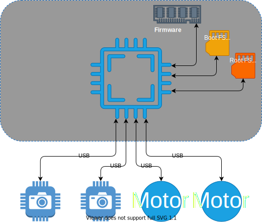

# Multi-Component Update Manifest File

## Quick Jump

- [Multi-Component Update Manifest File](#multi-component-update-manifest-file)
  - [Quick Jump](#quick-jump)
  - [MCU Manifest Schema](#mcu-manifest-schema)
    - [Update Identification and Description](#update-identification-and-description)
    - [Scripts, Scripts Bundle and Updates Bundle Information](#scripts-scripts-bundle-and-updates-bundle-information)
    - [Component Update List](#component-update-list)
    - [Component Update Information](#component-update-information)
    - [File Information Property](#file-information-property)
  - [Component Class](#component-class)
  - [Update Information](#update-information)
  - [Update Policy Property](#update-policy-property)
    - [MCU Manifest Example](#mcu-manifest-example)
      - [Smart Vacuum Component Diagram](#smart-vacuum-component-diagram)
    - [Update Information Property](#update-information-property)
  - [Links](#links)

## MCU Manifest Schema

The MCU manifest file contain 3 important parts:

- [Update identification and description](#update-description) (`provider`, `name`, `version`, and `description`)
- [Maintainer scripts information](#maintainer-scripts-information) (`scriptsBundle`, `preInstall`, and `postIntall`)
- Updates bundle file information, and Array of [Component-Specific Updates](#component-specific-updates) (`componentUpdates`)

```
{
    // Update identification and desription
    "provider" : "provider-name",
    "name" : "update-name",
    "version" : "version",
    "description" : "revision-description",

    // Maintainer scripts
    "scriptsBundle" : {file-info},
    "preInstall" : {file-info},
    "postInstall" : {file-info},

    // List of update for one or more components
    "updatesBundle" : {file-info},
    "componentUpdates" : [array-of-update-info]   
}
```

### Update Identification and Description

The customer can identify and describe the MCU manifest using the following properties:

Property|Type|Description|
|----|----|----|
|`provider`| string |Name of the author of this update.|
|`name`| string |Name of this update.|
|`version`| string |Version of this update.|
|`description`| string | (optional) A short description of this revision of the update.|
||||

### Scripts, Scripts Bundle and Updates Bundle Information

Property|Type|Description|
|----|----|----|
|`scriptsBundle`|[fileInfo](#file-information-property)|Information of a compressed file contains one or more script files to be run as part of this update.|
|`preInstall`|[fileInfo](#file-information-property)|A script file to be run before installing component-specific updates.|
|`postInstall`|[fileInfo](#file-information-property)|A script file to be run after all component-specific updates are completed.|
|`updatesBundle`|[fileInfo](#file-information-property)|Information of a compressed file contains one or more update files for the components.|

> Note: (optional) to reduce the number of files to be imported to the Device Update Service, all scripts can be packaged into a single archive file (gzip). This file will be downloaded and unpacked into a temporary sandbox directory (on a device) accessible only by the Device Update Agent's trusted users or groups.
>  
> Optinally, multiple small firmware image files can also packaged into a bundle file to reduces to total file number.

### Component Update List

The `componentUpdates` property in MCU manifest is an array of [Component Update Information](#component-update-information).  
Each update can be applied to a single component (by name, defined by the Device Builder), a group or groups of components (by group name, defined by the Device Builder), a group or groups of component classes (by `Manufacturer` and `Model` of the hareware component or peripheral).  
  
  See [`Component Enumerator`](./component-enumerator.md) for more info.

### Component Update Information

Property|Type|Description|
|----|----|----|
|`preInstall`|[fileInfo](#file-information-property)| (optional) A script file to be run before installing this component-specific update.<bt><br>**Note**: For MCU v1, must be bash files.|
|`postInstall`|[fileInfo](#file-information-property)| (optiona) A script file to be run after this component-specific update is completed.<bt><br>**Note**: For MCU v1, must be bash files.|
|`targetNames`|array of string|List of the **Device Builder Defined** component names that this update will be applied.<br><br>The "*" indicates that the update will be applied to every components.<br><br>This allows a Device Builder to target this update to specific component(s).
|`targetGroups`|array of string|List of the **Device Builder Defined** component groups that this update applicable for. <br><br> The "*" indicates that update will be applied to every component groups that match the compatibility criteria.|
|`targetClasses`|array of component class|One or more component classes that compatible with this update.<br><br>Component class can be identify by a combination of `manufacture` and `model`.<br><br>For example:<br>{<br>"manufacturer":"contoso"<br>"model":"usb-camera-1"<br>}|
|`updateInfo`|Update Information|The meta-data that specifies the `Update Type`, and update file(s).<br><br>For example:<br>{<br>"updateType":"microsoft/swUpdate;1"<br>"files":["usb-camera-1.swu"]<br>}|
|`updatePolicy`|[Update Policy](#update-policy)| A customer (`Update Builder`) can specify how to proceed when the update is already installed on the component, when the isntallation failed, and indicate whether device reboot is required after component is updated.<br><br>See [Update Policy](#update-policy) for details.

> **Requirement**: At least one (and no more than one) target must be specified. Either by name, group, or class. If not specified, we assume this is an update for the entire device.

### File Information Property

This applied to `scriptsBundle`, `updatesBundle`, `preInstall`, and `postInstall` properties.

```json
{
    "fileName"  : <string>,
    "sizeInBytes" : <number>,
    "hashes" : {
        "sha256"   : <string>
    }
},
```

Property|Type|Note|
----|----|----
`fileName`|string| A file name, relative to the Device Update `sandbox` directory created for current update workflow.<br><br> The Device Update agent will search for the file in a `sandbox` directory only.
`sizeInBytes`|number|File size, in bytes.
`hashes`|number|A JSON value type contains one or more base64-encoded file hashes.
`sha256`|string| SHA256 hash of the file. This will be used for file security validation.

## Component Class

A `component` on a device is classified using a combination of `manufacture` and `model`. This is identical to how a hardware or device is classified.

```json
{
    "manufacturer"  : <string>,
    "model" : <string>
},
```

> **Note:** Some components can be a logical `software` units which normally do not have manufacturer and model.

## Update Information

For each component, DU Agent will select a child UpdateContentHandler based on the `updateType` property in `UpdateInfo`.  
The child handler will be initialized with all neccesary data, including a collection of update files. 

See [UpdateContentHandler Extension Architecture](../update-content-handler.md) for details.

```text
"updateInfo" : {
                    "updateType" : <string>,
                    "compatibility" : [
                        {
                            "manufacturer" : <string>,
                            "model" : <string>
                        }
                    ]
                    "files" : [
                        <array-of-file-name>
                    ]
                }
```

## Update Policy Property

This is a group of properties that can be use to specify how to proceed after the each component update is completed (either when succeeded or failed).

Name|Type|Comment
----|----|----
maxRetry| number | How may time to retry when this update failed. Default is 0.
installRule| enum | What to do after update completed (skipped, failed, succeeded). Options: `"abortOnFailure"` (default), and `"continueOnFailure"`.
rebootBehavior| enum | Indicates whether a device reboot is required after a successful update. Options: `"none"` (default), `"immediate"`, and `"defer"`.  

### MCU Manifest Example
  
The following is an example of a complete MCU Manifest.
This update is intended for a **Smart Vacuum** device built by **Contoso** company.  

#### Smart Vacuum Component Diagram



**Smart Vacuum**  has 2 connected USB cameras, and 2 USB electric motor controller units.  

**Contoso** implements a Device Update Agent [Component Enumerator Extension](./component-enumerator.md) that enumerates all components in the device and return host device's properties, and a list of all updatable components, and their properties.  
See example output of the Component Enumerator below:

```text
{
    "manufacturer" : "contoso",
    "model" : "smart-vacuum",

    "updatableComponents" : [   
        {
            "id" : "0",
            "name" : "host-firmware",
            "group" : "system",
            "manufacturer" : "contoso",
            "model" : "smart-vacuum",
            "version" : "1.0.0",
            "description" : "A host device firmware",
        },
        {
            "id" : "1",
            "name" : "host-rootfs",
            "group" : "system",
            "manufacturer" : "contoso",
            "model" : "smart-vacuum",
            "version" : "1.0.0",
            "description" : "A host device root file system.",
            "updateProperties" : {
                "partition" : ""
            }
        },
        {
            "id" : "2",
            "name" : "host-bootfs",
            "group" : "system",
            "manufacturer" : "contoso",
            "model" : "smart-vacuum",
            "version" : "1.0.0",
            "description" : "A host device boot file system.",
            "updateProperties" : {
                "partition" : ""
            }
        },
        {
            "id" : "serial#ABCDE000001",
            "name" : "front-usb-camera",
            "group" : "usb-camera",
            "manufacturer" : "contoso",
            "model" : "usb-cam-0001",
            "version" : "1.0.0",
            "description" : "Front camera."
        },
        {
            "id" : "serial#ABCDE000002",
            "name" : "rear-usb-camera",
            "group" : "usb-camera",
            "manufacturer" : "contoso",
            "model" : "usb-cam-0001",
            "version" : "1.0.0",
            "description" : "Rear camera."
        },
        {
            "id" : "serial#WXYZ000010",
            "name" : "wheels-motor-controller",
            "group" : "usb-motor-controller",
            "manufacturer" : "contoso",
            "model" : "usb-mc-0001",
            "version" : "1.0.0",
            "description" : "Primary drive motor controller."
        },
        {
            "id" : "serial#WXYZ000020",
            "name" : "vacuum-motor-controller",
            "group" : "usb-motor-controller",
            "manufacturer" : "contoso",
            "model" : "usb-mc-0001",
            "version" : "1.0.0",
            "description" : "Primary vacuum motor controller."
        },
    ]

}
```

The following example MCU Manifest will install updates for `host-firmware`, a camera named `front-usb-camera` and all motor controllers in `usb-motor-controller` group.  
  
Also, note that an immediate device reboot is required after `host-firmware` update is installed (see **updatePolicy.rebootBehavior** property).  
  
After the device rebooted, **Device Update Agent** will resume the updates for `front-usb-camera`, `wheels-motor-controller` and `vacuum-motor-controller`.  

*Note that the order of the updates for motor controllers is determined by the order of components reported by **Contoso's** Component Enumerator plug-in.

> **Note: For MCU v1**, MCU Content Handler will aborts the update immediately, when encountered error occurs.
>
> **At MCU v2**, you can specify how to handle an update failure using `installRule` property, and the expected behavior is:  
*If the update for `wheels-motor-controller` failed, the Agent will proceed with the next component update, which is `vacuum-motor-controller`. In this case, the overall update result will be `'failed'` with the `'resultDetails'` contains detailed information of the failure.*

The latest example manifest file can be found [here](./example-mcu-manifest.mcu).

```json
{
    "$schema": "./mcu-manifest-schema.json",

    "provider" : "contoso",
    "name" : "smart-vacuum-update",
    "version" : "1.1",
    "description" : "Updates for host-firmware, bootfs, rootfs, front and rear USB cameras, and USB motors controller.",
    
    "scriptsBundle" : {
        "fileName" : "maintainer-scripts.gz",
        "sizeInBytes" : 1234,
        "hashes": {
            "sha256" : "trVvzUg6f+3CxI6UVtEFyp3BukmtsFOmu5lSPGs0THE="
        }
    },

    "preInstall" : { 
        "fileName": "smart-vacuum-preinstall.sh",
        "sizeInBytes": 100,
        "hashes": {
            "sha256" : "trVvzUg6f+3CxI6UVtEFyp3BukmtsFOmu5lSPGs0THE="
        }
    },

    "postInstall" : { 
        "fileName": "smart-vacuum-postinstall.sh",
        "sizeInBytes": 100,
        "hashes": {
            "sha256" : "trVvzUg6f+3CxI6UVtEFyp3BukmtsFOmu5lSPGs0THE="
        }
    },

    "updatesBundle" : {
        "fileName" : "maintainer-scripts.gz",
        "sizeInBytes" : 1234,
        "hashes": {
            "sha256" : "trVvzUg6f+3CxI6UVtEFyp3BukmtsFOmu5lSPGs0THE="
        }
    },

    "componentUpdates" : [
        {
            "preInstall" : { 
                "fileName": "host-bootfs-preinstall.sh",
                "sizeInBytes": 100,
                "hashes": {
                    "sha256" : "trVvzUg6f+3CxI6UVtEFyp3BukmtsFOmu5lSPGs0THE="
                }
            },
        
            "postInstall" : { 
                "fileName": "host-bootfs-postinstall.sh",
                "sizeInBytes": 100,
                "hashes": {
                    "sha256" : "trVvzUg6f+3CxI6UVtEFyp3BukmtsFOmu5lSPGs0THE="
                }
            },

            "targetNames" : [
                "host-bootfs"
            ],
                    
            "updateInfo" : {
                "updateType":"contoso/swupdate:1",
                "compatibility" : [
                    {
                        "manufacturer":"contoso",
                        "model":"smart-vacuum"
                    }
                ],
                "files" : [
                    {
                        "fileName": "smart-vacuum-fw-1.1.swu",
                        "sizeInBytes": 100,
                        "hashes": {
                            "sha256" : "trVvzUg6f+3CxI6UVtEFyp3BukmtsFOmu5lSPGs0THE="
                        }
                    }
                ]
            },
            
            "updatePolicy" : {
                "maxRetry" : 4,
                "installRule" : "abortOnFailure",
                "rebootBehavior" : "immediate"
            }
        },
        {
            "preInstall" : { 
                "fileName": "usb-camera-preinstall.sh",
                "sizeInBytes": 100,
                "hashes": {
                    "sha256" : "trVvzUg6f+3CxI6UVtEFyp3BukmtsFOmu5lSPGs0THE="
                }
            },
        
            "postInstall" : { 
                "fileName": "usb-camera-postinstall.sh",
                "sizeInBytes": 100,
                "hashes": {
                    "sha256" : "trVvzUg6f+3CxI6UVtEFyp3BukmtsFOmu5lSPGs0THE="
                }
            },

            "targetNames" : [
                "forward-usb-camera"
            ],
                    
            "updateInfo": {
                "updateType":"contoso/usb-camera:1",
                "compatibility" : [
                    {
                        "manufacturer":"contoso",
                        "model":"usb-camera"
                    }
                ],
                "files" : [
                    {
                        "fileName" : "contoso-usb-camera-fw-1.1.swu",
                        "sizeInBytes" : 2048,
                        "hashes": {
                            "sha256" : "trVvzUg6f+3CxI6UVtEFyp3BukmtsFOmu5lSPGs0THE="
                        }
                    }
                ]
            },

            "updatePolicy" : {
                "maxRetry" : 5,
                "installRule" : "abortOnFailure",
                "rebootBehavior" : "none"
            }
        },
        {
            "preInstall" : { 
                "fileName": "usb-motor-controller-preinstall.sh",
                "sizeInBytes": 100,
                "hashes": {
                    "sha256" : "trVvzUg6f+3CxI6UVtEFyp3BukmtsFOmu5lSPGs0THE="
                }
            },
        
            "postInstall" : { 
                "fileName": "usb-motor-controller-postinstall.sh",
                "sizeInBytes": 100,
                "hashes": {
                    "sha256" : "trVvzUg6f+3CxI6UVtEFyp3BukmtsFOmu5lSPGs0THE="
                }
            },

            "targetGroups" : [
                "usb-motor-controller"
            ],
                    
            "updateInfo" : {
                "updateType":"contoso/usb-motor-controller:1",
                "compatibility" : [
                    {
                        "manufacturer":"contoso",
                        "model":"usb-motor-controller"
                    }
                ],
                "files" :  [
                    {
                        "fileName": "contoso-usb-motor-controller-fw-1.1.swu",
                        "sizeInBytes": 2048,
                        "hashes": {
                            "sha256" : "trVvzUg6f+3CxI6UVtEFyp3BukmtsFOmu5lSPGs0THE="
                        }
                    }
                ]
            },

            "updatePolicy" : {
                "maxRetry" : 5,
                "installRule" : "continueOnFailure",
                "rebootBehavior" : "none"
            }
        }

    ]
}
```

The MCU manifest schema file can be found [here](./mcu-manifest-schema.json).

### Update Information Property

Name|Type|Comment
----|----|----
preInstall| [File Information Property](#file-information-property) | (Optional) A script to be run before installing this update.
postInstall| [File Information Property](#file-information-property)  | (Optional) A script to be run after installed this update.
targetNames| string | (Optional) One or more names of the target components.
targetGroups| string | (Optional) One or more names of the target component groups.
updateInfo| object | An json object that contains a subset of the Device Update Manifest data. This contains an update information (`updateType`) required to determine an UpdateContentHandler to be used for updating the target components, and `files` for the update.
updatePolicy|| See [Update Policy](#update-policy-property) below.

## Links

- [Previous - MCU Update Content Handler Overview](./mcu-update-handler.md)
- [Next - MCU Script Files](./mcu-script-files.md)
