# Multi Component Update Content Handler

A Multi Component Update Content Handler is an [`Update Content Handler`](../agent-core/update-content-handler.md) extension that can process the `microsoft/mcu:1` update type.  

## Quick Jump

- [Multi Component Update Content Handler](#multi-component-update-content-handler)
  - [Quick Jump](#quick-jump)
    - [MCU Update Workflow (Download)](#mcu-update-workflow-download)
    - [MCU Update Workflow (Install)](#mcu-update-workflow-install)
    - [MCU Component Update Workflow (Install)](#mcu-component-update-workflow-install)
    - [MCU Update Workflow (Apply)](#mcu-update-workflow-apply)
    - [Resuming the update after rebooted](#resuming-the-update-after-rebooted)
    - [How MCU Update Content Handler Locates Files](#how-mcu-update-content-handler-locates-files)
      - [Previous](#previous)
      - [Next](#next)

### MCU Update Workflow (Download)  

When processing “download” action, MCU Update Content handler will scan through MCU manifest and will download only files that has property “downloadOnDemand” set to “false” (either by default or explicit)  

[TODO] Add flow chart if needed.

### MCU Update Workflow (Install)



### MCU Component Update Workflow (Install)



### MCU Update Workflow (Apply)

When processing ‘apply’ action, if there’s any pending “reboot” request, the Agent will reboot the device.  

Otherwise, the MCU handler will check whether all components are updated successfully. If yes, the handler will report ‘idle’ state with ‘success’ resultCode and clear resultDetails string.  

If any of the update has failed, the handler will report ‘failed’ state with appropriate resultCode, extendedResultCode, and resultDetails.  

### Resuming the update after rebooted

To properly resume the update after the device has been rebooted, MCU Content Handler needs to persist the update progress in a local file so it can pick up where it left off.  

The progress will be saved to *`/<device-data-partition>/adu/data/<work-flow-id>-progress.json`*

File format:  

```json
{ 
  “workflowId” : <string>, 
  “deviceUpdateProgress” : { 
    “startDateTime” : < date-time >, 
    “endDateTime” : < date-time >, 
    “updateNumber”:  <component-update-indiex>, 
    “componentName”: <string> 
    “step” : <string>, 
    “resultCode” : number, 
    “extendedResultCode” : number, 
    “resultDetails” : <string>, 
    “retryCount” : <number> 
  }, 

  “componentUpdateProgress” : [ 
    { 
      “startDateTime” : < date-time >, 
      “endDateTime” : < date-time >, 
      “updateNumber”:  <component-update-index>, 
      “componentName”: <string> 
      “step” : <string>, 
      “resultCode” : number, 
      “extendedResultCode” : number, 
      “resultDetails” : <string>, 
      “retryCount” : <number>
    }, 
    … 
  ] 
}
```

### How MCU Update Content Handler Locates Files

The MCU Content Handler locates the file using `fileName` property. ( See [File Information Property](./mcu-manifest.md#file-information-property) for detail )

- For script files, if the specified file does not exist, MCU Update Handler will try to download (if needed) and unpack the scripts bundle into the `sandbox` directory. Then, MCU Update Handler will search for the file again. If failed, MCU Update Handler will report `FILE_NOT_FOUND` error.

- For update files, e.g., `device firmware file`, `bootfs image file`, `rootfs image file`, or other `component's firmware image`, MCU Update Handler will search for the specified file in `ADU Update Manifest` `fileUrls` list. If found, MCU Update Handler will requests ADU Agent to download the file into the `sandbox` folder (via Delivery Optimization Agent)

#### Previous

- [MCU Overview](./overview.md)
  
#### Next

- [MCU Manifest File](./mcu-manifest.md)
