# Multi Component Update Overview

## Quick Jump

- [Multi Component Update Overview](#multi-component-update-overview)
  - [Quick Jump](#quick-jump)
  - [What is Multi Component Update?](#what-is-multi-component-update)
  - [Component Definition](#component-definition)
  - [Design Goals](#design-goals)
    - [2021-Q1 Goals](#2021-q1-goals)
    - [GA Goals](#ga-goals)
    - [Update Type](#update-type)
    - [Multi Component Update Content Handler](#multi-component-update-content-handler)
    - [Update Payloads](#update-payloads)
      - [Identifying the MCU Manifest](#identifying-the-mcu-manifest)
  - [Scenarios](#scenarios)
    - [Microsoft Percept DK (Santa Cruz)](#microsoft-percept-dk-santa-cruz)
      - [Next](#next)

## What is Multi Component Update?

Multi-Component Update is an update bundle that consists of multiple (usually smaller) update files (e.g., firmware image, configuration file, application package, etc.); each can be applied to the various [`component`](#component-definition) on the device.  

One of the update artifacts (a.k.a. payload) that will be uploaded with the update files to Device Update Service is a JSON file that contains information on how these updates will be applied to each component on the device.

The Device Update Service will deliver an update payload to the Device Update Agent that runs on the primary (a.k.a, host) device.  
The Device Update Agent is then responsible for downloading, installing, and applying an update for each component by leveraging another Update Content Handler designed to handle `Update Type` specific to each component's software update technology or protocol.

## Component Definition

Within the MCU context, a `component` is a logical unit in a host device that Device Update Agent can update.  

Example of these `components` are:

- Host device's firmware
- Host device's Boot FS
- Host device's Root FS
- Small hardware that connected to the host device
- Peripheral that connected to the Host device
- Application that installed on the Host device
- Etc.

## Design Goals

The primary design goals for MCU is to enable the following functionality:

### 2021-Q1 Goals

- Support update to various components in a device (e.g., Firmware, Boot FS, Root FS, SoM Update, Peripheral, etc.)
- Express dependencies and order between the update to various components
- Component update result details
- Precise control to each component update
- Extensibility model to support 3P component installers and protocols

### GA Goals

- Support Delta Updates with fall back to canonical, if the component does not support delta.
- Effective tracking of software version of each component

### Update Type

The update type `microsoft/mcu:1` indicates the Multi Component Update

### Multi Component Update Content Handler

When processing `microsoft/mcu:1` update type, the Device Update Agent dynamically loads the [`MCU Content Handler`](./mcu-update-handler.md) which parse [`MCU Manifest File`](./mcu-manifest.md) and deligate one or more component update tasks to various Content Handler based on an update type specified for each component, in a specific order.  
See [MCU Content Handler](./mcu-update-handler.md) for detail.

### Update Payloads

The payload for Multi Component Update are:

- MCU Manifest File
- Update Related Scripts
  - Device Pre-Install Script
  - Device Post-Install Script
  - Component Pre-Install Scripts
  - Component Post-Install Scripts
- Update Files

> **Note:** Due to current limitation in Device Update Service (maximum of 5 files and total combined size of 800MBi), to reduce the number of files to be imported to the Device Update Service, all scripts can be packaged into a single archive file (gzip).  
>
>When needed, smaller update files can also be packaged into an archive file.
>
>This file will be downloaded and unpacked into a temporary sandbox directory (on a device) accessible only by the Device Update Agent's trusted users or groups.

#### Identifying the MCU Manifest

The current Device Update Manifest schema doesn't contain a property that can be used to indicate file type.  
The MCU Manifest will be indetify by the file extension (**.mcu.json**).
  
  See [MCU Manifest File](./mcu-manifest.md) for more info.

## Scenarios

### Microsoft Percept DK (Santa Cruz)

#### Next
- [`MCU Update Content Handler Overview`](./mcu-update-handler.md)