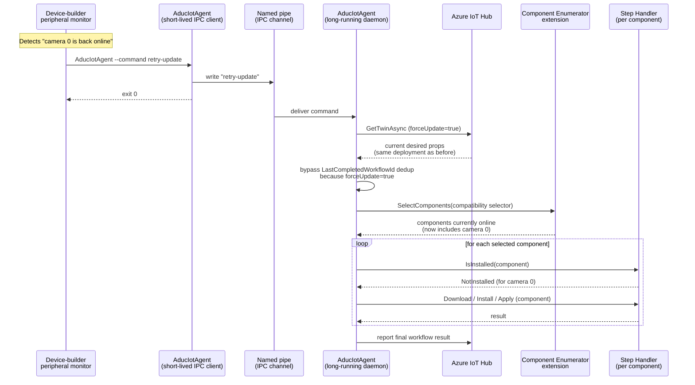

# Re-evaluating a deployment after offline components reconnect

> **Applies to:** Linux builds of the Device Update reference agent.
> The IPC command channel described here is built into every Linux build of
> the agent and is not available on Windows.

## Why this exists — the scenario

Bundle (proxy) updates often target multiple components or peripherals
connected to a host device — for example, sensors on a vehicle, MCUs on
an industrial controller, or downstream devices on a CAN/USB bus.

In real deployments, some of those peripherals are routinely **offline at
install time** (powered down, asleep, physically disconnected, busy, etc.).
A common, supported pattern is:

1. The Device Update service deploys a bundle update to the host.
2. The host's step handler iterates over the components returned by the
   registered **Component Enumerator** and installs the update on every
   peripheral that is currently reachable.
3. For peripherals that are offline, the step handler treats the component
   as not present (or returns a "no matching components" optional-step
   result) and the bundle as a whole reports success — because the host
   did what it could *with the components that were online*.

Once a previously-offline peripheral reconnects, the host needs the agent
to **re-evaluate the same deployment** so the missing peripheral gets
patched. The agent will not do this on its own — it has no built-in
peripheral-reconnect detection. The device builder owns reconnect detection
and is expected to *tell the agent when to re-evaluate*.

This document describes the supported mechanism for doing exactly that.

## TL;DR

When the device-builder code detects that a previously-offline component
has reconnected, run, on the device, as the `adu` user or root:

```sh
sudo -u adu /usr/bin/AducIotAgent --command retry-update
```

The running agent will re-fetch its current goal-state deployment from the
device twin and re-process it. The component enumerator will be queried
again, so newly-reachable components are picked up; the step handler's
`IsInstalled` check will report those components as not installed, and the
install / apply phases run for them.

No service-side action, no new deployment, no agent restart is required.

---

## How it works (concept-level)



The two key behaviors that make this work:

1. **`forceUpdate` bypasses the duplicate-deployment guard.**
   In normal operation the agent records the workflow ID of the most
   recently completed deployment, so an identical desired-property update
   arriving later (for example, after a token refresh) is treated as a
   no-op. The `retry-update` command sets a `forceUpdate` flag on the
   refreshed twin, which suppresses that guard for one cycle and causes
   the agent to re-process the deployment even though its workflow ID
   matches the last completed one.

2. **The component enumerator is re-queried every cycle.**
   The agent does not cache the component list across deployments. When
   the deployment is re-processed, the step handler asks the registered
   component enumerator for the components matching the manifest's
   compatibility selector, and the enumerator reports whatever is online
   *right now*. Newly-reachable peripherals appear in the list and flow
   through the per-component install loop.

For the lower-level state-machine view of how the agent processes a
deployment, see [Goal State Support](goal-state-support.md). For how the
per-component install loop is structured inside the bundle handler, see
the [Steps Handler reference](steps-handler.md).

---

## When to call `retry-update`

Call `retry-update` whenever something on the device changes such that the
component enumerator would now return a different set of components for
the current deployment than it did the last time the deployment was
processed. Typical triggers:

- A peripheral that was offline at install time has reconnected.
- A peripheral was swapped or hot-plugged.
- A peripheral firmware-version readback that previously failed (so the
  step handler had no way to evaluate `IsInstalled`) now succeeds.

`retry-update` is a no-op (and safe to call) when:

- The agent is idle and there is no current deployment.
- The current deployment is already in progress — in that case the command
  is recorded but the in-progress workflow is allowed to finish first, and
  re-processing only happens if the resulting twin still indicates the
  device is not at the goal state.
- All components are already up to date — the step handler's per-component
  `IsInstalled` check returns Installed and the agent reports Idle without
  redoing the install.

`retry-update` does **not** force a download or install of content that is
already correctly applied. It only causes the agent to re-evaluate the
current deployment end-to-end against the *current* component inventory.

---

## What you actually need to build

To use this mechanism end-to-end you need three things on the device:

1. **A registered Component Enumerator extension** that reports the
   current set of peripherals — including their online/offline state —
   each time the agent calls `SelectComponents` or `GetAllComponents`.
   See [Multi-Component Updates](multi-component-updating.md) and the
   [Contoso component enumerator sample](../../src/extensions/component_enumerators/examples/contoso_component_enumerator/README.md)
   for a worked example.

2. **A peripheral-reconnect detector** that fits your hardware. The
   agent does not provide one. Common implementations:
   - A udev rule that runs a script on hot-plug events.
   - A systemd path/service unit that watches a status file the bus
     driver maintains.
   - A polling daemon that periodically probes the bus.

3. **A small bridge that turns each reconnect event into a `retry-update`
   command**, as shown in the next section.

---

## Sample: a minimal reconnect-to-retry bridge

The reconnect-detection half of this pattern is inherently device-specific
— it depends on the bus (USB, CAN, UART, GPIO, network, …) and on how
your Component Enumerator decides whether a component is reachable. The
*bridge from a reconnect event to a `retry-update` command*, on the other
hand, is identical on every device. The sample below isolates that bridge.

### Step 1 — the bridge

This is a tiny wrapper that the device-specific detector calls when it
wants the agent to re-evaluate. Save as
`/usr/local/bin/adu-trigger-reprocess.sh` and make it executable
(`chmod +x`):

```sh
#!/bin/sh
# Ask the running Device Update agent to re-evaluate its current
# deployment. Safe to call when the agent is idle, busy, or already at
# goal state. The caller must be a member of the 'adu' group (so it can
# write to the agent's command FIFO).

set -eu

AGENT="${ADU_AGENT_BIN:-/usr/bin/AducIotAgent}"
REASON="${1:-unspecified}"

logger -t adu-trigger-reprocess "Requesting deployment re-evaluation (reason: ${REASON})"

if ! "$AGENT" --command retry-update; then
    rc=$?
    logger -t adu-trigger-reprocess "retry-update failed (rc=${rc})"
    exit "${rc}"
fi
```

### Step 2 — wire the bridge to your device's reconnect signal

Pick whichever of these fits your hardware. They all end the same way:
they invoke `adu-trigger-reprocess.sh` (or directly run
`AducIotAgent --command retry-update`) when a peripheral becomes
reachable.

**Option A — udev (USB / serial / most hot-pluggable buses).** Drop a
rule that fires on the `add` action for your peripheral's vendor/product
IDs:

```udev
# /etc/udev/rules.d/90-adu-peripheral.rules
ACTION=="add", SUBSYSTEM=="usb", \
    ATTR{idVendor}=="abcd", ATTR{idProduct}=="0001", \
    RUN+="/usr/local/bin/adu-trigger-reprocess.sh peripheral-hotplug"
```

Reload udev with `sudo udevadm control --reload-rules`. udev runs the
script as `root`, which already has FIFO-write permission.

**Option B — filesystem watch (when your driver publishes a status
file).** Use `inotifywait` from the `inotify-tools` package; this fits
the Contoso enumerator pattern, where each peripheral's reachability is
modelled by the presence of a per-component data file:

```sh
#!/bin/sh
# /usr/local/bin/adu-watch-contoso-components.sh
# Trigger re-evaluation whenever a peripheral's firmware data file
# (re)appears under the Contoso virtual-vacuum tree.

set -eu

ROOT="/usr/local/contoso-devices/vacuum-1"

inotifywait -m -r -e create -e moved_to --format '%w%f' "$ROOT" |
while IFS= read -r path; do
    case "$path" in
        */firmware.json|*/diskimage.json)
            /usr/local/bin/adu-trigger-reprocess.sh "fs-event:${path}"
            ;;
    esac
done
```

Run it under a `systemd` unit:

```ini
# /etc/systemd/system/adu-peripheral-watcher.service
[Unit]
Description=Trigger Device Update re-evaluation when peripherals reconnect
After=deviceupdate-agent.service
Requires=deviceupdate-agent.service

[Service]
Type=simple
User=adu
Group=adu
ExecStart=/usr/local/bin/adu-watch-contoso-components.sh
Restart=on-failure
RestartSec=5s

[Install]
WantedBy=multi-user.target
```

Enable with:

```sh
sudo systemctl daemon-reload
sudo systemctl enable --now adu-peripheral-watcher.service
```

**Option C — polling, when no event source is available.** If your bus
genuinely has no reconnect event you can subscribe to, poll the
enumerator's own view periodically and trigger only when the set grows.
Pseudocode:

```sh
# Pseudocode — replace `enumerate_online_component_ids` with whatever
# command, IPC, or bus probe your Component Enumerator uses to decide
# "is this component currently reachable".

prev_file="$(mktemp)"
curr_file="$(mktemp)"
trap 'rm -f "$prev_file" "$curr_file"' EXIT

: > "$prev_file"
while : ; do
    sleep 30
    enumerate_online_component_ids | sort -u > "$curr_file"
    # Lines unique to $curr_file (i.e. components that just arrived).
    new_arrivals="$(comm -13 "$prev_file" "$curr_file")"
    if [ -n "$new_arrivals" ]; then
        /usr/local/bin/adu-trigger-reprocess.sh "poll-new-arrivals"
    fi
    mv "$curr_file" "$prev_file"
    : > "$curr_file"
done
```

Only trigger on *new arrivals* (set grew) — a component going away does
not require a re-evaluation, since there's nothing new to patch.

> **Don't over-think rate-limiting.** `retry-update` is cheap and
> idempotent. If you receive a burst of reconnect events, a single
> `retry-update` per burst is sufficient; the agent will fold near-
> simultaneous requests together. A simple "debounce by a few seconds"
> in your detector is plenty.

---

## How it works (technical reference)

### The command IPC channel

When the agent starts on Linux, it creates a named pipe (FIFO) owned by
`adu:adu` and starts a listener thread on it. Any process that can write
to that FIFO can submit a one-line command. The agent looks the command
up in a small registered-command table; if the command matches a
registered entry, its callback is invoked.

The default FIFO path is `${ADUC_DATA_FOLDER}/du-commands.fifo`
(commonly `/var/lib/adu/du-commands.fifo`). The path is fixed at build
time via the `ADUC_COMMANDS_FIFO_NAME` CMake cache variable. The agent
enforces that:

- The FIFO is owned by `adu:adu`.
- The calling process's effective group is `root` or `adu`.

Both producer and consumer use a fixed-width 64-byte command frame; the
producer pads short commands with NUL bytes. This makes the frame
boundaries unambiguous without needing a length prefix or delimiter, at
the cost of a hard 63-character command-name limit.

For the legacy / pre-versioned command channel described here, only one
command is currently registered:

| Command       | Effect                                                                                          |
|---------------|-------------------------------------------------------------------------------------------------|
| `retry-update`| Re-fetch the device twin with `forceUpdate=true` and re-process the current goal-state deployment. |

The `AducIotAgent --command <cmd>` invocation is a thin client: the same
agent binary, started with `--command`, performs the security check,
opens the FIFO for write, writes the padded command frame, and exits.

### Why `forceUpdate` is needed

In normal goal-state operation, the agent tracks the workflow ID of the
most recently *completed* deployment in `LastCompletedWorkflowId`. When
the device-twin desired properties change — or when the IoT SDK refreshes
the connection (for example, after a SAS-token renewal) — the same
deployment payload often arrives again. The agent compares the incoming
workflow ID to `LastCompletedWorkflowId` and short-circuits the duplicate
back to Idle without re-running download/install/apply.

This is the correct behavior for genuinely-duplicate twin notifications,
but it is exactly the wrong behavior when something on the device has
changed and you want the same deployment re-processed.

The `retry-update` path side-steps the dedup check by setting a
per-fetch `forceUpdate` flag on the refreshed twin. The agent's
property-update handler propagates that flag onto the new workflow
handle. The dedup check explicitly skips itself when the workflow's
force-update flag is set, so the re-fetched deployment falls through to
the normal Process / Download / Install / Apply chain.

`forceUpdate` is scoped to that single re-evaluation cycle — it is not a
persistent agent setting and it does not change how subsequent
service-initiated twin updates are evaluated.

### Why the component enumerator picks up new arrivals automatically

The agent does not cache the component list between deployments or
between re-evaluations. Every time the bundle-update Steps Handler
processes a reference step, it calls `SelectComponents()` on the
registered Component Enumerator with the compatibility selector from the
child manifest, and then iterates over whatever the enumerator returns.

Your Component Enumerator extension is responsible for returning the set
of components that are present and reachable *at that moment*. If the
enumerator reports a freshly-reconnected peripheral, the Steps Handler
will run `IsInstalled` against it (per-component), see that it is not at
the target version, and run Download / Install / Apply against it. The
agent reports the aggregated per-component result for the whole bundle
as the final workflow result.

There is no extra plumbing here: the same code paths that handle a
brand-new deployment also handle a re-evaluation. The only difference is
who initiated the cycle (cloud-pushed twin update vs. local
`retry-update`) and whether the dedup check is bypassed.

### Where this lives in the agent

| Concern                                                | Where to read more                                                                 |
|--------------------------------------------------------|------------------------------------------------------------------------------------|
| Goal-state state machine and per-step iteration        | [Goal State Support](goal-state-support.md)                                        |
| Bundle handler per-component loop and `IsInstalled`    | [Steps Handler](steps-handler.md)                                                  |
| Component Enumerator extension contract                | [Multi-Component Updates](multi-component-updating.md), [Extensibility Points](device-update-agent-extensibility-points.md) |
| Cross-process status query (read-only complement)      | [Service Status API (GetAduServiceStatus)](GetAduServiceStatus.md)                 |

---

## Operational notes

- **The agent must be running.** `retry-update` is a request to a
  running daemon. If the agent is not running, the command simply fails
  (the FIFO either doesn't exist or has no reader); start the daemon
  first.
- **`retry-update` is idempotent.** Calling it twice in close succession
  is harmless. The second call typically either finds the agent still
  re-processing from the first call (and is folded into that cycle) or
  finds the device already at goal state (and is a no-op).
- **`retry-update` does not bypass signature checks.** The re-fetched
  update manifest goes through the same root-key / JWS validation as any
  other deployment. You cannot use `retry-update` to apply unsigned or
  tampered content.
- **`retry-update` is local-only.** It does not change anything in the
  cloud, does not send anything to IoT Hub except the normal workflow
  status reports, and does not affect other devices in the deployment
  group.
- **Reporting cadence is unchanged.** The cloud sees the re-evaluation
  as the normal `DeploymentInProgress → Idle` (or `Failed`) status
  transitions on the device, identified by the same workflow ID. There
  is no separate "this was a retry" signal in the reported properties.
- **Pair with the Service Status API for end-to-end orchestration.**
  Use [`GetAduServiceStatus()`](GetAduServiceStatus.md) from your
  peripheral-watcher (or any other on-device process) to check whether
  the agent is currently busy before issuing a `retry-update`, and to
  observe when the re-evaluation cycle has settled back to Idle.

---

## See also

- [Multi-Component Updates](multi-component-updating.md) — Proxy update concept and component enumerator role.
- [Goal State Support](goal-state-support.md) — Goal-state workflow and state-machine semantics that re-evaluation rides on.
- [Steps Handler](steps-handler.md) — Per-component install loop inside the bundle handler.
- [Service Status API](GetAduServiceStatus.md) — Read-side counterpart to `retry-update`: query the agent's current state from another process.
- [Architecture Overview](architecture-overview.md) — Where the IPC command channel sits in the overall agent design.
- [Contoso Component Enumerator sample](../../src/extensions/component_enumerators/examples/contoso_component_enumerator/README.md) — Reference implementation of a component enumerator with mock online/offline peripherals.
