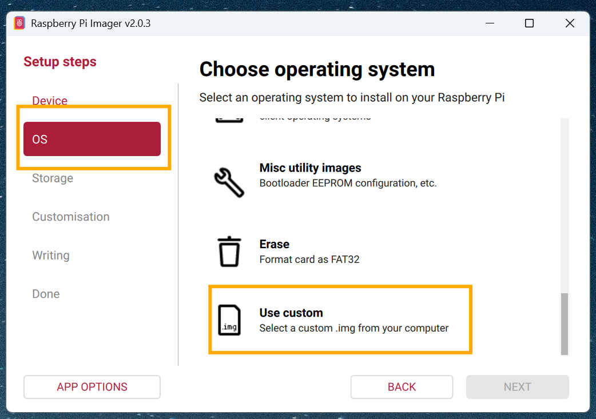
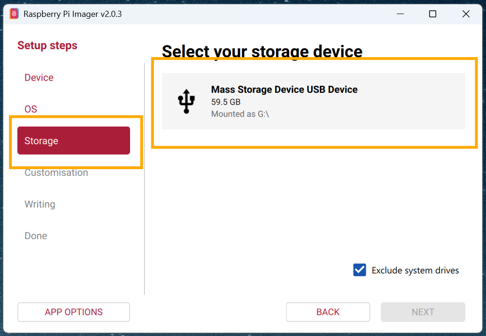

# Azure Device Update Bug Bash: A/B Root File System with Delta

## Overview
This bug bash tests Azure Device Update (ADU) agent with A/B Root File System updates using Delta compression to deliver smaller, differential updates between image versions.


## Activities

### 0. Hardware Setup (Raspberry Pi 4 + Base Image)

#### Hardware Requirements
- **Raspberry Pi 4 Model B** (2GB RAM or higher recommended)
- **MicroSD Card**: 32GB or larger (Class 10 or UHS-I recommended)
- **MicroSD Card Reader**: For flashing the base image
- **Power Supply**: Official Raspberry Pi 4 power supply (5V/3A USB-C)
- **Network Connection**: Ethernet cable or WiFi access
- **Optional**: Monitor, keyboard, and micro-HDMI cable for debugging

#### Required Software
- **Raspberry Pi Imager** - Official SD card imaging tool
  - Download: [https://www.raspberrypi.com/software/](https://www.raspberrypi.com/software/)
  - Available for Windows, macOS, and Linux

#### Flashing the Base Image

1. **Download the Base Image**
   - Extract the delta test package: `tar -xzf adu-delta-test-package.tar.gz`
   - Navigate to the images directory: `cd delta-test-package-*/images/`
   - Locate the base image: `adu-base-image.wic.gz`

2. **Install Raspberry Pi Imager**
   - Download from [raspberrypi.com/software](https://www.raspberrypi.com/software/)
   - Install following the instructions for your operating system
   - Launch the Raspberry Pi Imager application

3. **Flash the SD Card**
   - Insert the microSD card into your card reader
   - Open Raspberry Pi Imager
   - Click **"Choose OS"** → **"Use custom"** → Select `adu-base-image.wic.gz`
   - Click **"Choose Storage"** → Select your microSD card
   - Click **"Next"** , then **"WRITE"** , then confirm to begin flashing
   - Wait for the process to complete (5-10 minutes)
   - Eject the SD card when done

4. **Boot the Raspberry Pi**
   - Insert the flashed microSD card into the Raspberry Pi 4
   - Connect Ethernet cable (or prepare WiFi credentials)
   - Connect power supply to boot the device
   - Wait for the system to boot (first boot may take 2-3 minutes)

5. **Verify System Boot**
   - Connect via SSH or serial console
   - Default credentials (if applicable): Check the base image documentation
   - Verify network connectivity: `ping -c 3 google.com`
   - Check disk partitions: `lsblk` (should show A/B partitions)
   - Verify ADU agent is installed: `systemctl status adu-agent`

**Note**: The base image includes:
- Raspberry Pi OS with A/B partition layout
- Azure Device Update agent pre-installed
- SWUpdate for dual-boot support
- Network configuration tools

### 1. Configure ADU Agent
- Acquire device identity certificates and authentication files for IoT Hub
- Configure ADU configuration file (`du-config`)
- Verify device connection to IoT Hub endpoint

#### Using adu-configs-tool for Automated Setup
You can use the `adu-configs-tool` to automatically create an `adu-configs-pkg` that simplifies device configuration. For detailed information, see the [adu-configs-tool README](adu-configs-tool/README.md).

1. **Prepare Certificates**
   - Navigate to the `adu-configs-tool` directory
   - Place your certificates in the `certs` folder:
     - CA certificate (root certificate)
     - Intermediate certificate
     - Leaf device certificate
     - Private key

2. **Create Config Package**
   - Run the tool to generate `adu-configs-pkg`

3. **Deploy to Device**
   - Copy the `adu-configs-pkg` to the SD card's `/boot` partition
   - Insert the SD card into the Raspberry Pi and boot

4. **Run Setup Script**
   - Once booted, run: `sudo /boot/adu-device-setup.sh`
   - This script will:
     - Configure `du-config.json` with proper settings
     - Copy certificate files to required locations
     - Set correct permissions

**Note:** Personalize the following to avoid conflicts:
- Update Provider, Name, and Compatibility properties
- Device Manufacturer and Model in `du-config`

### 2. Import Updates
- Import 3 sequential updates to IoT Hub using provided import manifests
- Staged for deployment (older → newer versions)

**Import Order**:
1. v1.0.0 (full base update)
2. v2.0.0 (delta from v1.0.0)
3. v3.0.0 (delta from v2.0.0 or v1.0.0)

### 3. Deploy Updates
- Import all updates simultaneously
- Deploy updates individually in version order
- Monitor deployment progression

**Deployment Scenarios**:
- **Full Update**: Deploy v1.0.0 → v2.0.0 using full SWU (240MB)
- **Delta Update**: Deploy v1.0.0 → v2.0.0 using delta diff (~600 bytes)
- **Multi-hop Delta**: Deploy v1.0.0 → v3.0.0 using delta diff (~600 bytes)

### 4. Monitor Progress
- Monitor real-time updates via `journalctl` on device
- Review log files for results and status
- Verify delta download and reconstruction

**Key Log Messages to Watch**:
- Delta download progress
- Delta reconstruction/patching
- Update installation status
- Reboot and activation

### 5. Bonus Activities
- Create import manifest from provided artifacts
- Manually generate X.509 certificates, keys, intermediate, and root certificates for device registration ([X.509 Authentication Guide](https://github.com/Azure/iot-hub-device-update/blob/user/nox-msft/vnext-delta/docs/agent-reference/how-to-x509-authentication.md))
- Test delta update rollback scenarios
- Verify disk space savings with delta vs full updates
- Compare update times: delta vs full image deployment

#### Cache Management Testing
Use `cache_manager.sh` to test ADU cache functionality:

```bash
# Store an update in cache
./cache_manager.sh store <provider> <version> <file>

# Lookup cached update
./cache_manager.sh lookup <provider> <version>

# List all cached files
./cache_manager.sh list

# Show cache info
./cache_manager.sh info
```

#### Delta Verification
Use `delta_operations.py` to verify delta operations:

```bash
# Calculate file hash
python3 delta_operations.py hash <file>

# Verify two files match
python3 delta_operations.py verify <file1> <file2>

# Show file info
python3 delta_operations.py info <file>
```

## Testing Checklist

- [ ] Base image deployed successfully
- [ ] Full update v1.0.0 installed
- [ ] Delta update v1→v2 downloaded (~600 bytes)
- [ ] Delta patch applied and verified
- [ ] Update v2.0.0 installed successfully
- [ ] Delta update v2→v3 tested
- [ ] Multi-hop delta v1→v3 tested
- [ ] Cache management verified
- [ ] Log files reviewed
- [ ] Rollback tested (if applicable)

## Known Delta Configurations

### Standard Delta Update (v1 → v2)
- Source: `adu-update-image-v1-recompressed.swu`
- Target: `adu-update-image-v2-recompressed.swu`
- Delta: `adu-delta-v1-to-v2.diff`
- Size: Full = 240MB, Delta = ~600 bytes
- Savings: 99.9%

### Multi-hop Delta (v1 → v3)
- Source: `adu-update-image-v1-recompressed.swu`
- Target: `adu-update-image-v3-recompressed.swu`
- Delta: `adu-delta-v1-to-v3.diff`
- Size: Full = 240MB, Delta = ~600 bytes
- Savings: 99.9%

### Sequential Delta (v2 → v3)
- Source: `adu-update-image-v2-recompressed.swu`
- Target: `adu-update-image-v3-recompressed.swu`
- Delta: `adu-delta-v2-to-v3.diff`
- Size: Full = 240MB, Delta = ~600 bytes
- Savings: 99.9%

## Troubleshooting

### Delta Download Issues
- Check network connectivity
- Verify IoT Hub endpoint accessibility
- Review ADU agent logs: `journalctl -u adu-agent`

### Delta Reconstruction Failures
- Verify source image version matches delta requirement
- Check available disk space (need ~2x target image size)
- Review reconstruction logs in `/var/lib/adu/downloads/`

### Cache Issues
- Check cache directory permissions: `/var/lib/adu/sdc/`
- Verify ownership: `adu:adu`
- Check available disk space

### Update Installation Failures
- Verify SWUpdate configuration
- Check hardware compatibility strings
- Review system logs: `journalctl -xe`

---

## Test Package Contents

The delta test package (`adu-delta-test-package.tar.gz`) contains all necessary files for comprehensive delta update testing:

### Images Directory
**Original Update Images** (SWU format):
- `adu-update-image-v1.swu` (~240MB) - Version 1.0.0
- `adu-update-image-v2.swu` (~240MB) - Version 2.0.0
- `adu-update-image-v3.swu` (~240MB) - Version 3.0.0

**Recompressed Update Images** (optimized for delta):
- `adu-update-image-v1-recompressed.swu` (~240MB)
- `adu-update-image-v2-recompressed.swu` (~240MB)
- `adu-update-image-v3-recompressed.swu` (~240MB)

**Delta Diff Files** (differential patches):
- `adu-delta-v1-to-v2.diff` (~600 bytes) - Patch from v1.0.0 → v2.0.0
- `adu-delta-v1-to-v3.diff` (~600 bytes) - Patch from v1.0.0 → v3.0.0
- `adu-delta-v2-to-v3.diff` (~600 bytes) - Patch from v2.0.0 → v3.0.0

**Import Manifests**:
- `delta-manifest-v1.0.0-to-v2.0.0.importmanifest.json`
- `delta-manifest-v1.0.0-to-v3.0.0.importmanifest.json`
- `delta-manifest-v2.0.0-to-v3.0.0.importmanifest.json`

**Base Image**:
- `adu-base-image.wic.gz` (~512MB) - Base Raspberry Pi OS image

### Tools Directory
- `dumpextfs` - Tool for extracting/analyzing ext4 filesystem dumps
- `diffgentool` (if available) - Tool for generating delta diffs

### Scripts Directory
- `cache_manager.sh` - Bash script for managing ADU update cache
  - Store updates in cache: `/var/lib/adu/sdc/<provider>/sha256-<hash>`
  - Lookup cached versions by provider and version
  - List all cached files with metadata
  - Show cache statistics

- `delta_operations.py` - Python script for delta file operations
  - Calculate SHA256 hashes
  - Verify file integrity
  - Display file information

### Documentation
- `README.md` - Quick start guide
- `TESTING_GUIDE.md` - Detailed testing procedures

## Update Versions

| Version | Changes | Base Size | Delta from v1 | Delta from v2 |
|---------|---------|-----------|---------------|---------------|
| v1.0.0  | Base version with test files | 240MB | N/A | N/A |
| v2.0.0  | Modified test files | 240MB | ~600 bytes | N/A |
| v3.0.0  | Additional modifications | 240MB | ~600 bytes | ~600 bytes |

## Support
For issues or questions, contact the ADU team or refer to the official Azure Device Update documentation.

