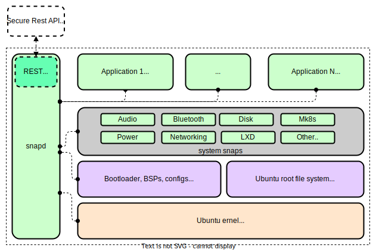

# Device Update Agent Snap for Ubuntu Core

## Achronym

| Achronym | Description | Note|
|---|---|---|
| DO | Delivery Optimization | e.g., DO Clent, DO Client Snap, DO SDK
| DU | Device Update | e.g., DU Agent, DU Agent Snap, DU Service


## Ubuntu Core

Ubuntu Core is a secure and reliable operating system that is tailored for use in IoT and embedded devices. It employs the "snap" packaging system, which simplifies software installation, updates, and rollbacks for individual packages and apps. Ubuntu Core is designed with app isolation and containerization to provide enhanced security features, making it a preferred choice for IoT and other embedded devices.

Visit [Ubuntu Core Official Page](https://ubuntu.com/core) for more information.

## Inside Ubuntu Core

The Ubuntu Core architecture overview diagram below depicts the delivery of the kernel, boot assets, runtime environment, applications, and device enablement capabilities as snaps. These snaps are managed by the snap daemon (snapd) and the daemon itself is packaged as a snap.  
Visit [Ubuntu Core](https://ubuntu.com/core/docs/uc20/inside) page for more details.



> Credit: the diagram above is adapted from [Inside Ubuntu Core](https://ubuntu.com/core/docs/uc20/inside) diagram.
## Device Update Agent Snap for Ubuntu Core

The Device Update Agent, also known as the DU Agent, is a crucial `application` snap  specifically designed for Ubuntu Core. Its primary purpose is to manage updates and ensure the security and reliability of devices that run on this operating system. 

### Device Update Agent and Dependencies

The diagram below illustrates the relationship between the DU Agent Snap, DO Agent Snap, Azure Identity Service Snap, and the snapd daemon.


### Snap Dependencies
There are two snaps that DU snap needs to run with.
1. Azure Identity Service Snap: This is the snap for configuring the Edge device. Alternatively, we can use the connection string stored on du-config.json for the configuration.
2. Delivery Optimization Client Snap: This is the downloader we use. Alternatively, we can use `curl` as the downloader.
3. Snapd: This is the system daemon that supervises all other snaps on Ubuntu Core. It exposes a REST API that makes Ubuntu Core appliances IP-addressable by default. Ubuntu Core exposes a built-in REST API for secure device command and control. Authenticated and authorised clients can perform software management and configuration tasks on their Ubuntu Core devices remotely. Devices running Ubuntu Core can be configured remotely via the REST API.

See [Install Snap using Device Update Script Handler](./examples/install-snap/README.md) example for more details.

### Snap User/Group Security Model

In Ubuntu Core, each snap is packaged in a container-like environment called a snap package, which contains all of the dependencies and libraries required to run the application. The snap package is isolated from the rest of the system and runs with its own set of user and group permissions.

In a nutshell, `snaps` are isolated from other snaps and the rest of the system with dedicated user accounts and groups. `Snap groups` manage permissions and access to system resources. `Interfaces` allow snaps to access resources outside of their own container, while `AppArmor` profiles restrict snap access to system resources, preventing any compromised snap from affecting other parts of the system.

Overall, the snap user and group security model in Ubuntu Core provides a high degree of isolation and security for individual applications, while still allowing them to access the resources they need to function properly.

For more information, see [Security Policy and Sandboxing of Snapcraft](https://snapcraft.io/docs/security-policy-and-sandboxing), a snap is run inside a isolated sandbox, so the user accessing Device Update Agent will always be `root`. 

#### DU Agent Snap User and Group
Key differences between Device Update Agent and Device Update Agent Snap:

| | Device Upate Agent | Device Update Agent Snap |
|---|---|---|
| user id| adu | snap_aziotdu | 
| group id| adu | snap_aziotdu |

### How DU Agent Acquire the IoT Hub Connection Information

Typically, the IoT Hub connection information is obtained by the Device Update Agent from the Azure Identity Service Agent via a secure communication channel that is established between the two agents. By providing the required IoT Hub connection details to the Device Update Agent, the Azure Identity Service Agent enables it to connect to the IoT Hub and receive updates securely.

To configure the DU Agent Module principal file (.toml) in Ubuntu jCore, you need to create the file at /etc/aziot/identityd/snap-aziot-du.toml. The file should contain the following information:

```toml
[[principal]]
name = "IoTHubDeviceUpdate"
idtype = ["module"]
uid = <SNAP_AZIOT_DU_USER_ID>
```

Replace `SNAP_AZIOT_DU_USER_ID` with the actual user id of `snap_aziotdu`

This specifies the principal information for the DU Agent Module, including its name, ID type, and user ID. It is important to ensure that the file is created with the correct filename and location, and that the specified values are appropriate for your specific use case.


#### Connect to Other Snap with Specific User ID
When connecting snaps with interfaces, the snaps are typically connected with the default user or "system" user. However, it is possible to connect snaps with a specific user ID by using the `--classic` and `--username` options with the snap connect command.

For example, to connect to Azure Identity Service with a specific user ID called "snap_aziotdu", you would use the following command:
`snap connect --classic --username=snap_aziotdu deviceupdate-agent:AIS-interface azureIdentityService-snap:AIS-interface`  
This will connect the two snaps using the "snap_aziotdu" user ID, allowing the snaps to communicate with each other as that user.

It is important to note that using the `--classic` and `--username` options with the snap connect command can have security implications, as it allows the connected snaps to access each other's data and resources as the specified user. Therefore, it should only be used if necessary and with caution.

### Integrating With Other Snaps

The sections below explains how Device Update Agent snap communicate with other snap.

### Delivery Optimization Integration

To download files using DO Agent snap, the DU Agent snap need to connect to the following `slots` provided by the DO Agent snap:

```yaml
# Note: snippet from https://github.com/microsoft/do-client/blob/develop/snapcraft-options/snapcraft-agent.yaml

slots:
  do-port-numbers:
    interface: content
    content: do-port-numbers
    read: [ $SNAP_DATA/run ]

  do-configs:
    interface: content
    content: do-configs
    write: [ $SNAP_DATA/etc ]

plugs:
  deviceupdate-agent-downloads:
    interface: content
    content: deviceupdate-agent-downloads
    target: $SNAP_DATA/deviceupdate-agent-downloads

layout:
  # DU agent will provide the /var/lib path as download location.
  # Map it to the correct path within this snap.
  /var/lib/deviceupdate-agent-downloads:
    symlink: $SNAP_DATA/deviceupdate-agent-downloads
```

You can list a DO client snap's connections by using  the `snap connections` command. This command displays information about the snap's connections, including its slots and plugs.

```shell
$ snap connections deliveryoptimization-client

Interface     Plug                                                      Slot                                         Notes
content       -                                                         deliveryoptimization-client:do-configs       -
content       -                                                         deliveryoptimization-client:do-port-numbers  -
content       deliveryoptimization-client:deviceupdate-agent-downloads  -                                            -
network       deliveryoptimization-client:network                       :network                                     -
network-bind  deliveryoptimization-client:network-bind                  :network-bind                                -

```

DU Agent snap will declare the following `plugs` and `layout`

```yaml
# Note: from ../snapcraft.yaml
plugs:
  do-port-numbers:
    interface: content
    content: do-port-numbers
    target: $SNAP_DATA/do-port-numbers

  do-configs:
    interface: content
    content: do-configs
    target: $SNAP_DATA/do-configs

  snapd-control:
    interface: snapd-control

# Provides resources to be accssed by other snaps.
slots:
  #
  # A downloads folder.
  #
  # Consumer(s):
  #
  #    Delivery Optimization : writes downloaded file to this folder and/or sub-folders.
  #
  deviceupdate-agent-downloads:
    interface: content
    content: deviceupdate-agent-downloads
    write:
        - $SNAP_DATA/data/downloads

layout:
# adu_data_dir
  /var/lib/adu:
    symlink: $SNAP_DATA/data

  /var/lib/deviceupdate-agent-downloads:
    symlink: $SNAP_DATA/data/downloads

# adu_conf_dir
  /etc/adu:
    symlink: $SNAP_DATA/config
# adu_shell_dir
  /usr/lib/adu:
    symlink: $SNAP/usr/lib/adu
# adu_log_dir
  /var/log/adu:
    symlink: $SNAP_DATA/log
# curl command
  /usr/bin/curl-downloader:
    symlink: $SNAP/usr/bin/curl

```

> Note that above DU's `_plug_name_:downloads-folder` identifier must match DO's `_slot_name_:deviceupdate-agent-downloads` identifier 

To connect, use following commands:

```shell
# Required connections for content downloading using Delivery Optimization snap.
sudo snap connect deviceupdate-agent:do-port-numbers deliveryoptimization-client:do-port-numbers

sudo snap connect deviceupdate-agent:do-configs deliveryoptimization-client:do-configs

sudo snap connect deliveryoptimization-client:deviceupdate-agent-downloads deviceupdate-agent:downloads-folder

# Required interface for Snapd RestFul requests. 
sudo snap connect deviceupdate-agent:snapd-control

```

### Azure Identity Service Integration
To connect to Azure Identity Service, install AIS with this command `sudo snap install --edge azure-iot-identity`, wiring it up with the following command,
```shell
sudo snap connect azure-iot-identity:log-observe 

sudo snap connect azure-iot-identity:system-observe 

sudo snap connect azure-iot-identity:tpm 
```
Here is the process of configuring AIS using a `config.toml` file and creating a `testing.toml` file for cloud identity creation. 

Use the following commands:

```shell
sudo snap set azure-iot-identity raw-config="$(cat /path/to/config.toml)"
```
```shell
$ sudo cat testing.toml 
[[principal]] 
uid = <REPLACE WITH uid> 
name = "testing" 
idtype = ["module"] 

sudo chown root:root testing.toml 
sudo chmod 0600 testing.toml 

sudo mv testing.toml /var/snap/azure-iot-identity/current/shared/config/aziot/identityd/config.d/testing.toml 
```
then use the following command to connect Device Update and AIS:

```shell
sudo snap connect deviceupdate-agent:identity-service azure-iot-identity:identity-service
```

Verify that connections are ok:

```shell
$ snap connections deviceupdate-agent 

Interface                              Plug                                                      Slot                                         Notes
content[deviceupdate-agent-downloads]  deliveryoptimization-client:deviceupdate-agent-downloads  deviceupdate-agent:downloads-folder          manual
content[do-configs]                    deviceupdate-agent:do-configs                             deliveryoptimization-client:do-configs       manual
content[do-port-numbers]               deviceupdate-agent:do-port-numbers                        deliveryoptimization-client:do-port-numbers  manual
content[aziot-identity-service]        deviceupdate-agent:identity-service                       azure-iot-identity:identity-service          manual
home                                   deviceupdate-agent:home                                   :home                                        -
network                                deviceupdate-agent:network                                :network                                     -
snapd-control                          deviceupdate-agent:snapd-control                          -                                            -
```

### Snap Parts

Parts are used to describe your application, where its various components can be found, its build and run-time requirements, and those of its dependencies.

1. installdeps (Install Dependencies)
    > Similar to how to build a debian package, we run `./scripts/install-deps.sh --install-all-deps`.

2. agent (Build the Agent)
    > To support a build for snapcraft, we add an option to build the agent with `--ubuntu-core-snap-only`. To be more specific, inside the agent, we need to make the following changes:
    > a. Currently, the user is `root` instead of `adu` or any specified desired user.
    > b. Bypassed the `healthcheck()`. More details will be discussed in `Snap User/Group Security Model`.
    > c. Exclude DeliveryOptimization as a build dependency, as it will become a separate snap.
    > d. Exclude `InitializeCommandListenerThread()`, as there is no need to register to commands inside the snap sandbox.
    > e. Only include `script handler`, exclude other handlers, as they are not needed in the snapcraft use case.


### Snap Apps

This is exposing executable components. A snap’s executable is exposed to the host system via the top-level apps section of snapcraft.yaml. Its name needs to correspond with part name responsible for staging the executable within your snap.

1. adu-shell
    > adu-shell is used for backward compatibility. For classic agent, we're using adu-shell to run some tasks elevated as 'root', but since the snap agent is already running as root, ideally, the handlers can be modify to bypass adu-shell. For example, in the reference Script Handler, we have a bool `useAduShell`, this is used to bypass adu-shell.
2. deviceupdate-agent

### Snap Hooks
Snap hooks are scripts or programs that are run at specific points during the lifecycle of a snap. These hooks allow the snap to perform certain tasks or actions at specific times, such as during installation, removal, or configuration.

1. Configure
    > A configure hook is a script that is run when a snap is configured. This allows the snap to perform any necessary tasks or actions when its configuration options are changed, such as updating its runtime behavior or modifying its environment.
    >
    > A configure hook is defined in the snapcraft.yaml file for the snap, and is specified using the configure keyword. The configure keyword should be followed by the path to the script that should be run when the snap is configured, as well as any additional options or arguments that should be passed to the script.
    >
    > When the snap is configured using the snap set command, the configure hook will be run and the "configure.sh" script will be executed. This script can then perform any necessary tasks or actions based on the configuration options that were set.
    >
    > For example, in this reference snap agent, in `../hooks/configure`, we set up the directories and files as needed and register the extensions.

More hooks can be added to the snap as needed, including `install`, `refresh`, `remove`, etc.

### Layouts

In Snapcraft, a snap layout is a way of organizing the files and directories within a snap. A snap layout defines the structure and organization of the snap's files, and specifies where the files should be placed within the snap's directory hierarchy.

A snap layout is defined in the snapcraft.yaml file for the snap, and is specified using the layout keyword. The layout keyword should be followed by a list of directories and the paths to the files that should be placed in each directory.

With layouts, you can make elements in $SNAP, $SNAP_DATA, $SNAP_COMMON accessible from locations such as /usr, /var and /etc. This helps when using pre-compiled binaries and libraries that expect to find files and directories outside of locations referenced by $SNAP or $SNAP_DATA.
Note that $SNAP is read-only, while $SNAP_DATA is a modifiable data folder.
For example, in our reference snap agent, the following table shows the file location mapping.
#### File Locations
| Classic DU Agent | Snap DU Agent |
--- | --- |
| /var/lib/adu | $SNAP_DATA/data |
| /etc/adu | $SNAP_DATA/config |
| /usr/lib/adu | $SNAP_DATA/config |
| /var/log/adu | $SNAP_DATA/log |
| /usr/bin/curl-downloader | $SNAP/usr/bin/curl |


## Building DU Snap

To build the DU Snap, run `snapcraft` command at project root folder.

```bash
cd project_root
snapcraft --debug
```

If you are building it on ARM64 environment, use the following command.

```bash
cd project_root
sudo snapcraft --target-arch=arm64 --destructive-mode --enable-experimental-target-arch
```

### Build Output

If build success, you can find `deviceupdate-agent_#.#_amd64.snap` at the project root directory.

### How To View the DU Snap Package Content

You can use `unsquashfs` command to extract `.snap` file.

```shell
# Run unsquashfs <snap file name>
# e.g., unsquashfs deviceupdate-agent_0.1_amd64.snap
rm -rf squashfs-root

unsquashfs deviceupdate-agent_0.1_amd64.snap

# The content will be extracted to 'squashfs-root' directory
# You can use 'tree' command to view the directory content
tree squashfs-root
```
## Run The Snap

To run a shell in the confined environment:

```shell
$ sudo snap run --shell deviceupdate-agent
```

## View Snap Logs using Journalctl

The name of the Device Update agent in the confined environment is `snap.deviceupdate-agent.deviceupdate-agent`.

To view the journal log, use following command:

```shell
$ journalctl -u snap.deviceupdate-agent.deviceupdate-agent -f --no-tail
```

## Start and Stop The Device Update Snap Daemon

To start the daemon:

```shell
$ sudo systemctl start  snap.deviceupdate-agent.deviceupdate-agent
```

To stop the daemon:

```shell
$ sudo systemctl stop  snap.deviceupdate-agent.deviceupdate-agent
```

To restart the daemon:

```shell
$ sudo systemctl restart  snap.deviceupdate-agent.deviceupdate-agent
```

## Provisioning Device Update Agent Snap

> NOTE | To obtain comprehensive information on provisioning the Device Update Agent, please refer to the following link: [Device Update Agent Provisioning](https://learn.microsoft.com/en-us/azure/iot-hub-device-update/device-update-agent-provisioning)

To configure the DU Agent, you can use `deviceupdate-agent.set-config` command.

  This command decodes and saves base64 encoded configuration data to a file with the given name in the `\$SNAP_DATA/config` directory.  

  The script takes two required options - the name of the config file and the base64 encoded data - and saves the data to the specified file.  

  > NOTE | Only two config file names are allowed: `du-config.json` and `du-diagnostics-config.json`.

| Options | Arguments | Description |
|---|---|---|
|-c, --config-file | \<config file name\> |  Specifies the name of the configuration file to be created or updated.<br/><br/>The only valid values for the config file name are \"du-config.json\" and \"du-diagnostics-config.json\".|
| -d, --data  | \<base64 encoded data\> | Specifies the base64 encoded configuration data to be saved to the specified config file. |
| -h, --help  | | Displays this usage information |

Examples:

```shell
# Save the base64 encoded configuration data to the \"du-config.json\" file:

$ sudo deviceupdate-agent.set-config --config-file du-config.json --data "$(base64 /path/to/du-config.json)"
```

```shell
# Save the base64 encoded configuration data to the "du-diagnostics-config.json" file:

$ sudo deviceupdate-agent.set-config -c du-diagnostics-config.json -d "$(base64 /path/to/du-diagnostics-config.json)"
```

> IMPORTANT | After updating the configuration file(s), it is necessary to restart the agent.

## Summary

Key differences between Device Update Agent and Device Update Agent Snap:

| | Device Upate Agent | Device Update Agent Snap |
|---|---|---|
| user id| adu | snap_aziotdu | 
| group id| adu | snap_aziotdu |
| downloads folder | /var/lib/adu/downloads | $SNAP_DATA/data/downloads |
| configs file | /etc/adu/du-config.json | $SNAP_DATA/configs/du-config.json|
| logs folder | /var/log/adu | $SNAP_DATA/log 
