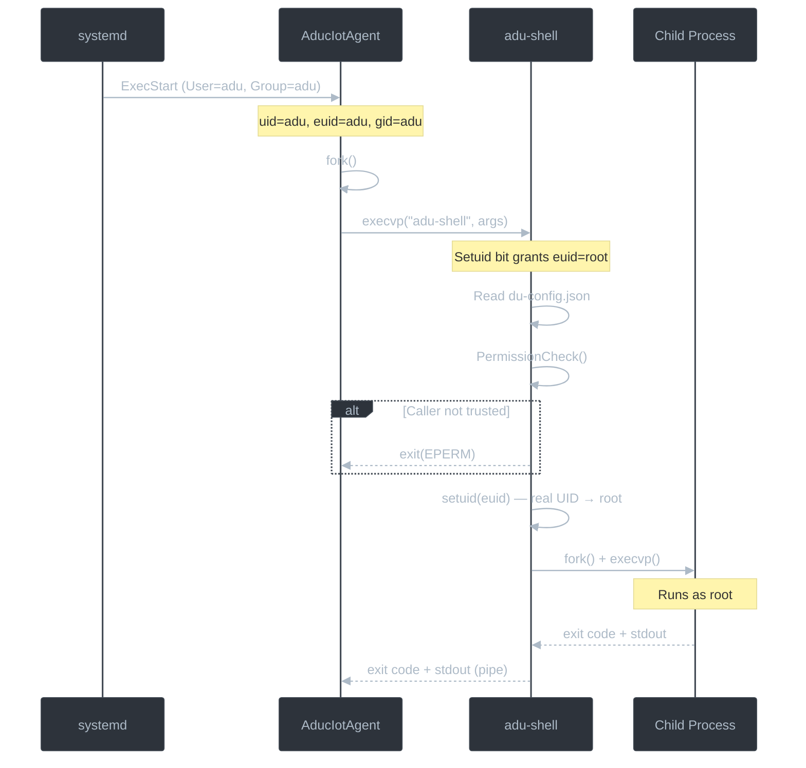

# adu-shell — Privilege-Separated Helper

adu-shell is a setuid-root helper binary that the Device Update (DU) agent
invokes when it needs to perform a privileged operation — package installation,
script execution, or system reboot. The agent itself never runs as root; the
Unix setuid mechanism gives adu-shell (and only adu-shell) the ability to
escalate privileges on behalf of the agent.

## Why Privilege Separation?

The DU agent runs as the unprivileged `adu` user. Many update operations
require root access (e.g. `apt-get install`, `reboot`). Rather than running
the entire agent as root, the design follows the principle of least privilege:

- The agent runs unprivileged — a vulnerability in the agent cannot directly
  compromise the system.
- Only adu-shell runs with root privileges, for a limited set of operations,
  after verifying the caller is trusted.

## How the Linux Setuid Bit Works

On Linux, an executable with the **setuid bit** set runs with the **file
owner's** privileges rather than the invoking user's. When the binary is
owned by `root` and has the setuid bit, any user who executes it gains an
effective UID of `0` (root) for the duration of that process.

The installed permissions on adu-shell are:

```
-r-sr-x---  root  adu  /usr/bin/adu-shell
 |||||||
 |||└┬─┘└─── no access for others
 ||| └────── group 'adu' can read + execute
 └┬┘
  └────────── owner can read + execute; 's' = setuid bit
```

- **Owner:** `root` — so the setuid bit grants root's effective UID.
- **Group:** `adu` — only members of the `adu` group can execute the binary.
- **Others:** no permissions — arbitrary users cannot run it.

In octal this is **`4550`** (or symbolically `u=rxs,g=rx,o=`). The `4` in the
leading position is the setuid bit.

> **Note:** This is the *setuid* bit (`chmod u+s`), not the *sticky* bit
> (`chmod +t`). The sticky bit applies to directories and is unrelated to
> privilege escalation.

## Process Launch Flow

The following diagram shows how the agent launches adu-shell and how effective
user IDs change across the process boundary.



### Process Boundaries and Effective Users

| Process | Real UID | Effective UID | Real GID | Effective GID | Why |
|---------|----------|---------------|----------|---------------|-----|
| **AducIotAgent** | `adu` | `adu` | `adu` | `adu` | systemd starts it as `User=adu` |
| **adu-shell** (before `setuid()`) | `adu` | `root` | `adu` | `adu` | Setuid bit on the binary grants `euid=root` |
| **adu-shell** (after `setuid()`) | `root` | `root` | `adu` | `adu` | Calls `setuid(euid)` to promote real UID |
| **Child command** | `root` | `root` | `root` | `root` | Inherits root from adu-shell |

## Permission Checking

adu-shell validates the caller before performing any work. The check
(`ADUShell_PermissionCheck()` in `main.cpp`) has two tiers:

1. **Trusted user list** — loads `aduShellTrustedUsers` from `du-config.json`
   and compares the caller's effective UID against each user's UID.
   Root (UID 0) is always trusted.

2. **Trusted group fallback** — if the user is not in the trusted list (or
   the config file cannot be loaded), adu-shell checks whether the caller's
   effective GID matches the `adu` group.

If neither check passes, adu-shell exits immediately with `EPERM`.

```json
"aduShellTrustedUsers": ["adu", "do"]
```

## Task Handlers

adu-shell dispatches work to task handler modules based on the `--update-type`
argument:

| Update Type | Handler | Build Flag | Source | Operations |
|-------------|---------|-----------|--------|------------|
| `common` | Common | always | `common_tasks.cpp` | `reboot` |
| `microsoft/apt` | APT | `ADUSHELL_APT` | `aptget_tasks.cpp` | `install`, `remove` (Debian/Ubuntu packages) |
| `microsoft/script` | Script | `ADUSHELL_SCRIPT` | `script_tasks.cpp` | `execute` (arbitrary script with ownership/permission validation) |

## Launch Arguments

| Argument | Short | Required | Description |
|----------|-------|----------|-------------|
| `--update-type` | `-t` | ✅ | Update type string (`common`, `microsoft/apt`, `microsoft/script`) |
| `--update-action` | `-a` | ✅ | Action to perform (`install`, `apply`, `cancel`, `reboot`, `execute`, …) |
| `--target-data` | `-d` | ❌ | Opaque data for the target command (e.g. package names, script path) |
| `--target-options` | `-o` | ❌ | Additional options forwarded to the target command (repeatable) |
| `--target-log-folder` | `-f` | ❌ | Log folder for the target command |
| `--log-level` | `-l` | ❌ | Logging verbosity: `0` (debug) – `3` (error) |
| `--config-folder` | `-F` | ❌ | Override config directory (default: `/etc/adu`) |
| `--version` | `-v` | ❌ | Print version and exit |

Example invocation (as performed internally by the agent):

```
/usr/bin/adu-shell \
  --config-folder /etc/adu \
  --update-type microsoft/apt \
  --update-action install \
  --target-data "libfoo libbar"
```

## Installation and Permissions Setup

During package installation (`postinst`) or the build-install script, the
following steps establish the security model:

1. **Create the `adu` system user and group** — `addgroup --system adu`,
   `adduser --system adu --ingroup adu --no-create-home --shell /bin/false`.
2. **Set ownership** — `chown root:adu /usr/bin/adu-shell`.
3. **Set setuid permissions** — `chmod u=rxs,g=rx,o= /usr/bin/adu-shell`
   (octal `4550`).

The agent binary (`AducIotAgent`) is run by systemd as `User=adu, Group=adu`
and does **not** have the setuid bit.

## Extending adu-shell

To add a new task handler:

1. Create a new source file (e.g. `my_tasks.cpp`) and header in `inc/`.
2. Implement a function matching the `ADUShellTaskFuncType` signature:
   ```cpp
   ADUShellTaskResult MyTask(const ADUShell_LaunchArguments& launchArgs);
   ```
3. Register the handler in `adushell_action.cpp` under a new update-type key.
4. Gate the code behind a new build flag in `CMakeLists.txt` if the handler is
   optional.

## Related Documentation

- [Architecture Overview](../../docs/agent-reference/architecture-overview.md) —
  sandboxing section, high-level security model
- [Configuration Guide](../../docs/agent-reference/configuration-guide.md) —
  `aduShellTrustedUsers` and `aduShellFolder` config fields
- [Extensibility Points](../../docs/agent-reference/device-update-agent-extensibility-points.md) —
  how step handlers plug into the agent
- [Agent Integration Guide](../../docs/agent-reference/agent-integration-guide.md) —
  systemd setup, platform integration, adu-shell permission steps
- [Source Module Catalog](../README.md#adu-shell) —
  adu-shell entry in the module catalog
