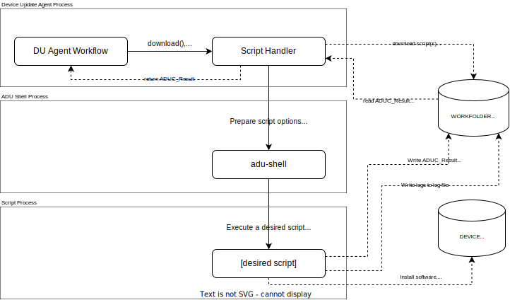

# Script Handler Extension

Script Handler Extension (or, in short, **Script Handler**) handler can be used to prepare and execute a script on the IoT Device.

## Overview

For some update scenarios, you may want to run additional set of commands before, during, or after, installing a software update on your device. This can be achieved using an **Inline Step** with `microsoft/script:1` handler type.

By default, Device Update Agent workflow invokes **Script Handler** to process `microsoft/script:/1` steps.

> For more information about **Inline Step**, see [Update Manifest V4 Schema](../../../docs/agent-reference/update-manifest-v4-schema.md)

**Script Handler** key concepts include:

- execute a custom script that's delivered to a device as an update payload.
- pass option(s) and argument(s) specified in an Update Manifest to the script at runtime.
- pass Device Update Agent workflow information to the script at runtime. Component Data to the script at runtime.
- gather result (ADUC_Result data) of the script execution then report back to the Device Update Agent workflow.
- communicate the Script's desired action (e.g., restart the Agent process, reboot the device) back to the Device Update Agent workflow.
- gather error and informational logs generated from the script execution then report back to the Device Update Agent workflow.

### High-Level Update Flow



## Understanding How Script Handler Communicates with the Script

### Example Update Manifest

> NOTE | For demonstration purposes, we will use following Update Manifest data as an example throughout this document.

The following update contains 3 in-line steps (in `instructions.steps` array) :

- Pre-install step
- Firmware installation step
- Post-install step

All 3 steps are handled by Script Handler, as indicated by `"handler":"microsoft/script:1"` in each step data.

>NOTE | Device Update agent will dynamically load a registered **Update Handler** for a **Handler Type** (also known as **Update Type**) specified in `handler` property. The Script Handler provided in the project will be registered to handle `microsoft/script:1` update type by default as part of **deviceupdate-agent** APT package installation.

#### Example Update Manifest JSON Data

```json
{
    "updateId": {
        "provider": "contoso",
        "name": "Virtual-Vacuum-virtual-motors",
        "version": "3.0"
    },
    "isDeployable": false,
    "compatibility": [
        {
            "group": "motors"
        }
    ],
    "instructions": {
        "steps": [
            {
                "description": "Motors Update pre-install step",
                "handler": "microsoft/script:1",
                "files": [
                    "contoso-motor-installscript.sh"
                ],
                "handlerProperties": {
                    "scriptFileName": "contoso-motor-installscript.sh",
                    "arguments": "--pre-install-sim-success --component-name --component-name-val --component-group --component-group-val --component-prop path --component-prop-val path",
                    "installedCriteria": "1.2"
                }
            },
            {
                "description": "Motors Update - firmware installation",
                "handler": "microsoft/script:1",
                "files": [
                    "contoso-motor-installscript.sh",
                    "motor-firmware-1.2.json"
                ],
                "handlerProperties": {
                    "scriptFileName": "contoso-motor-installscript.sh",
                    "arguments": "--firmware-file motor-firmware-1.2.json --component-name --component-name-val --component-group --component-group-val --component-prop path --component-prop-val path",
                    "installedCriteria": "1.2"
                }
            },
            {
                "description": "Motors Update post-install step",
                "handler": "microsoft/script:1",
                "files": [
                    "contoso-motor-installscript.sh"
                ],
                "handlerProperties": {
                    "scriptFileName": "contoso-motor-installscript.sh",
                    "arguments": "--post-install-sim-success --component-name --component-name-val --component-group --component-group-val --component-prop path --component-prop-val path",
                    "installedCriteria": "1.2"
                }
            }
        ]
    },
    "referencedBy": [
        {
            "provider": "Contoso",
            "name": "Virtual-Vacuum",
            "version": "5.0"
        }
    ],
    "manifestVersion": "4.0",
    "scanResult": "Success",
    "importedDateTime": ...,
    "bundledBy": [...],
    "createdDateTime": ...,
    "etag": ...
}
```

## Handler Properties Requirements

The current implementation of the Script Handler requires following values in the `handlerProperties` map:

| Key | Value | Description |
|----|----|----|
|scriptFileName| Name of the script file|This file must be imported as part of the update. The file will be downloaded into a working folder on the device, when Device Update agent processing the update.<br/><br/> See [Specify A Script Filename](#specify-a-script-filename) for more details.|
|arguments|Space-delimited list of options and arguments to pass to the script file when executing the step| There are a **reserved options and arguments** that Script Handler appends to the list, at runtime. <br/><br/> For script that support **Multi-Component Update**, the **reserved component-related** options can be specified in the `handlerProperties.arguments`. These options will be processed by the Script Handler, and replaced with the runtime values for a `component` being updated.
|installedCriteria|A string interpreted by the handler to determine whether the **Step** need to be processed.| Script Handler pass the responsibility to determine whether the **Step** has been **completed** (aka., installed) by passing this `installedCriteria` string to the script.

## Specify A Script Filename

From an [example steps data](#example-update-manifest-json-data) above, notice the `handlerProperties.scriptFileName` property values, which are the same as file names in `files` array.

At runtime, the Script Handler will download every files listed in `files` array, into a `workfolder` (e.g., **/var/lib/adu/downloads/workflow_id_1234567890/**).

>**Note** | Learn more about how the Script Handler passes `workfolder` path to the script in [Default Workflow Options and Arguments](#default-workflow-options-and-arguments) section below.

Later on, the Script Handler will invoke the specified script file, in a forked-process, to perform various tasks, such as `download` (additional file), `install` an update, `apply` the installed update, `cancel` the update flow if needed, or perform `is-installed` evaluation.

> **IMPORTANT** | Whatever file is referenced in the update manifest will be run as `root`! If you do not wish to enable this behavior, then you can modify `adu-shell` to run the file as other user.

## Passing Arguments To Script

You can specify the script argument in `handlerProperties.arguments' property of the **In-line Step** (see [Update Manifest](https://docs.microsoft.com/en-us/azure/iot-hub-device-update/update-manifest) for more information about Multi-Step Ordered Execution and different between **In-line** vs. **Reference** steps)

For example (see **arguments** value below):

```json
{
    "description": "Motors Update post-install step",
    "handler": "microsoft/script:1",
    "files": [
        "contoso-motor-installscript.sh"
    ],
    "handlerProperties": {
        "scriptFileName": "contoso-motor-installscript.sh",
        "arguments": "--post-install-sim-success --component-name --component-name-val --component-group --component-group-val --component-prop path --component-prop-val path",
        "installedCriteria": "1.2"
    }
}
```

### Arguments Value Format

The `arguments` value contains a space-delimited `options` and `arguments` that will be processed by the Script Handler. These `options` may be interpreted by the Script Handler, then, replaced by, or populated with runtime variables.

Additionally, the Script Handler will append some default runtime workflow related values, such as, `workfolder`, `result-file`, `installed-criteria`, etc. to the options and arguments list.

You can specify any options and arguments that relevant to the script in this 'arguments' string, as long as they don't conflict with [reserved options](#reserved-options) or [default workflow runtime options and arguments](#default-workflow-options-and-arguments) listed below.

### Reserved Options

You can specify any argument in the `handlerProperties.arguments` string, except the  [default workflow options and arguments](#default-workflow-options-and-arguments) and [options for component runtime variables](#options-for-components-runtime-variables) listed in tables below:

> **IMPORTANT**: Specify these options in the `handlerProperties.arguments` string may cause an unexpected behavior.

#### Default Workflow Options and Arguments

The following options and arguments are automatically pass to the script.

> **IMPORTANT**: Specify these options in the `handlerProperties.arguments` string may cause an unexpected behavior:

| Options | Argument(s) | Description |
|----|----|----|
|--action-apply| none | Script Handler will append this option to the `arguments` list to indicate that the script is invoked as part of the `apply` action.<br/>The Script should perform any additional tasks that finalize the installation of the update.<br/> For example, for SWUpdate flow, the `install` action may involve files copy and bootloader configurations changes. The `apply` action may involve device restart, using the boot partition which contains the new version of the OS. |
|--action-cancel| none | Script Handler will append this option to the `arguments` list to indicate that the update (step) is being canceled.<br/>The Script should consider canceling any in-progress task, and restore the device or component back to the original state. |
|--action-download| none | Script Handler will append this option to the `arguments` list to indicate that the script is invoked as part of the `download` action.<br/>The Script should perform any additional content download tasks to ensure that all content required by the installation is accessible during the installation. |
|--action-install| none | Script Handler will append this option to the `arguments` list to indicate that the script is invoked as part of the `install` action.<br/>The Script should perform all tasks related to the software installation. Such as, install a software package(s) on host device, transfer firmware file to connected peripheral, remove existing file(s) that no longer needed, etc.|
|--action-is-installed| none |Script Handler will append this option to the `arguments` list to indicate that the script is invoked as part of the `isInstalled` inquiry.<br/>As part of the Agent-Orchestrated workflow, sometimes, Device Update Agent will invoke the Script Handler's `IsInstalled` function to determine wither the current Step has been **installed**. <br> For Step that does not install any software, **is installed** is equivalent to **applied**. E.g., "Is the step has been applied on the device or components?"|
| --work-folder | <"work_folder_path">| A fully qualified path to `workfolder` (a.k.a. `sandbox folder`). This is a folder used for storing downloaded file, workflow result file, and any other temp files.<br/><br/>Script Handler will append this option to the arguments list when invoking the script. |
| --result-file | <"result_file_path"> |A fully qualified path to the workflow task result. The result file contains a  ADUC_Result data in a JSON. The Script Handler will read ADUC_Result data in this file and continue or abort the update workflow based on the `resultCode`. If the result file does not exist, or can not be opened, the update workflow will be aborted.<br/><br/>Script Handler will append this option to the arguments list when invoking the script.|
| --installed-criteria | <"installed_criteria_string">| Pass-through value to the script.|

#### Options for Components Runtime Variables

The following options are reserved, and will be replaced by component-related value(s) at runtime. They are useful when implementing script that is support multi-component updates, which often perform various component(s)-specific tasks.

For example:

- Copy files to a specific device path
- Install firmware for a specific device name
- Install firmware for a group of device

> **NOTE** | The following arguments will be replaced by **"n/a"** if `Component Enumerator Extension` is not registered.

| Options | Arguments | Runtime Value Type | Description |
|----|----|----|----|
|--component-id-val| none | string |The current components' id |
|--component-name-val| none | string | The current component's name |
|--component-manufacturer-val| none | string | The component's manufacturer |
|--component-model-val| none | string | The component's model |
|--component-version-val| none | string | The component's version |
|--component-group-val| none | string | The component's group |
|--component-prop-val| property name | string | The components' property value.<br/><br/>**NOTE:** The argument must follow by a component's property name.|

#### Example - specify component-related options and arguments

The following instruction step contains various reserved options that would be replaced by component-related runtime variables, after processed by the Script Handler.

```json
    {
        "description": "Motors Update - firmware installation",
        "handler": "microsoft/script:1",
        "files": [
            "contoso-motor-installscript.sh",
            "motor-firmware-1.2.json"
        ],
        "handlerProperties": {
            "scriptFileName": "contoso-motor-installscript.sh",
            "arguments": "--firmware-file motor-firmware-1.2.json --component-name --component-name-val --component-group --component-group-val --component-prop path --component-prop-val path",
            "installedCriteria": "1.2"
        }
    },
```

Following are the mapping between the `step.handlersProperties.arguments` value and the actual arguments that **StepHandler** pass to the script at runtime.
> Note: for this example, let's assumed that the Script Handler is processing an update workflow (`install`) for following component information provided by a registered `Component Enumerator` extension

```json
{
    "components": [

        ...,

        {
            "id": "contoso-motor-serial-00000",
            "name": "left-motor",
            "group": "motors",
            "manufacturer": "contoso",
            "model": "virtual-motor",
            "properties": {
                "path": "\/usr\/local\/contoso-devices\/vacuum-1\/motors\/contoso-motor-serial-00000",
                "firmwareDataFile": "firmware.json",
                "status": "ok"
            },
            "version": "1.2",
            "description": "This component is generated for testing purposes."
        },

        ...
    ]
}
```

| handleProperties.arguments<br/>(option) | handleProperties.arguments<br/>(arguments)| Value pass to the script at runtime<br/>(*after processed by Script Handler*) | Note
|----|----|----|---|
| --firmware-file motor-firmware-1.2.json| | --firmware-file motor-firmware-1.2.json | Not a reserved option. |
|--component-name||--component-name|Not a reserved option.|
|--component-name-val|| **"left-motor"** | This is the value of the component's **name** property above.|
|--component-group||--component-group| Not a reserved option. |
|--component-group-val|| **"motors"** | This is the value of the component's **group** property above.|
|--component-prop |path| --component-prop path| Not a reserved option. Note that both option and argument are unchanged. |
|--component-prop-val| path|**"\/usr\/local\/contoso-devices\/vacuum-1\/motors\/contoso-motor-serial-00000"**| This is the value of the component's **properties.path** value above. |
|||***--action-install***| Automatically appended as part of the *`*install*`* workflow. This indicates that the script should perform 'install' task. |
|||**--work-folder** **"/var/lib/adu/downloads/workflow_id_1234567890/"**| Automatically appended as part of the *`*install*`* workflow. Note that is is for demonstration purposes. The actual work folder path will be different in real update scenario. |
|||**--result-file** **"/var/lib/adu/downloads/workflow_id_1234567890/aduc_result.json"**| Automatically appended as part of the *`*install*`* workflow. Note that is is for demonstration purposes. The actual file path will be different in real update scenario. |
|||**--installed-criteria** **"2.0"**| Automatically appended as part of the *`*install*`* workflow. The value **"2.0"** is the value of `handlerProperties.installedCriteria`, if specified. |

From the post-processed values in the table above, this is what the script invoking command looks like:

```sh
contoso-motor-installscript.sh
    --firmware-file motor-firmware-1.2.json
    --component-name "left-motor" --component-group "motors"
    --component-prop path "/usr/local/contoso-devices/vacuum-1/motors/contoso-motor-serial-00000"
    --action-install
    --work-folder "/var/lib/adu/downloads/workflow_id_1234567890/"
    --result-file "/var/lib/adu/downloads/workflow_id_1234567890/aduc_result.json"
    --installed-criteria": "1.2"

```

### Example Script

To get started, you can take a look at the [example-installscript.sh](./examples/example-installscript.sh) to see how the script can be implemented.

> IMPORTANT: Please note that this is for demonstration purposes only. The example script is provided AS-IS. You should not use it for your production project.

### Communicating the script execution result back to the Script Handler

The script, must write an ADUC_Result data into a designated result file (specified by --result-file option)

> IMPORTANT: Make sure to modify the default behavior of writing result file. If agent detects ResultCode and ExtendedResultCode of 0, then for discoverability, it will replace the ExtendedResultCode with ADUC_ERC_SCRIPT_HANDLER_INSTALL_FAILURE_SCRIPT_RESULT_EXTENDEDRESULTCODE_ZERO that has numeric code of 81054976 (decimal) and 0x30500206 (hexadecimal).

Example contents of result file for Success:

```json
{
    "resultCode": 1,
    "extendedResultCode": 0,
    "resultDetails": ""
}
```

Example contents of result file for Failure:

```json
{
    "resultCode": 0,
    "extendedResultCode": <some non-zero decimal number>,
    "resultDetails": "some optional description"
}
```

#### Example

The following is excerpt from an example script:

```sh

...


#
# Write result json string to result file.
#
result(){
    # NOTE: don't insert timestamp in result file.
    if [ -z $result_file ]; then
        echo "$@" >&1
    else
        echo "$@" > "$result_file"
    fi
}

...

#
# Perform install-related tasks.
#
InstallUpdate() {
    resultCode=0
    extendedResultCode=0
    resultDetails=""
    ret_val=0

    #
    # PLACEHOLDER : Evaluate 'installCriteria' to determine if there is anything to do.
    #               If not, return ADUC_Result_Install_Success (600). Otherwise, continue.
    #

    #
    # PLACEHOLDER : Perform installation tasks here.
    #
    #               Based on overall result..
    #
    #               # Set result code and details
    #               resultCode=<Result Code>
    #               extendedResultCode=<Extended Result Code, in case of error>
    #               resultDetails="<Additional result details>
    #               $ret_value=<Script exit code>

    # Prepare ADUC_Result json.
    aduc_result_json="{\"resultCode\":$resultCode, \"extendedResultCode\":$extendedResultCode,\"resultDetails\":\"$resultDetails\"}"

    # Write ADUC_Result to result file.
    result  "$aduc_result_json"

    $ret $ret_val
}

...

```

