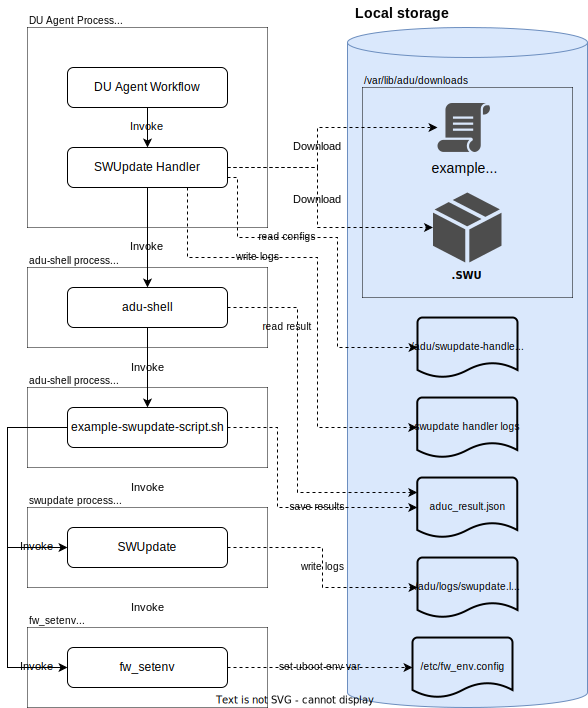
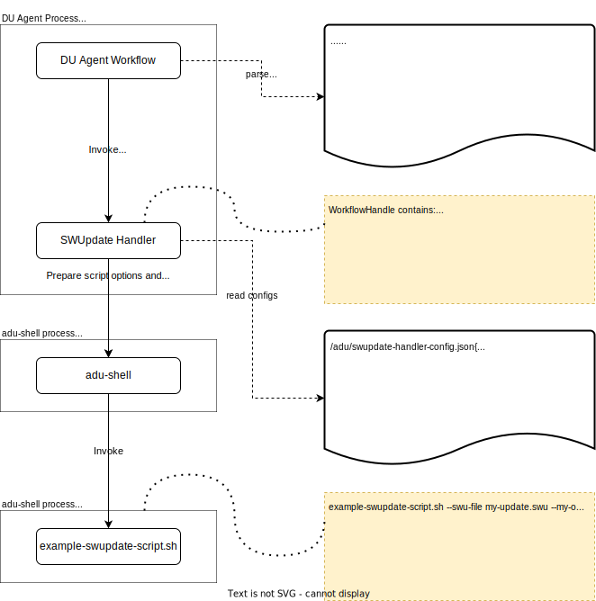

# SWUpdate Handler

## What is SWUpdate?

[SWUpdate](https://github.com/sbabic/swupdate) is a Linux Update agent with the goal to provide an efficient and safe way to update an embedded Linux system in field. SWUpdate supports local and OTA updates, multiple update strategies and it is designed with security in mind.

## What is SWUpdate Handler?

SWUpdate Handler is a Device Update Agent extension that provides a local software update capability on an embedded device with payloads delivered over the air via Device Update for IoT Hub.  

See [How To Implement A Custom Content Handler Extension](../../../../docs/agent-reference/how-to-implement-custom-update-handler.md) for more information.

## SWUpdate Handler Goals

While SWUpdate supports many features (see [SWUpdate feature list](https://github.com/sbabic/swupdate#features) ), the main goals of this SWUpdate Handler are to demonstrate:

- how to perform A/B system update on an embedded linux device.
- how to execute SWUpdate command, with pass-through options, on an embedded linux device.
- how to deliver multiple .swu files to a device, then install those files onto multiple peripherals.

> NOTE | for A/B system update, most of the example scripts and update artifacts in this document will used to demonstrate how to deliver an update to a Raspberry Pi device that running a sample reference Yocto (warrior) image with built-in Device Update Agent service.

## Architecture

### High-level Overview of Device Update Agent Workflow



## How To Use SWUpdate Handler

### Registering SWUpdate Handler extension

To enable SWUpdate on the device, the handler must be registered to support **'microsoft/swupdate:2'**.

Note that this version of SWUpdate Handler is different from the previous version published as part of the 2022 Public Preview Refresh release. The new handler is not backward compatible with previous versions. Hence, we recommend using a new update-type (**'microsoft/swupdate:2'**)

Following command can be run manually on the device:

```sh
sudo /usr/bin/AducIotAgent --update-type 'microsoft/swupdate:2' --register-content-handler <full path to the handler file> 
```

### Setting SWUpdate Handler Properties

Using [Multi Step Ordered Exeuction (MSOE)](), you can create a step that perform various swupdate tasks on the embedded device.  

The SWUpdate Handler support following handler properties (`handlerProperties`) :

| Name | Type | Description |
|---|---|---|
| scriptFileName | string | Name of a script file that perform additional logics related to A/B system update. This property should be specified only when performing A/B System Update.<br/><br/> See [A/B Update Script](#ab-update-script) below for more information. |
| arguments | string | A space delimited options and arguments that will be passed directly to SWUpdate command.
| installedCriteria | string | String interpreted by the specified `scriptFileName` to determine if the update completed successfully. <br/> This value will be passed to the underlying update script in this format: `--installed-criteria <value>` |

#### List of Supported handlerProperties.arguments

| Name | Type | Required | Description |
|---|---|---|---|
|--swu-file| string | yes | Name of the image or software (.swu) file to be installed by swupdate.

#### List of SWUpdate runtime options

| Name | Type | Description |
|---|---|---|
|--work-folder| string | Full path to a work (sandbox) folder used by an Agent when performing update-related tasks. |
|--output-file|string|Full path to an output file that swupdate script should write to|
|--log-file|string| Full path to a log file that swupdate script should write to. (This is different that Agent's log file)|
|--result-file|string|Full path to an ADUC_Result file that swupdate script must write the end result of the update tasks to. If this file does not exist or cannot be parsed, the task will be considered failed.|
|--action-download,<br/>--action-install,<br/>--action-apply,<br/>--action-cancel,<br/>--action-is-installed| (no arguments)| An option indicates the current update task.

### Example: A/B Update Script

In [./tests/testdata](./tests/testdata/) folder you will find an example script file that can be invoked to perform various update related tasks, such as:

- download additional files.
- install the update (.swu file).
- apply the update (e.g., reboot the device into the updated partition)
- cancel the update.
- check whether the device meets an installed criteria specified in the update manifest.

#### How SWUpdate Handler Invokes Update Script



1. SWUpdate prepares options and arguments from the following sources:
   - swupdate-handler-config.json (static data in .json file)
   - an agent workflow context (runtime data), such as, `--work-folder <sandbox folder>`
   - handlerProperties.swuFileName (static data in update manifest). This value will be converted to a script option as `--swu-file <file path>`.
   - handlerProperties.arguments (static data in update manifest)
   - SWUpdate log, output, and result file path.
2. SWUpdate then invoke an underlying update script as 'root' (using adu-shell as a broker).
3. After the script is completed, SWUpdate handler collects data from log file, output file, and result file, then proceed an Agent workflow accordingly.

#### Evaluating 'installedCriteria'

For this example, to determine whether the new image has been installed on the device successfully, the SWUpdate Handler will run the specified `scriptFileName` with `--action-is-installed '<installedCriteria>'` option.

For example:

```sh

/adu/downloads/workflow-01234567/example-a-b-update.sh --action-is-installed --installed-criteria '8.0.1.0001'

```

In this [example update script](./tests/testdata/adu-yocto-ab-rootfs-update/example-a-b-update.sh), it simply compares the given 'installedCriteria' value (8.0.1.0001) to a content of `adu-version` file (located at /etc/adu-version folder).

The algorithm for evaluating `installedCriteria` can be 100% customized to fit your device design and requirements.

