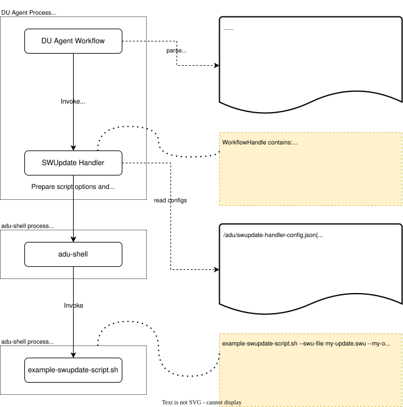

# SWUpdate Handler V3

## Overview

SWUpdate Handler V3 is an enhanced version of the SWUpdate handler that provides:

- **Standard U-Boot Integration**: Uses generic U-Boot environment variables instead of platform-specific solutions
- **Boot Health Checking**: Automatic post-reboot health verification with rollback capability
- **Fail-Safe Updates**: Automatic rollback to previous working partition if health check fails
- **Handler-Specific Error Codes**: Detailed error reporting for troubleshooting

## Key Differences from V2

| Feature | V2 | V3 |
|---------|----|----|
| Update Type | `microsoft/swupdate:2` | `microsoft/swupdate:3` |
| Bootloader | Raspberry Pi specific (rpipart) | Generic U-Boot variables |
| Health Check | None | Automatic with rollback |
| Error Codes | Agent error codes | Handler-specific |
| Recovery | Manual | Automatic |

## U-Boot Environment Variables

V3 uses the following U-Boot variables (matching boot.cmd.in):

- `boot_partition`: Currently active boot partition ("rootA" or "rootB")
- `upgrade_available`: Flag indicating pending upgrade ("0" or "1")
- `boot_attempts`: Number of boot attempts since upgrade
- `boot_result`: Current boot result ("unknown", "success", or "failed")
- `boot_attempts_A`: Total boot attempts for rootA partition
- `boot_attempts_B`: Total boot attempts for rootB partition
- `boot_result_A`: Last result for rootA partition
- `boot_result_B`: Last result for rootB partition
- `boot_timestamp_A`: Last boot timestamp for rootA
- `boot_timestamp_B`: Last boot timestamp for rootB

**Note:** Boot limit is hardcoded to 3 in boot.cmd.in

## Update Flow

### Installation Phase

1. Download update files
2. Install update to inactive partition using swupdate
3. Set U-Boot environment:
   - `boot_partition` = target partition ("rootA" or "rootB")
   - `upgrade_available` = "1"
   - `boot_attempts` = "0"
   - `boot_result` = "unknown"
4. Reboot system

### Post-Reboot Verification

1. System boots from new partition
2. U-Boot increments `boot_attempts` (if upgrade_available="1")
3. U-Boot checks if `boot_attempts` >= 3:
   - If yes: marks `boot_result` = "failed", switches partition, reboots
4. Handler checks `upgrade_available` flag
5. If `boot_attempts` < 3: Run health check
6. If health check passes:
   - Set `boot_result` = "success"
   - Set `boot_result_A` or `boot_result_B` = "success"
   - Set `upgrade_available` = "0"
   - Reset `boot_attempts` = "0"
   - Report success to Azure
7. If health check fails:
   - Set `boot_result` = "failed"
   - Reboot and retry (U-Boot handles rollback after 3 attempts)

## Configuration

Create `/etc/adu/swupdate-handler-v3-config.json`:

```json
{
    "description": "SWUpdate Handler V3 Configuration",
    "version": "3.0",
    "uboot": {
        "boot_partition_var": "boot_partition",
        "upgrade_available_var": "upgrade_available",
        "boot_attempts_var": "boot_attempts",
        "boot_result_var": "boot_result",
        "boot_limit": 3
    },
    "health_check": {
        "enabled": true,
        "script_path": "/usr/lib/adu/scripts/boot-health-check.sh",
        "timeout_seconds": 120
    },
    "swupdate": {
        "binary_path": "/usr/bin/swupdate",
        "default_args": ["-v"]
    }
}
```

## Requirements

### Build Requirements
- CMake >= 3.5
- C++ compiler with C++14 support
- Azure Device Update Agent SDK

### Runtime Requirements
- `swupdate` binary
- `u-boot-fw-utils` (fw_setenv, fw_printenv)
- Dual A/B partition setup
- U-Boot bootloader with environment variable support

## Registration

Register the handler with the ADU agent:

```bash
sudo /usr/bin/AducIotAgent --update-type 'microsoft/swupdate:3' \
    --register-content-handler /var/lib/adu/extensions/sources/libmicrosoft_swupdate_3.so
```

## Update Manifest Example

```json
{
    "updateManifest": "5.0",
    "updateId": {
        "provider": "Contoso",
        "name": "System-Update",
        "version": "1.0.0"
    },
    "updateType": "microsoft/swupdate:3",
    "installedCriteria": "1.0.0",
    "files": [
        {
            "fileName": "system-update.swu",
            "sizeInBytes": 52428800,
            "hashes": {
                "sha256": "abc123..."
            }
        }
    ],
    "handlerProperties": {
        "swuFileName": "system-update.swu",
        "apiVersion": "3.0"
    }
}
```

## Error Codes

V3 uses handler-specific extended error codes in the format:
- Facility: 10
- Component: 3
- Error Code: Specific to error type

Common error codes:
- 10 (0x0A): U-Boot environment read failed
- 11 (0x0B): U-Boot environment write failed
- 20 (0x14): Boot health check failed
- 30 (0x1E): Boot limit exceeded, rollback initiated
- 100 (0x64): SWUpdate execution failed

## Troubleshooting

### Check U-Boot Variables

```bash
fw_printenv boot_partition
fw_printenv upgrade_available
fw_printenv boot_attempts
fw_printenv boot_result
fw_printenv boot_result_A
fw_printenv boot_result_B
```

### Check Handler Logs

```bash
journalctl -u deviceupdate-agent | grep swupdate-handler-v3
```

### Manual Rollback

If automatic rollback fails:

```bash
# Switch to the other partition
CURRENT=$(fw_printenv -n boot_partition)
if [ "$CURRENT" = "rootA" ]; then
    fw_setenv boot_partition rootB
else
    fw_setenv boot_partition rootA
fi

fw_setenv upgrade_available 0
fw_setenv boot_attempts 0
fw_setenv boot_result unknown
reboot
```

## Development Status

This is an initial implementation that demonstrates:
- ✅ U-Boot environment variable management
- ✅ Post-reboot state detection
- ✅ Boot counter and limit checking
- 🚧 Actual swupdate execution (simulated)
- 🚧 Health check script execution
- 🚧 Automatic rollback implementation

Future enhancements will include complete health check and rollback logic.

## See Also

- [ADU Agent SDK Design](../../../../docs/agent-reference/aduagent-sdk-design.md)
- [SWUpdate Handler V3 Design](./DESIGN.md)
- [Implementation Roadmap](../../../../docs/agent-reference/aduagent-sdk-implementation-roadmap.md)
| scriptFileName | string | Name of a script file that perform additional logics related to A/B system update. This property should be specified only when performing A/B System Update.<br/><br/> See [A/B Update Script](#ab-update-script) below for more information. |
| arguments | string | A space delimited options and arguments that will be passed directly to SWUpdate command.
| installedCriteria | string | String interpreted by the specified `scriptFileName` to determine if the update completed successfully. <br/> This value will be passed to the underlying update script in this format: `--installed-criteria <value>` |
| apiVersion | string | An API version. Default value is <*empty*> which implies "1.0". Current supported value is 1.0" and "1.1". |

#### List of Supported handlerProperties.arguments

| Name | Type | Required | Description |
|---|---|---|---|
|--swu-file| string | yes | Name of the image or software (.swu) file to be installed by swupdate.

#### List of SWUpdate runtime options

> NOTE | As part of the update workflow, the underlying script will receive these options. So, there is no need to include them in the `handlerProperties.arguments` section of the step in the import manifest.

| Name | Type | Description |
|---|---|---|
|--work-folder| string | Full path to a work (sandbox) folder used by an Agent when performing update-related tasks. |
|--output-file|string|Full path to an output file that swupdate script should write to|
|--log-file|string| Full path to a log file that swupdate script should write to. (This is different that Agent's log file)|
|--result-file|string|Full path to an ADUC_Result file that swupdate script must write the end result of the update tasks to. If this file does not exist or cannot be parsed, the task will be considered failed.|
|--action-download,<br/>--action-install,<br/>--action-apply,<br/>--action-cancel,<br/>--action-is-installed| (no arguments)| An option indicates the current update task.<br/><br/>**NOTE:** If **"apiVersion"** set to **"1.1"**, the handler will pass following arguments instead:<br/>"--action **download**", "--action **install**", "--action **apply**", "--action **cancel**", "--action **is-installed**"

### Example: A/B Update Script

In [./tests/testdata](./tests/testdata/) folder you will find an example script file that can be invoked to perform various update related tasks, such as:

- download additional files.
- install the update (.swu file).
- apply the update (e.g., reboot the device into the updated partition)
- cancel the update.
- check whether the device meets an installed criteria specified in the update manifest.

#### How SWUpdate Handler Invokes Update Script



1. SWUpdate prepares options and arguments from the following sources:
   - swupdate-handler-config.json (static data in .json file)
   - an agent workflow context (runtime data), such as, `--work-folder <sandbox folder>`
   - handlerProperties.swuFileName (static data in update manifest). This value will be converted to a script option as `--swu-file <file path>`.
   - handlerProperties.arguments (static data in update manifest)
   - SWUpdate log, output, and result file path.
2. SWUpdate then invoke an underlying update script as 'root' (using adu-shell as a broker).
3. After the script is completed, SWUpdate handler collects data from log file, output file, and result file, then proceed an Agent workflow accordingly.

#### Evaluating 'installedCriteria'

For this example, to determine whether the new image has been installed on the device successfully, the SWUpdate Handler will run the specified `scriptFileName` with `--action is-installed '<installedCriteria>'` option.

For example:

```sh

/adu/downloads/workflow-01234567/example-a-b-update.sh --action is-installed --installed-criteria '8.0.1.0001'

```

In this [example update script](./tests/testdata/adu-yocto-ab-rootfs-update/payloads/example-a-b-update.sh), it simply compares the given 'installedCriteria' value (8.0.1.0001) to a content of `adu-version` file (located at /etc/adu-version folder).

The algorithm for evaluating `installedCriteria` can be 100% customized to fit your device design and requirements.

