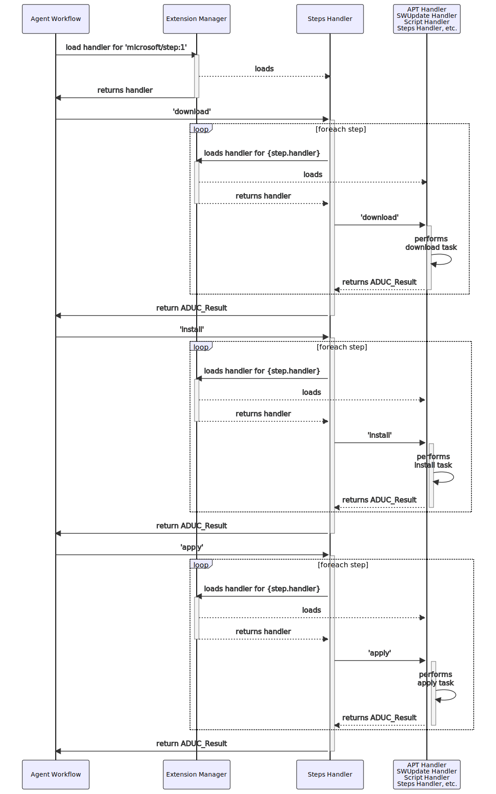
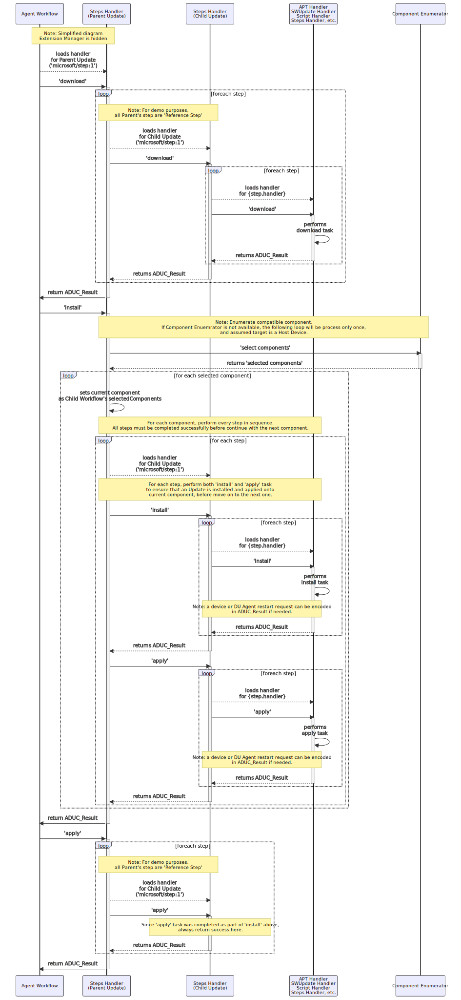

# Steps Content Handler

## Introducing Install Instructions Step

At the Device Update Public Preview Refresh, the top level Update Manifest version v4 will no longer contain the `UpdateType` property, instead it will have one or more `instruction.steps` data.

### Example Update Manifest with Steps

The following is an example of the Update Manifest version v4 that contains two instuction steps. In this example, both steps are `inline` step. 'Inline' step is the default value if not specified.

> Note: see [Multi Step Ordered Execution](../../../docs/agent-reference/update-manifest-v4-schema.md#multi-step-ordered-execution-msoe-support) for more information about `step`. The step's `handler` property is equivalent to an `Update Type` that was introduced in the previous version of the Update Manifest.

> Note: the step data also contains a property called `handlerProperties`. This is a JSON object that contains the data (such as, installedCriteria, script arguments, etc.) usually used by the Handler when performing various update tasks (such as download, install, apply, and cancel)

Usually, the Handler implementer is responsible for defining the set of properties, what they are, how and when they are used.

```txt
    "updateId": {...},
    "compatibility": [
        {
            "manufacturer": "adu-device",
            "model": "e2e-test"
        }
    ],
    "instructions": {
        "steps": [
            {
                "description": "Install libcurl4-doc on host device",
                "handler": "microsoft/apt:1",
                "files": [
                    "apt-manifest-1.0.json"
                ],
                "handlerProperties": {
                    "installedCriteria": "apt-update-test-2.2"
                }
            },
            {
                "description": "Install tree on host device",
                "handler": "microsoft/apt:1",
                "files": [
                    "apt-manifest-tree-1.0.json"
                ],
                "handlerProperties": {
                    "installedCriteria": "apt-update-test-tree-2.2"
                }
            }
        ]
    },
    "manifestVersion": "4.0",
    "importedDateTime": "...",
    "createdDateTime": "..."
```

## The Steps Handler

As mentioned earlier on this page, the top level (parent) Update Manifest does not contains `Update Type`, an Agent Workflow will implicitly assign a type called `microsoft/step:1`, and automatically load the Steps Handler (libmicrosoft_steps_1.so) to process this Parent Update Manifest (and if available the Child Update Manifest as well, which will be demonstrated later in this document).

It's worth noting that, for Parent Update, the Steps Handler will iterates through every step. For each step, the handler will perform 'download', 'install', and 'apply' actions, in the exact order. Unless an error occurs, in which case, the workflow will be aborted and the `ResultCode`, `ExtendedResultCode`, and `ResultDetails` will be reported to the cloud accordingly.

**Figure 1** - High-Level Overview of Steps Handler Sequence Diagram

>**Note** - for simplification, the following diagram demonstrates a workflow sequence without 'cancel' action and errors.



## A Reference Step

A **Reference Step** is a step that contains Update Identifier of another Update, called `Child Update`.  When processing a Reference Step, Steps Handler will download a Detached Update Manifest file specified in the Reference Step data, then validate the file integrity.

Next, Steps Handler will parse the Child Update Manifest and create ADUC_Workflow object (aka. Child Workflow Data) by combining the data from Child Update Manifest and File URLs information from the Parent Update Manifest.  This Child Workflow Data also has a 'level' property set to '1'.

> Note: For Update Manfiest version v4, the Child Udpate cannot contain any Reference Steps.

## Handling Reference Steps (Child Updates)

**Figure 2** - Overview of Steps Handler Sequence Diagram With Parent and Child Updates



### Things To Know

- To deliver an update to a component or group of components connected to a Host Device, the step must be `Reference Step`. The `compatibility` property will be used for selecting target components.<br/><br/>See [Contoso Component Enumerator Example](../../extensions/component_enumerators/examples/contoso_component_enumerator/README.md) for more details about components selection process.

- Parent Update's inline steps will be applied to Host Device only.
- Only Parent Update can contains Reference Step.
- Only one level of referencing is allowed. A Child Update cannot contains any reference steps.

## Related Topics

- [How To Implement Custom Update Content Handler](../../../docs/agent-reference/how-to-implement-custom-update-handler.md.md)
- [Multi Component Updating](../../../docs/agent-reference/multi-component-updating.md)
- [Contoso Component Enumerator Example](../../extensions/component_enumerators/examples/contoso_component_enumerator/README.md)
- [What's MSOE](../../../docs/agent-reference/update-manifest-v4-schema.md#multi-step-ordered-execution-msoe-support)
